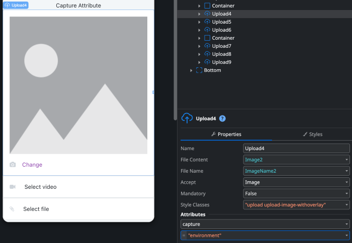
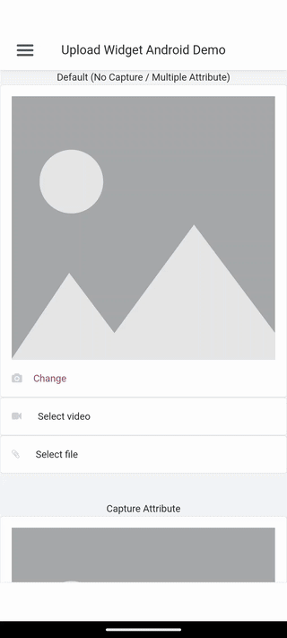

# MABS 11 release notes

Check the mobile stack details for each available MABS version in [Mobile Apps Build Service Versions](mabs-versions.md).

For common issues and solutions check also [Troubleshooting the Mobile Apps Generation](../../troubleshooting/application-development/troubleshoot-mobile-apps-generation.md).

MABS 11 is an important milestone for all mobile developers who publish on App Store and Play Store. MABS 11 targets iOS 18 and Android 15, letting you continue submitting your Android and iOS apps to the stores while taking advantage of the new features that new iOS and Android versions bring.

It's recommended to update all supported plugins to the latest version available on the Forge. For more details, see [System Requirements](#system-requirements).

## MABS 11.2 { #mabs-version-11-2 }

**First release:** 2025-10-15 10:30:00 UTC 
**Last update:** 2025-10-15 14:30:00 UTC.

This minor release brings architecture improvements to unify the O11 and ODC mobile application build service. In order to support this change, some supported plugins were also updated (ODC ONLY). If you are building production apps on ODC with these specific plugins, we recommend you start upgrading the plugin versions for your apps to 11.2 immediately.

[MABS 11.2 release notes](../../release-notes/mabs/11/11.2/11.2.md)

## System requirements

For more details, click the plugin name on Forge. OutSystems recommends always using the latest version available of a supported plugin.

|Plugin|Minimum supported version for ODC|
|:---|---|
|[Cloud Messaging (Firebase)](https://www.outsystems.com/forge/component-versions/12174)|2.3.1 or later|
|[Health & Fitness](https://www.outsystems.com/forge/component-versions/11715)|1.4.0 or later|
|[Key Store](https://www.outsystems.com/forge/component-versions/1550)|1.2.3 or later|
|[Payments](https://www.outsystems.com/forge/component-versions/13678)|1.1.10 or later|
|[OutSystems AppShield](https://www.outsystems.com/forge/component-overview/9379/outsystems-appshield-o11)|1.0.0 or later|

## MABS 11.1 { #mabs-version-11-1 }

**First release:** 2025-03-28 14:30:00 UTC 
**Last update:** 2025-03-28 14:30:00 UTC.

Starting with MABS 11.1 the Upload Widget by default only allows selecting pictures or videos from the device's gallery. If you wish to capture pictures or videos from the device's camera, you need to add the [capture attribute](https://developer.mozilla.org/en-US/docs/Web/HTML/Attributes/capture) with the value **environment** to the Upload Widget in the IDE (see below) and then publish your app. This change only affects Android applications with the [AddUploadWidgetPermissions preference](./mabs-7.md#upload-widget-permissions) set to `true`.

### What's new

This minor version is focused on privacy and user experience improvements.

### Android

* Using the **Upload Widget** no longer requires the READ_MEDIA_IMAGES and READ_MEDIA_VIDEO permissions in order to comply with [Google Play's Photo and Video Permissions policy](https://support.google.com/googleplay/android-developer/answer/14115180?sjid=6224487226101929084-EU).
* **Upload Widget** now uses the [Android photo picker](https://android-developers.googleblog.com/2023/04/photo-picker-everywhere.html), providing a faster user experience consistent across a range of devices with Android versions supported by MABS 11.

**Before MABS 11.1**

Upload Widget prompted the user for multiple permissions upfront to select a picture and didn't honor the limited access selection.

**Staring with MABS 11.1**

Upload Widget no longer prompts for any permission for media selection and the apps can only access the user selection.

Upload Widget only prompts for a single permission and immediately opens the Camera for media capture when the **capture** attribute is set.

### Breaking Changes and Known Limitations

Applies to MABS 11.1.

#### Upload Widget no longer offers the camera to capture media by default on Android

To let users take photos or videos directly with the Upload Widget on Android, set the [capture attribute](https://developer.mozilla.org/en-US/docs/Web/HTML/Attributes/capture) to **environment** and rebuild your app. OutSystems changed this to simplify things and make the widget behave like modern browsers expect. Check the release notes for more details.

This change affects applications built with MABS 11 and later. When targeting MABS versions earlier than 11, this attribute setting has no effect and can be safely ignored.

#### Upload Widget doesn't capture media on Android 9

The [capture attribute](https://developer.mozilla.org/en-US/docs/Web/HTML/Attributes/capture) doesn't work on Android 9 due to a system limitation. This means the Upload Widget cannot perform media capture regardless of the **capture** attribute.

Workarounds:

* Use the Camera app first to capture the picture or video, then switch to the app and select the captured media.
* Use the OutSystems Camera Plugin.

## MABS 11 release

* [MABS 11.0 release notes](../../release-notes/mabs/11/11.0/11.0.md)

## System requirements

Plugin requirements for **MABS 11**. For more details, please check the Forge by clicking on the plugin name.

|Plugin|Required minimum version for O11|Required minimum version for ODC|
|:---|---|---|
|[Barcode](https://www.outsystems.com/forge/component-versions/1403)|5.5.7 or later|1.2.7 or later|
|[Camera](https://www.outsystems.com/forge/component-versions/1390)|7.6.4 or later|1.1.4 or later|
|[Card IO](https://www.outsystems.com/forge/component-versions/1438)|3.2.3 or later|-|
|[Calendar](https://www.outsystems.com/forge/component-versions/1566)|3.1.6 or later|1.0.2 or later|
|[Ciphered Local Storage](https://www.outsystems.com/forge/component-versions/1500)|3.2.4 or later|1.0.2 or later|
|[File](https://www.outsystems.com/forge/component-versions/1633)|3.0.7 or later|1.0.3 or later|
|[File Viewer](https://www.outsystems.com/forge/component-versions/1606)|2.0.10 or later|1.0.2 or later|
|[Health & Fitness](https://www.outsystems.com/forge/component-versions/11715)|2.2.1 or later|1.2.1 or later|

The table below contains the list of plugins and their supported versions. It is important to note that it is recommended to always use the latest version available of a plugin.

|Plugin|Supported minimum version for O11|Supported minimum version for ODC|
|---|---|---|
|[Contacts](https://www.outsystems.com/forge/component-versions/1394)|4.0.6 or later|1.0.1 or later|
|[File Transfer](https://www.outsystems.com/forge/component-versions/1409)|2.1.7 or later|1.0.2 or later|
|[Key Store](https://www.outsystems.com/forge/component-versions/1550)|2.4.1 or later|1.1.1 or later|
|[Location](https://www.outsystems.com/forge/component-overview/1395/location-plugin)|5.2.2 or later|1.1.2 or later|
|[Local Notifications](https://www.outsystems.com/forge/component-overview/1541/local-notifications-plugin)|7.2.1 or later|1.0.2 or later|
|[Analytics (Firebase)](https://www.outsystems.com/forge/component-versions/10704)|2.2.2 or later|1.2.1 or later|
|[Cloud Messaging (Firebase)](https://www.outsystems.com/forge/component-versions/12174)|4.4.0 or later|2.2.0 or later|
|[Crash Reporting (Firebase)](https://www.outsystems.com/forge/component-versions/10705)|2.1.1 or later|1.1.2 or later|
|[Dynamic Links (Firebase)](https://www.outsystems.com/forge/component-versions/10988)|2.1.1 or later|1.1.2 or later|
|[Performance Monitoring (Firebase)](https://www.outsystems.com/forge/component-versions/10706)|2.1.1 or later|1.1.2 or later|
|[Touch ID](https://www.outsystems.com/forge/component-versions/1431)|3.3.9 or later|1.1.1 or later|
|[OneSignal](https://www.outsystems.com/forge/component-versions/2119)|3.7.5 or later|1.1.1 or later|
|[SSL Pinning](https://www.outsystems.com/forge/component-versions/1873)|7.0.1 or later|1.0.1 or later|
|[Social Login Mobile](https://www.outsystems.com/forge/component-versions/7895)|4.2.2 or later|-|
|[Payments](https://www.outsystems.com/forge/component-versions/13678)|1.2.2 or later|1.1.2 or later|
|[InAppBrowser](https://www.outsystems.com/forge/component-versions/1558)|2.4.10 or later|1.0.1 or later|

## Breaking changes

Here is the list of changes made to MABS 11 that may affect the building of your apps.

* Changed the `AddUploadWidgetPermissions` property default value from `true` to `false`. The Android permissions associated with the upload widget are no longer added out of the box.
* Changed the `StatusBarOverlaysWebView` property default value from `false` to `true`.
* Added the `StatusBarStyle` property default value as `default`.
