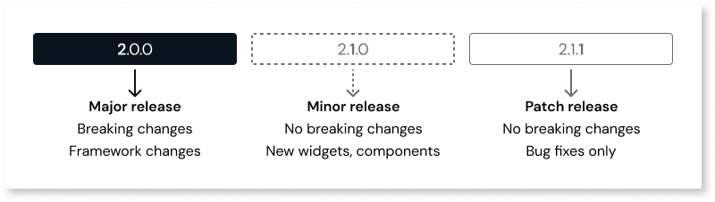
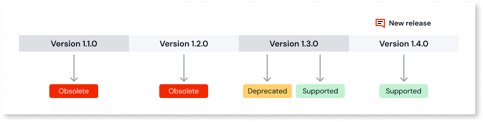

# Mobile UI versioning and lifecycle management

The [Mobile UI framework](https://success.outsystems.com/documentation/outsystems_developer_cloud/building_apps/mobile_apps/mobile_ui_framework/) follows a structured lifecycle management approach to ensure stability, compatibility, and continuous improvement. This article outlines the versioning strategy, support lifecycle, [breaking changes policy](#breaking-changes-policy), and update procedures for the Mobile UI framework.

## Versioning strategy

The Mobile UI framework adheres to [semantic versioning](https://semver.org/) (SemVer) conventions. Each framework release is categorized as a major, minor, or patch version. For detailed information about different versions, refer to the release notes.

The following table summarizes the characteristics and implications of each version type:

| Version type | Description | Breaking changes |
| -------------- | ------------- | ------------------ |
| **Major release** (Example: 2.0.0) | Significant evolution of the framework introducing new framework-wide capabilities and major architecture improvements. | Yes - May require implementation updates |
| **Minor release** (Example: 2.1.0) | Incremental value while maintaining backward compatibility. Includes new widgets, patterns, component capabilities, and additional features. | No - Upgrade without disrupting existing app structure |
| **Patch release** (Example: 2.1.1) | Focuses exclusively on stability and reliability. Includes bug fixes for issues identified in previous versions. | No - Apply immediately for optimal performance |

For a comprehensive list of all notable changes to the Mobile UI framework, refer to the release notes associated with each version.

You must review the release notes carefully before [updating](#updating-mobile-ui-update-ui) to understand the impact on your apps.

The following diagram illustrates how version releases progress from a major release to minor releases and patch releases:

## Mobile UI support lifecycle

To maintain high quality and rapid framework improvement, OutSystems provides active support for a maximum of two minor versions, that is, the latest and the previous versions.

When a new major or minor version is released, the support status shifts:

* The new release becomes **Supported** (latest)
* The previous release becomes **Deprecated**
* Older versions become **Obsolete**

The following diagram illustrates the Mobile UI framework lifecycle:

The following table describes each support status and the actions you should take:

| Support status | Description | Support level | Action required |
| ---------------- | ------------- | --------------- | ------------------ |
| **Supported** | Latest version of the framework | Full support from OutSystems Support, active bug fixes | Recommended for all active development |
| **Deprecated** | Version immediately preceding the latest release | Support requests accepted, bug fixes released as patches in latest minor version | Prepare to upgrade immediately. Becomes obsolete when next major/minor release occurs |
| **Obsolete** | Any version older than the deprecated release | No support requests accepted | Update to latest version for stability and security - platform displays warning message |

OutSystems recommends that you always use the latest Mobile UI version. Staying current provides:

* Immediate access to the newest framework features
* Latest UI widgets and components
* Critical performance improvements
* Maximum compatibility with the broader OutSystems ecosystem
* Support for latest mobile device standards

## Breaking changes policy {#breaking-changes-policy}

OutSystems aims to keep upgrades as smooth as possible.

Understanding how breaking changes are classified helps you plan maintenance effectively.

The following rules determine whether a release contains a breaking change:

* A release contains a breaking change if you must perform manual intervention to fix the app's existing appearance, UI elements, CSS (both framework-provided and custom), standard features, or default behavior.

* A release does not contain a breaking change if manual intervention is only required for custom JavaScript. Custom code exists outside the framework's standard guardrails. Therefore, you are responsible for maintaining and updating custom scripts to remain compatible with the evolving framework.

## Updating Mobile UI {#update-ui}

The update process depends on the current status of your application:

* For new apps, the Mobile UI framework is automatically updated within the platform environment. New apps automatically use the latest available version. This ensures immediate access to the most recent features and fixes

* For apps in development or production, the framework does not automatically update. You will be notified when new versions are available, and you can decide when to update.

OutSystems recommends that you test the new framework version in test environment before committing to production to ensure compatibility. Specific Mobile UI versions may require a minimum ODC Studio version to be fully operational. Always check the release notes for dependencies.

## Related resources

* [Mobile UI framework](https://success.outsystems.com/documentation/outsystems_developer_cloud/building_apps/mobile_apps/mobile_ui_framework/)

* [Mobile UI website](https://mobileui.outsystems.com)
