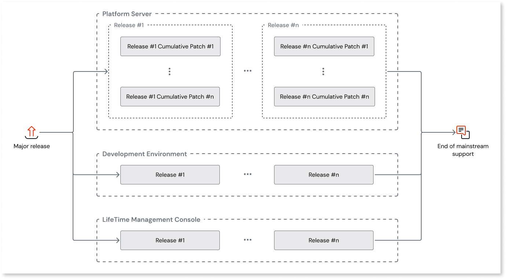
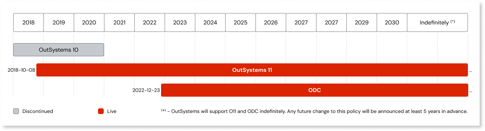

# OutSystems 11 lifecycle and support calendar

At OutSystems, we strive to ensure that our customers can continuously benefit from our latest innovations and features, which truly help to speed up digital transformation. With this goal in mind, we’ve devised a product lifecycle that allows OutSystems to keep our product innovative and up to date with current market trends.
OutSystems Developer Cloud (ODC) is an evergreen platform that is regularly updated with no downtime or impact on customers. OutSystems 11 (O11) is normally upgraded by customer request and follows a well-defined lifecycle policy with releases and cumulative patches.

Our product is updated through several types of releases:

* **Major release** - Since O11 availability in 2018, OutSystems has continuously launched new features, while keeping the same Major release. 

* **Release** - We will periodically release new features in O11. OutSystems informs customers and developers through press releases, [Product Releases and Updates pages](https://www.outsystems.com/product-updates/), community digests, social media posts, and others. All customers’ registered users in OutSystems Community are informed of these changes. 

* **Cumulative patch** - these are mainly focused on bug fixing but may include minor features. This type of release is communicated through release notes published on our website.

You can read more about the types of releases [here](../release-cycle.md).

OutSystems occasionally offers early access to new capabilities through different types of programs, such as technical previews or limited availability. These programs help validate the solution and may come with dedicated support, but aren't meant for production use.

[Learn more about the different types of early access.](../release-cycle.md#early-access)

## End of mainstream support

OutSystems will support O11 and ODC indefinitely. In case of a future change to this policy, (for example, caused by disruptions in the technology stack), OutSystems will notify affected customers at least 5 years in advance of the targeted end-of-support date.

### Support calendar 

The below calendar shows the past, current, and planned dates for OutSystems product mainstream support.

### Installing new releases

OutSystems ecosystem is divided into components with different release cycles. To find out more about each component check [OutSystems tools and components](https://www.outsystems.com/evaluation-guide/architecture/) and for release cycles check [OutSystems Product Releases](../release-cycle.md).

Upgrading to a new release is optional (but recommended) for self-managed customers. For OutSystems 11 Cloud, upgrades can be scheduled and are then [performed by the OutSystems Support team](https://www.outsystems.com/tk/redirect?g=617e2ef6-9fca-4cf0-9840-a0277670083e). In extreme cases, the upgrades may require very small downtimes. 

For Service Studio upgrades, developers are free to update to the latest release as soon as it becomes available, or turn on auto-update.

## Documentation and training updates

The following table shows the different types of documentation and the moments when they're updated:

| | Major release | Release | Cumulative patch |
|---|---|---|---|
| [Training](https://learn.outsystems.com/training) | Updated | Updated | Not applicable1 |
| [Product documentation](https://success.outsystems.com/documentation/) | Updated | Updated | Not applicable1 |
| [Breaking changes](../11/side-effects-breaking-changes.md) | Updated | Updated | Not applicable1 |
| [System requirements](https://www.outsystems.com/tk/redirect?g=244db17a-7a98-4cb0-93c0-db91f1c91fd8) | Updated | Updated | Not applicable1 |
| [Installation checklist](https://www.outsystems.com/downloads/search/11) | Updated | Updated | Updated |
| [Release notes](../intro.md) | Updated | Updated | Updated |
| [Product updates](https://www.outsystems.com/product-updates/) | Updated | Updated | Not applicable1 |

1 Cumulative patches don't introduce changes that require updates to these content types.

