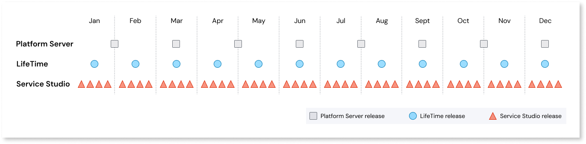

# OutSystems Product releases

At OutSystems, we use a continuous delivery approach, focused on constantly releasing incremental value with minimal disruptions to our customer's operations and business.

## Release terminology applicable to OutSystems 11

As defined below, **Major release**, **Release**, **Cumulative patch**, and **Hotfix** are terms applicable to OutSystems 11 releases of Platform Server and LifeTime.
OutSystems version numbers are a sequence of three numbers, separated by a period, and assigned in ascending order. The version numbering schema is as follows: **Major release**.**Release**.**Cumulative patch** **Build**

### Major release

This type of release introduces significant and important features, along with bug fixes. It can also include breaking changes.
Due to the continuous delivery approach, no further major releases are expected for OutSystems 11. See more at [OutSystems 11 product lifecycle and support calendar](product-lifecycle/product-lifecycle.md).

### Release

A version associated with a Major release that can include new features or significant improvements to current functionalities, along with bug fixes.
Since releases introduce new features, they may also bring low impact breaking changes that will only be introduced if strictly necessary.
This number increases when OutSystems adds functionality to a release in a backward-compatible manner (for example, from Platform Server 11 **.7**._1_, to Platform Server 11 **.8**.0).

### Cumulative patch

Meant to be a patch to an existing release with less impact and risk-free, cumulative patches (CP) introduce minor improvements of current functionalities, and bug fixes. A new cumulative patch does not introduce breaking changes to the associated release.
This number increases when OutSystems makes backward-compatible bug fixes or minor improvements in a release (for example, from Platform Server 11.7 **.1** to 11.7 **.2**).

### Hotfix

Custom product component version built on demand for a specific customer(s) to unblock a critical issue without an acceptable workaround. Hotfixes are private (not publicly available) and delivered to customers via the Product Support team.

## Release terminology applicable to all products { #early-access }

As defined below, **Technical preview**, **Early Access Program**, **Limited Availability**, and **Beta** can apply to both OutSystems 11 and OutSystems Developer Cloud (ODC). The features released under these programs will be free of charge for the duration of the programs.

### Technical preview (TP)

Technical previews (TP) are meant for early validation, to prove a given technology or approach from all perspectives including robustness. Because these are just a preview of the capabilities, they may not be completed, and some quirks may happen from time to time. Capabilities in TP aren't meant for production usage.
TPs are private and limited to customers or partners, who will be invited to participate.
Any program and capability updates will be shared with the participants via email.

### Early Access Program (EAP)

Early Access Programs (EAPs) are managed by OutSystems, providing early access to OutSystems' new capabilities as they roll out.
EAPs are intended to validate the value derived from the complete capability, and the quality of the proposed solution. Even though capabilities are in a more mature state, some quirks may happen from time to time. Capabilities in EAP aren't meant for production usage.
They can be private or public and are limited to interested partners and customers who can be invited and selected to participate.
Information about active Public EAPs will be shared [here](https://www.outsystems.com/eap/).
Any program and capability updates will be shared with the participants mainly via email.

### Limited Availability (LA)

Limited Availability (LA) are programs managed by OutSystems, providing access to OutSystems' new capabilities as they roll out.
LAs are mainly used to get further validation for complex capabilities with production usage.
They are private programs and are limited to specific customers who will be invited to the program.
Any program and capability updates will be shared with the participants via email.

### Beta

Beta releases include a set of capabilities that will soon be released in General Availability. It can be seen as similar to Early Access, but it's related to a specific version as a whole, such as MABS, instead of just a specific feature.

## Release cycles

OutSystems ecosystem is divided into components with different release cycles.

* **Platform Server**: The core server part of OutSystems product. A new version of Platform Server is released twice a quarter and you can check the latest releases [here](https://www.outsystems.com/downloads/search/Platform-Server/11).

* **LifeTime management console**: The web console for DevOps processes. LifeTime is released monthly and you can check the latest releases [here](https://www.outsystems.com/downloads/search/LifeTime/11).

* **Service Studio**: The visual IDE, Service Studio has weekly releases. Check the latest ones [here](https://www.outsystems.com/downloads/search/Service-Studio/11).

* **Supported Forge components**: Components that increase the existing built-in capabilities and can be reused across applications. Each component has its own release cycle. OutSystems components can be found [here](https://www.outsystems.com/forge/list?q=&t=&o=most-popular&tr=False&oss=True&c=%20&a=&v=&hd=False&tn=&scat=forge).

The following products are delivered as Software as a Service over the web and continuously updated and improved:

* **Mobile Apps Build Service**: A cloud service developed by OutSystems that allows the generation of mobile app packages. Check out MABS release history [here](mabs/mabs-versions.md).

* **AI Mentor Studio**: The OutSystems technical debt monitoring tool, delivered as a cloud service. AI Mentor Studio release history can be found [here](https://success.outsystems.com/support/release_notes/ai_mentor_studio/).

* **Builders**: Cloud services to build native experiences, design workflows, and automate processes. These include [Integration Builder](https://success.outsystems.com/support/release_notes/integration_builder/), and [Workflow Builder](https://success.outsystems.com/support/release_notes/workflow_builder/).

The OutSystems solution template for Microsoft Azure Marketplace is updated with new Platform Server and LifeTime versions twice a year.

## Planned dates for OutSystems 11

### Platform Server

<iframe frameborder="0" height="300" marginheight="0" marginwidth="0" scrolling="yes" src="https://release.outsystems.net/ReleaseDashboard/O11PSReleasePlan.aspx" vspace="0" width="800"></iframe>

### LifeTime Management Console

<iframe frameborder="0" height="300" marginheight="0" marginwidth="0" scrolling="yes" src="https://release.outsystems.net/ReleaseDashboard/O11LTReleasePlan.aspx" vspace="0" width="800"></iframe>

### Development Environment

<iframe frameborder="0" height="500" marginheight="0" marginwidth="0" scrolling="yes" src="https://release.outsystems.net/ReleaseDashboard/O11DEReleasePlan.aspx" vspace="0" width="800"></iframe>

