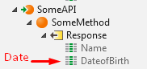
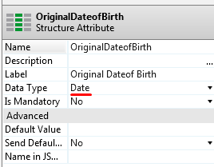

# OutSystems side effects and breaking changes

This document lists the side effects and breaking changes introduced in OutSystems 10 relative to release 9.1.

OutSystems is committed to minimize its customers’ effort when upgrading their installations to a new major release of OutSystems platform.

As such, before introducing a breaking change for a new release, OutSystems carefully analyzes its impact, namely, the expected number of occurrences in its customers’ installations. A breaking change is introduced only if it affects a small number of customers.

## Check Before You Upgrade

1. Be sure to read all the documents that might impact your upgrade. As an example, if you're upgrading from version 8 to 10, read the breaking changes for the versions 9, 9.1, and 10.

1. In version 9.0.1 the encryption algorithm that the OutSystems Platform uses to store the settings in the database was improved and applications in later versions of the OutSystems Platform are not able to read settings stored with the previous algorithm. To avoid downtime in Production environments, when upgrading OutSystems from a revision earlier than 9.0.1 you must do the following:

    1. Perform a full upgrade to the latest 9.0.1 revision.
    1. Validate the functionality of the applications running on OutSystems Platform 9.0.1.
    1. Perform a full upgrade to OutSystems 10.

1. To use the new OutSystems 10 mobile app generation capabilities, you need to download a new license file from [OutSystems Licensing](http://www.outsystems.com/Licensing) and upload the new license file in Service Center (subject to your licensing model).

## Breaking changes

#### Data Types

1\. <a id="bc-1"></a>

**Issue:** Decimal literals on edge cases, where the number can’t be represented as a double (e.g., 823456789123456.3), now don’t lose precision.

**Stack:** .NET, Java

**Rationale:** Decimal literals used to lose precision and behave incoherently. For example, 823456789123456.3 would become 823456789123456 in .NET and 823456789123456.2 in Java. This issue was corrected to make the behavior of Decimal literals coherent and according to user expectation when dealing with Decimal’s precision.

**Workaround:** In situations where the loss of Decimal literal's precision is intended, change the value to remove the precision.

---

2\. <a id="bc-2"></a>

**Issue:** Occurs only in versions earlier than 9.1.601.0. In Lists of basic types (e.g. List of Date, List of Text), the value of List.Current for a new empty List is now the OutSystems default value of the corresponding basic type, instead of C# or Java default value. If you are using the value of List.Current for a new empty List in your logic, you might hit an unexpected behavior.

**Stack:** .NET, Java

**Rationale:** Behavior was incorrect.

**Workaround:** Analyze the code where you are using the value of List.Current for a new empty List of basic types and make the necessary corrections.

---

#### Built-in Functions

3\. <a id="bc-3"></a>

**Issue:** Built-in function TextToTime in Java now returns the Time default value #00:00:00# if the input parameter can't be converted to a valid Time value. E.g., TextToTime("20") would return #20:00:00#, and now returns #00:00:00#.

**Stack:** Java

**Rationale:** Make the behavior in Java consistent with .Net and JavaScript stacks.

**Workaround:** To keep the previous behavior, you must change your application manually.

---

4\. <a id="bc-4"></a>

**Issue:** Built-in functions DecimalToInteger and DecimalToLongInteger in Java now use the round half to even rule. The upgrade process automatically changes existing modules to keep the previous behavior.

**Stack:** Java

**Rationale:** Make the behavior in Java consistent with .Net and JavaScript stacks.

**Workaround:** To keep the previous behavior, use the Trunc built-in function.

---

5\. <a id="bc-5"></a>

**Issue:** Built-in function GetBrowserType was removed.

**Stack:** .NET, Java

**Rationale:** This built-in function is deprecated since version 4.2.

**Workaround:** Use built-in function GetUserAgent instead.

---

6\. <a id="bc-6"></a>

**Issue:** Built-in functions FormatDecimal, FormatCurrency and FormatPercent in Java no longer supports negative decimal places.

**Stack:** Java

**Rationale:** Make the behavior in Java consistent with .Net stack.

**Workaround:** To keep the previous behavior, you must change your application manually.

---

7\. <a id="bc-7"></a>

**Issue:** Decimal and group separators in built-in funcions FormatDecimal, FormatCurrency and FormatPercent now support only one character, which is the first character of the string specified.

**Stack:** .NET

**Rationale:** Make the behavior in .Net consistent with Java stack.

**Workaround:** To keep the previous behavior, create your own format functions.

---

8\. <a id="bc-8"></a>

**Issue:** Built-in function EncodeHtml now encodes also the single quote character. It is encoded to "&#39;".

**Stack:** Java

**Rationale:** Make the behavior in Java consistent with .Net stack. The single quotes are already being encoded in the .NET stack since P9.0 due to an upgrade to .NET Framework 4.

**Workaround:** To keep the previous behavior, replace the "&#39;" back to the single quote character

---

#### Extensions

9\. <a id="bc-9"></a>

**Issue:** .NET Framework 4.6.1 is now the minimum required version to compile the extensions code. Integration Studio will be unable to compile extensions because it can’t find the .NET Framework 4.6.1 reference assemblies.

**Stack:** .NET

**Rationale:** In OutSystems 10, all platform libraries have been upgraded to .NET Framework 4.6.1 to take advantage of the latest features, stability and security improvements. Since extensions code depends on these libraries, the minimum required version to compile them is now version 4.6.1.

**Workaround:** After installing .NET Framework 4.6.1 and upgrading the Development Environment, open the Integration Studio options and configure the new path to the .NET Compiler Tool either manually or by clicking the "Reset Defaults" button.

---

10\. <a id="bc-10"></a>

**Issue:** The name of the classes generated by Integration Studio for the Structures and Entities of your extension will change if you have a Structure/Entity named &lt;A&gt; and also a Structure/Entity named &lt;A&gt;Record or &lt;A&gt;RecordList. In this situation, if you have code in your extension using the previous class names, the extension will fail to publish. This particular scenario is expected to be rare.

**Stack:** .NET, Java

**Rationale:** Avoid name clashing while having a centralized class name that can be used safely in both server-side and client-side code.

**Workaround:** Correct the code of your extension to use the new class names, which usually will have a number appended after the name. For example, "RLExample1RecordList".

---

11\. <a id="bc-11"></a>

**Issue:** An upgraded version of the Newtonsoft.Json library is now included automatically in extensions by Integration Studio and in the generated applications. This can cause some extensions to fail upgrading if the previously included library is not in the /bin folder.

**Stack:** .NET

**Rationale:** The Newtonsoft.Json library is now included in all applications. To allow its usage from extensions and guarantee that the version matches, it is now automatically added in all extensions.

**Workaround:** Open the extensions that fail to upgrade in Integration Studio and correct in Visual Studio the reference to Newtonsoft.Json to use the Newtonsoft.Json.dll present in the /bin folder. It is also recommended to set the "Specific Version" of that reference to False, to avoid future upgrade issues.

Use this query to detect possible extensions with issues:

```sql
select ex.Name, dep.Filename, dep.Path  
from ossys_Extension ex  
inner join ossys_Extension_Dependency dep on ex.Id = dep.Extension_Id and ex.Version_Id = dep.Extension_Version_Id  
where dep.Compile_Action <> 'Ignore'  
and dep.Filename like 'Newtonsoft%'
```

---

12\. <a id="bc-12"></a>

**Issue:** Upgraded versions of the Jackson libraries are now included automatically in extensions by Integration Studio and in the generated applications. Since library files in Java usually include the version numbers in the name this can cause them to be both included causing compilation and runtime problems.

**Stack:** Java

**Rationale:** The Jackson libraries are now included in all applications. To allow its usage from extensions and guarantee that the version matches, it is now automatically added in all extensions.

**Workaround:** Open the extensions that currently include versioned Jackson library files or are outside the /lib folder in Integration Studio, remove the old libraries and change the projects in J2EE IDE to use the distributed libraries that are automatically placed there.

Use this query to detect possible extensions with issues:

```sql
select ex.Name, dep.Filename, dep.Path  
from ossys_Extension ex  
inner join ossys_Extension_Dependency dep on ex.Id = dep.Extension_Id and ex.Version_Id = dep.Extension_Version_Id  
where dep.Compile_Action <> 'Ignore'  
and dep.Filename like 'jackson-core%' and (dep.Filename like '%-2.%' or dep.Path <> '\Source\J2EE\lib\')
```

---

13\. <a id="bc-13"></a>

**Issue:** When integrating with Oracle, the uppercase of column names is no longer performed automatically in runtime when querying the database. Instead, the uppercase of column names is stored in the extension.  
The upgrade process for extensions detects the entities from an Oracle database and updates the extension with the uppercased column name. For this, you must be connected to an environment when upgrading your extension.

**Stack:** .NET, Java

**Rationale:** The behavior changed to support special characters in the column names.

**Workaround:** If an extension isn't yet published in the environment where you are connected during the upgrade process, it won’t be automatically updated. For these cases, open the extension in Integration Studio, refresh the affected entities and republish.

---

14\. <a id="bc-14"></a>

**Issue:** The introspection of entities over linked servers in integration connections with SQL Server is no longer allowed. Existing entities will still work as before, only new ones can't be added.

**Stack:** .NET

**Rationale:** This feature is not supported.

**Workaround:** If the platform is using SQL Server as database, create the linked server in the platform database.

---

#### REST APIs

15\. <a id="bc-15"></a>

**Issue:** When exposing REST APIs, if a decimal number is received in an input attribute of type Integer or Long Integer, a deserialization error is thrown. The previous behavior was to round the decimal value.

**Stack:** Java

**Rationale:** Make the behavior in Java consistent with .NET and with client-side deserialization in JSON nodes.

**Workaround:** Change the attribute type to Decimal or Text.

---

16\. <a id="bc-16"></a>

**Issue:** Previously, when consuming REST APIs that return attributes of type Date, Time or DateTime, parsing errors were being "hidden" and the return attribute was filled with the default value of the corresponding data type. Now when there is a parsing error an exception will be thrown.  
Scenario: You are consuming a REST API that has an output where one of the attributes has the type Date / Time / DateTime.



However, the output from the API is not matching your definition, and is returning a JSON string like this:  
  
`{ "Name": "John", "Date of Birth": "notadate" }`  
  
Previously, there would be no visible error and the DateofBirth attribute of the response would have the default Date value 1900-01-01. With this change, there will be an exception thrown:  
  
`Failed to parse response of the method 'SomeMethod' of the 'SomeAPI' REST API: The value 'notadate' is not valid for Date.`  
  
Note that this only affects scenarios where the attribute has an **invalid** value. If the attribute is not present in the response string, the old behavior is still maintained (attribute gets the default value)

**Stack:** .NET, Java

**Rationale:** Errors were being hidden and there was no distinction between the attribute missing in the response or a wrong response.

**Workaround:** If you are not using the attribute as a Date, Time or DateTime (you don’t need the attribute or you only need it as Text), a simple workaround is to simply delete the attribute (extra attributes in payload are ignored) or change the attribute type to Text.


If you need to use the attribute as a Date (for example in a scenario where the API only sends a valid Date in some requests), a possible workaround is:

1. Change the attribute type to Text (as above).

1. Add a new attribute to the Structure with the same type as the original attribute.  

    

1. After consuming the API, assign to the new attribute the conversion of the text value.  

    

1. If the text is not a valid Date, Time or DateTime, the new attribute will have the corresponding default value, keeping the same behavior as before.

---

#### Database Connections

17\. <a id="bc-17"></a>

**Issue:** Changed the way how connection strings are built for MySQL and iDB2 when the user configures the connection using the Advanced Configuration option:

* Previously if the username and password fields were filled, they weren't being used in the generated connection string. Now they are appended to the string according to the syntax of each DB engine.
* For iDB2 the JDBC prefix ("jdbc:as400://") was missing before and now it is automatically added.

**Stack:** Java

**Rationale:** Make the behavior in Java consistent with .Net and Oracle/SQL Server for Java.

**Workaround:** If a connection stops working, update your configuration by removing the username, password, and prefix from the JDBC URL.

---

#### Security and Authentication

18\. <a id="bc-18"></a>

**Issue:** Hybrid Authentication Mode feature allowed to perform user authentication first through an external authentication plugin, and afterward, if the previous failed, through OutSystems authentication model. This feature has been removed from the platform and also from the plugins ADAuthProvider and LDAPAuthProvider, provided in System Components.

**Stack:** .NET, Java

**Rationale:** This feature had security constraints.

**Workaround:** If you have an external authentication plugin using Hybrid Authentication Mode, you must change your plugin to implement the hybrid behavior.

---

19\. <a id="bc-19"></a>

**Issue:** The error message "Invalid login", thrown by the Users module and by system actions related to login operation, has changed to "Invalid username or password" as well as specific error messages when there are too many failed login attempts.

**Stack:** .NET, Java

**Rationale:** Keep consistency with the error messages thrown by platform management consoles.

**Workaround:** If you are using the previous message hard coded on your code, change your logic to expect the new messages.

---

20\. <a id="bc-20"></a>

**Issue:** The behavior of action GetIP() of extension HTTPRequestHandler changed for requests including the X-Forwarded-For header. Instead of returning the first IP address from the header, now returns the first no-trusted IP address.

**Stack:** .NET, Java

**Rationale:** To prevent brute force attacks from behind proxys/loadbalancers we must look at the X-Forwarded-For header to understand the source of the request. However, this can be easily spoofed. To close this security flaw, we only take into account the X-Forwarded-For header when the request comes from a trusted source.

**Workaround:** When the infrastructure is behind a load balancer, configure its address in the Network Security page in Service Center, using one of the following supported formats, separated by a semicolon (";").

Supported formats:  
192.168.0.0/24  
127.0.0.1  
192.255.0.0-192.255.0.255  
192.168.0.0/255.255.255.0

---

#### Internal Network

21\. <a id="bc-21"></a>

**Issue:** The SOAP web services OutSystemsPlatform, PlatformServices\_v7\_0\_0, PlatformServices\_v8\_0\_0 and Profiler have been set to internal access only.

**Stack:** .NET, Java

**Rationale:** These internal endpoints are used for infrastructure managing purposes only. If the infrastructure has an Internal Network configured, the internal endpoints must also be affected by that configuration.

**Workaround:** If you have an Internal Network configured in your infrastructure and you are using the LifeTime, assure that:

* The Internal Network definition in each environment includes the IP address of the LifeTime;
* The Internal Network definition in the LifeTime includes the IP addresses of all environments.

---

22\. <a id="bc-22"></a>

**Issue:** The Internal Network definition now uses different formats. Some of the previous formats (e.g., specifying an incomplete IP address such as "8.8.") are no longer accepted. The upgrade process automatically changes existing Internal Network configurations to the new formats, which are as follows:

192.168.0.0/24  
127.0.0.1  
192.255.0.0-169.255.0.255  
192.168.0.0/255.255.255.0

The configuration of Internal Network is now executed in the Service Center, under the Environment Security page. If you need to reset the Internal Network configuration of an environment but you can't access the Service Center (e.g., because you entered a configuration that locked you out), you can do it in the Configuration Tool.

**Stack:** .NET, Java

**Rationale:** Improve security and usability of Internal Network configuration.

**Workaround:** In each environment, go to the Service Center and confirm the new Internal Network configuration. Assure that:

* The Internal Network definition in each environment includes the IP address of the LifeTime;
* The Internal Network definition in the LifeTime includes the IP addresses of all environments.

---

#### Factory Configuration

23\. <a id="bc-23"></a>

**Issue:** The library used to apply XSLT for web.config generation was updated. If you use Factory Configuration application and created your own XSLT to customize web.config for your modules, your transformations might fail during 1CP.

The main difference between the two libraries that has impact in our platform is that the old one ignores some errors in the XSLTs definition and proceeds with the transformations, while the new library doesn't apply the transformation at all if one of those errors occur.
To understand if a XSLT has some of the patterns that Microsoft describes as "discretionary behaviors allowed by the XSLT 1.0 recommendation" please check the table at [https://msdn.microsoft.com/en-us/library/yt8dcec2(v=vs.110).aspx](https://msdn.microsoft.com/en-us/library/yt8dcec2(v=vs.110).aspx).

**Stack:** .NET

**Rationale:** Changes in the web.config to support mobile applications were not compatible with the previous library (deprecated since .NET Framework 2.0).

**Workaround:** Rewrite the XSLTs in Factory Configuration that have patterns categorized by Microsoft as "discretionary behaviors allowed by the XSLT 1.0 recommendation".

---

#### OutDoc

24\. <a id="bc-24"></a>

**Issue:** In the XML generated by OutDoc, stylesheet content is now dumped as an attribute of the Theme instead of a child text node.

**Stack:** .NET, Java

**Rationale:** Support TrueChange in CSS.

**Workaround:** If you have tools consuming the generated XML, change them to read the value of the stylesheet from the attribute instead of the child node.

---

### Side Effects

#### Built-in Functions

1\. <a id="se-1"></a>

**Issue:** Date and time format built-in functions were replaced by built-in function FormatDateTime, which allows formatting a Date Time value using the specified format. The upgrade process automatically changes existing modules to keep the previous behavior using built-in function FormatDateTime.

**Stack:** .NET, Java

**Rationale:** Maintain only one generic function.

**Workaround:** None.

---

2\. <a id="se-2"></a>

**Issue:** Built-in function FormatCurrency no longer adds a space between the symbol and the value.

**Stack:** .NET, Java

**Rationale:** Follow most common currency format standard.

**Workaround:** To keep the previous behavior, add a space to the symbol parameter.

---

#### System Actions

3\. <a id="se-3"></a>

**Issue:** System action Audit was renamed to LogMessage. The upgrade process automatically changes existing modules to use the new action name.

**Stack:** .NET, Java

**Rationale:** Make the action name consistent with the performed operation, which is sending a log message to the server.

**Workaround:** None.

---

#### Security

4\. <a id="se-4"></a>

**Issue:** Importing external entities in Integration Studio using a database connection no longer requires to have Reuse&Monitor permissions over the environment. Instead, the user can now have permissions only over the specific database connection.

**Stack:** .NET, Java

**Rationale:** Improve security by increasing permissions granularity.

**Workaround:** None.

---

5\. <a id="se-5"></a>

**Issue:** User_Login action from Users now raises an Invalid Login exception when trying to login with an inactive user, instead of failing silently.

**Stack:** .NET, Java

**Rationale:** Log information regarding the failed login.

**Workaround:** None.

---

#### Meta-Model

6\. <a id="se-6"></a>

**Issue:** Attributes mobilethemeglobalkey and webthemeglobalkey were removed from the meta-model of Applications.

**Stack:** .NET, Java

**Rationale:** Rebuild the meta-model to cope with OutSystems 10 new experience.

**Workaround:** None.

---

7\. <a id="se-7"></a>

**Issue:** The SUs (Software Units) of widgets Editable Tables and Forms are now correctly contributing towards the total SUs of the modules. Upgrades from version 9 and 9.1 will force the recounting of existing elements, causing a potential increase of the SUs for the modules using these elements.

**Stack:** .NET, Java

**Rationale:** Widgets Editable Table and Form were not contributing towards the total SUs of the modules. The behavior was fixed.

**Workaround:** None.

---

#### Service Studio UI

8\. <a id="se-8"></a>

**Issue:** The extended properties of screens and widgets now override the Style property. As a side effect, the preview mode in Service Studio can now have a different result.

**Stack:** .NET, Java

**Rationale:** Get the behavior in design time closer to the behavior in runtime.

**Workaround:** You can force the Style property to have a priority higher than the extended properties in design time by surrounding the extended attribute value with an If expression, since is not possible to evaluate expressions in design time.
