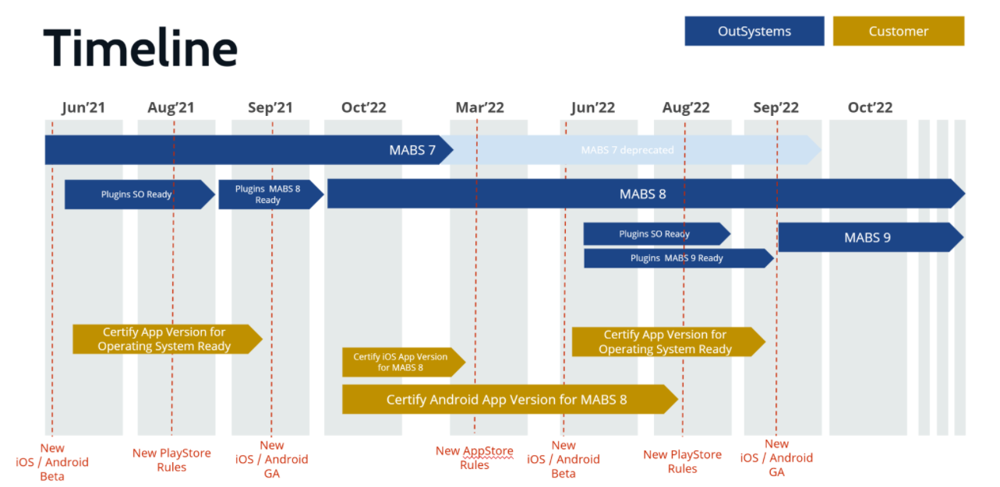

# Support provided for MABS beta versions

OutSystems supports new operating system versions as soon they're released, which, for both Android and iOS, is usually in September. OutSystems releases new software development kits (SDKs) with a new major version for the Mobile Application Build Service (MABS), and from that moment the SDKs are available on supported MABS versions.

In general, this means that customers may need to generate their mobile apps with the new MABS version. In some cases, using a different MABS version may also require an upgrade of Platform Server. For more information about the MABS versions, see the page [Mobile Apps Build Service Versions](https://success.outsystems.com/Support/Release_Notes/Mobile_Apps_Build_Service_Versions).

OutSystems supports:

* Runtime primitives of the platform (widgets, etc.) with the goal of finding and correcting misbehaving primitives
* Supported Forge components, with the goal of testing and fixing misbehaving components

For both runtime primitives and Forge components, OutSystems releases the required updates ahead of the new operating system release. New SDKs become mandatory for publishing mobile apps on the iOS AppStore and Google Play. 

Customers play a part in supporting upcoming versions of mobile operating systems and new SDKs. Mobile applications have at least the following aspects that require customer attention:

 
* **Interaction between different plugins**. Each plugin behaves in a way that can interfere with other plugins, and those interferences may change with the version of the mobile operating system and the new SDKs. It's the customer's responsibility to test their application and to identify misbehaving interactions.

* **Customer-owned plugins**. While OutSystems makes an effort to facilitate all types of integrations, OutSystems can't test non-supported plugins extensively. However, OutSystems user forums provide a good resource for information about the required changes.
 
OutSystems strongly recommends that customers begin testing their apps with the first official public previews of upcoming versions of mobile operating systems. After the release of the first public previews OutSystems begins accepting support requests from customers. However, due to the instability of beta version operating systems, OutSystems can't guarantee a stable mobile offer over those beta versions.

OutSystems also strongly recommends that customers begin testing their apps with the new SDKs as soon as OutSystems releases a new MABS major version. OutSystems begins accepting customer support requests from that moment. The severity levels of those requests are assigned according to the MABS version (beta or stable).

## Example timeline

The following timeline represents an example of the typical mobile development yearly cycle, indicating the work done by OutSystems (in blue), and the expected work from customers (in gold).
 

**June to September**

* iOS and Android beta versions are released. Customers should start validating their apps against those versions to ensure that the apps run properly in the new operating systems before release and general availability.
* OutSystems validates all supported components and releases updates as required.

**September to March/August**

* OutSytems releases a new MABS version along with the new Android and iOS SDKs. All supported components need to be updated to work with the new SDKs.
* Customers should start using the latest MABS version to build mobile apps that can take advantage of the new operating system capabilities, and which are compliant with the upcoming revised AppStore and Google Play guidelines. Any necessary update must be implemented by customers by the time the new store guidelines are mandatory (normally March for AppStore and August for Google Play).
