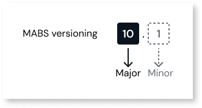
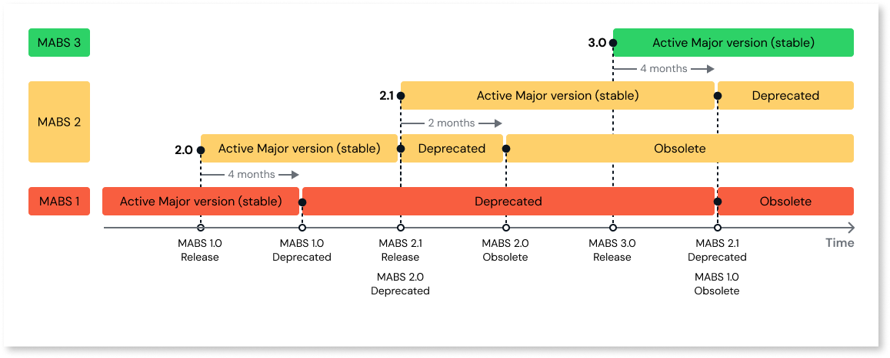

# MABS versioning and lifecycle

## MABS Versioning

OutSystems regularly releases new versions of this cloud service, supporting new mobile stacks and, therefore, newer mobile platform versions.

The MABS lifecycle consists of **major**, **minor**, and patch releases. A major MABS release brings new features and potential breaking changes, while a minor comes with small improvements without breaking changes. Patches are not versioned since they are minor changes, and they can be seen under the release notes for each major version.

OutSystems recommends that OutSystems mobile developers always use the latest MABS version to guarantee access to new features and compatibility with the latest mobile operating systems.

OutSystems marks MABS versions as **Supported**, **Deprecated**, or **Obsolete**:

- **Supported-**  A supported version is typically the latest version available of MABS and will increase the minor version every time a new feature is released to the public.

- **Deprecated**- Versions marked as deprecated don't get new features but still receive security updates. These remain available to customers to use to build their mobile applications.

- **Obsolete**-  When a version reaches the **Obsolete** state, it's no longer available for use in the mobile package creation process.

In some instances, a **Beta** version may also be available. Refer to [Mobile Apps Build Service Versions](mabs-versions.md#beta) for more details.

## MABS Lifecycle

### MABS Major Versions

OutSystems typically releases MABS major versions yearly whenever the main mobile operating systems release a new SDK. Refer to [Support for new mobile operating system](mabs-beta-support.md) versions for more information on this.

Whenever a new MABS Major version is released, the **previous version is deprecated after 4 months**. Whenever OutSystems deprecates the previous version, it moves **older versions to obsolete**.

### MABS Minor Versions

OutSystems can release minor versions of MABS between Major releases whenever there is a justifiable delivery of value to customers.

Minor versions have a slightly different timeline than Major versions. For every new minor release, the **previous minor version is deprecated and becomes obsolete two months later**. In the rare event that OutSystems releases two or more minors in a two-month window, the dates depicted above still stand.

Refer to the timeline of the typical lifecycle for three successive MABS major versions with details for the minor lifecycle in one of these majors.

MABS version numbers on this figure are indicative

The MABS support period is independent of the iOS and Android operating systems support period. OutSystems supports each version of **iOS or Android for a minimum of three years** from the release of the mobile operating system.

Before a new MABS version is stable, OutSystems provides all users with a **Beta** version. This version targets early adopters who are willing to provide feedback and report any issues they encounter while using the new MABS version. New versions of SDKs are initially released under Beta so that customers can adapt early to the changes that come with the latest Android/iOS releases. Refer to [Mobile Apps Build Service Versions](mabs-versions.md) for details on OutSystems' policy regarding new mobile operating system support.

## Setting the MABS version

The **available MABS versions** constitute the group of current Stable and Deprecated versions. You can check the available MABS versions and their corresponding supported mobile stacks in [Mobile Apps Build Service Versions](mabs-versions.md).

You select the MABS version for **each app** and **each mobile platform** at the moment of package creation. You have two options available:

* **Always use the latest version available**. Always use the most recent MABS version available to create the app's mobile package for the current platform and environment.

* **Specific version**: Create mobile app packages in the current environment with the MABS version.

OutSystems recommends using the same MABS version to maintain a consistent mobile app across stages. You use the MABS version to create a mobile package, **and save the app version tag to promote that consistency**. 

The way you select the MABS version differs between OutSystems platforms. For the specificities of each platform, check Setting the MABS version on OutSystems 11 and Setting the MABS version on OutSystems ODC.

## Advantages of using the latest MABS version

OutSystems promptly embraces the latest mobile operating system versions upon their release, typically around September for Android and iOS. When OutSystems introduces a new major version of MABS, it includes support for the new mobile operating systems and SDKs. This enables your mobile app to harness the benefits of enhanced performance, stability, security, and user experience that come with the new versions of operating systems and SDKs.

Customers support upcoming mobile operating system versions and new SDKs, as some compatibility aspects require their attention. For more details refer to [Support for new mobile operating system versions](mabs-beta-support.md).
