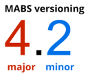

---
summary:
guid: 61CB98BF-3C28-4590-9E19-0C1C7B7F0408
locale: en-us
---

# Mobile Apps Build Service Versions

## MABS and mobile operating systems lifecycles

The MABS support period is independent of the iOS and Android operating systems support period. We support each version of **iOS or Android for a minimum of three years** from the release of the mobile operating system.

The MABS lifecycle consists of major and minor releases. A major MABS release brings big new features and potential breaking changes. A minor comes with small improvements. New features, big or small, are always released as the latest version. This means that, to get the new features, you need to use the latest MABS version.

When we release a new major version, four months after that we deprecate the previous major version and obsolete all other major versions. When a new minor version is released, the previous minor version is deprecated and becomes obsolete in two months.

The change of the MABS version is an optional feature. It’s usually enough to use the default option and let the platform build your mobile apps with the latest MABS version. With this you get the newest stacks, regular updates, and your apps comply with Google Play and Apple Store requirements.

## Beta

See [Support provided for beta versions](mabs-beta-support.md) for more information about the OutSystems policy for supporting new versions of mobile operating systems.

**Version 8.1 (beta)**  - [See Release Notes](https://success.outsystems.com/Support/Release_Notes/Mobile_Apps_Build_Service#MABS_Version_8.1) 
Released on April 6 2022 - Deprecation date to be announced

It’s **MANDATORY** to upgrade all supported plugins to the latest version available on the Forge in order to use MABS 8. For more details, please check the **[release notes](https://success.outsystems.com/Support/Release_Notes/Mobile_Apps_Build_Service#MABS_Version_8.0)**.

This version can run your apps on:

<small> Android 8 to 12   iOS 13 to 15</small>

**More details:**

<table style="width: 632px; table-layout: fixed">
    <tbody class="RegularLightText">
        <tr>
            <td style="width:156px;"></td>
            <td style="width:231px;">Android</td>
            <td>iOS</td>
        </tr>
        <tr>
            <td style="vertical-align:middle;width:156px;">Target SDK</td>
            <td style="width:231px;">12 (API 31) 
            Build Tools 31.0.0 
            Gradle 7.1.1 
            Kotlin 1.5.21 (Default)</td>
            <td>iOS 15 
            Xcode 13.3 
            Cocoa Pods 1.11.2 
            Swift 4, 4.2 and 5.5</td>
        </tr>
        <tr>
            <td style="vertical-align:middle;width:156px;">Cordova CLI</td>
            <td style="width:231px;">10.0.0</td>
            <td>10.0.0</td>
        </tr>
        <tr>
            <td style="vertical-align:middle;width:156px;">Cordova Engine</td>
            <td style="width:231px;">10.1.1</td>
            <td>6.2.0</td>
        </tr>
    </tbody>
</table>

## Supported

You get full support through the support requests for the version, along with the bug fixes for the version.

**Version 8.0**  - [See Release Notes](https://success.outsystems.com/Support/Release_Notes/Mobile_Apps_Build_Service#MABS_Version_8.0) 
Released on April 6 2022 - Deprecation date to be announced

It’s **MANDATORY** to upgrade all supported plugins to the latest version available on the Forge in order to use MABS 8. For more details, please check the **[release notes](https://success.outsystems.com/Support/Release_Notes/Mobile_Apps_Build_Service#MABS_Version_8.0)**.

This version can run your apps on:

<small> Android 8 to 12   iOS 13 to 15</small>

**More details:**

<table style="width: 632px; table-layout: fixed">
    <tbody>
        <tr>
            <td style="width:156px;"></td>
            <td style="width:231px;">Android</td>
            <td>iOS</td>
        </tr>
        <tr>
            <td style="vertical-align:middle;width:156px;">Target SDK</td>
            <td style="width:231px;">12 (API 31) 
            Build Tools 31.0.0 
            Gradle 7.1.1 
            Kotlin 1.5.21 (Default)</td>
            <td>iOS 15 
            Xcode 13.0 
            Cocoa Pods 1.11.2 
            Swift 4, 4.2 and 5.5</td>
        </tr>
        <tr>
            <td style="vertical-align:middle;width:156px;">Cordova CLI</td>
            <td style="width:231px;">10.0.0</td>
            <td>10.0.0</td>
        </tr>
        <tr>
            <td style="vertical-align:middle;width:156px;">Cordova Engine</td>
            <td style="width:231px;">10.1.1</td>
            <td>6.2.0</td>
        </tr>
    </tbody>
</table>

## Deprecated

You can select the version in the configuration and build apps with it, but you get limited support. Limited support means that you get advice and workarounds through the support requests, but there are no bug fixes for the version.

**Version 7.2**  - [See Release Notes](https://success.outsystems.com/Support/Release_Notes/Mobile_Apps_Build_Service#MABS_Version_7.2) 
Released on Oct 7 2021 Deprecated on Mar 24 2022  
Obsolete date to be announced

This version can run your apps on:

<small> Android 6 to 12   iOS 12 to 15</small>

**More details:**

<table style="width: 632px; table-layout: fixed">
    <tbody>
        <tr>
            <td style="width:156px;"></td>
            <td style="width:231px;">Android</td>
            <td>iOS</td>
        </tr>
        <tr>
            <td style="vertical-align:middle;width:156px;">Target SDK</td>
            <td style="width:231px;">11 (API 30) 
            Build Tools 30.0.0 
            Gradle 6.5.0 
            Kotlin 1.3.50 (Default)</td>
            <td>iOS 14 
            Xcode 12.2 
            Cocoa Pods 1.10.0 
            Swift 4, 4.2 and 5.3</td>
        </tr>
        <tr>
            <td style="vertical-align:middle;width:156px;">Cordova CLI</td>
            <td style="width:231px;">10.0.0</td>
            <td>10.0.0</td>
        </tr>
        <tr>
            <td style="vertical-align:middle;width:156px;">Cordova Engine</td>
            <td style="width:231px;">9.0.0</td>
            <td>6.1.1</td>
        </tr>
    </tbody>
</table>

**Version 5.2**  - [See Release Notes](https://success.outsystems.com/Support/Release_Notes/Mobile_Apps_Build_Service#MABS_Version_5.2) 
Released on Dec 26 2019 Deprecated on May 20 2020  
Obsolete date to be announced

This version can run your apps on:

<small> Android 5.0 to 10.0   iOS 10.0 to 13.3</small>

**More details:**

<table style="width: 632px; table-layout: fixed">
    <tbody>
        <tr>
            <td style="width:156px;"></td>
            <td style="width:231px;">Android</td>
            <td>iOS</td>
        </tr>
        <tr>
            <td style="vertical-align:middle;width:156px;">Target SDK</td>
            <td style="width:231px;">9 (API 28) 
            Build Tools 28.0.3 
            Gradle 4.10.3</td>
            <td>iOS 12 
            Xcode 10.1 
            Cocoa Pods 1.3.1</td>
        </tr>
        <tr>
            <td style="vertical-align:middle;width:156px;">Cordova CLI</td>
            <td style="width:231px;">7.1.0</td>
            <td>7.1.0</td>
        </tr>
        <tr>
            <td style="vertical-align:middle;width:156px;">Cordova Engine</td>
            <td style="width:231px;">8.0.0</td>
            <td>4.5.5</td>
        </tr>
        <tr>
            <td style="vertical-align:middle;width:156px;">Recommended Specifications</td>
            <td style="width:231px;">RAM: 2 GB or more; 
            CPU: Dual-Core 1.2 GHz or better; 
            OS: Android 5.0 or later.</td>
            <td>iPhone 5S or later models</td>
        </tr>
    </tbody>
</table>

## Obsolete

This version is no longer available, and you cannot build apps with it. The support requests about an obsolete version are not answered.

**Version 6.3**  - [See Release Notes](https://success.outsystems.com/Support/Release_Notes/Mobile_Apps_Build_Service#MABS_Version_6.3) <small>
Released on Sep 23 2020 Deprecated on May 26 2021 Obsolete on Jan 5 2022</small>

This version can run your apps on:

<small> Android 5.0 to 11.0   iOS 11.0 to 14.5</small>

**More details:**

<table style="width: 632px; table-layout: fixed">
    <tbody>
        <tr>
            <td style="width:156px;"></td>
            <td style="width:231px;">Android</td>
            <td>iOS</td>
        </tr>
        <tr>
            <td style="vertical-align:middle;width:156px;">Target SDK</td>
            <td style="width:231px;">10 (API 29) 
            Build Tools 29.0.2 
            Gradle 5.4.1 </td>
            <td>iOS 13 
            Xcode 11.1 
            Cocoa Pods 1.7.5 
            Swift Version 5.1</td>
        </tr>
        <tr>
            <td style="vertical-align:middle;width:156px;">Cordova CLI</td>
            <td style="width:231px;">7.1.0</td>
            <td>7.1.0</td>
        </tr>
        <tr>
            <td style="vertical-align:middle;width:156px;">Cordova Engine</td>
            <td style="width:231px;">8.1.0</td>
            <td>5.1.1</td>
        </tr>
        <tr>
            <td style="vertical-align:middle;width:156px;">Recommended Specifications</td>
            <td style="width:231px;">RAM: 2 GB or more; 
            CPU: Dual-Core 1.2 GHz or better; 
            OS: Android 5.0 or later.</td>
            <td>iPhone 5S or later models</td>
        </tr>
    </tbody>
</table>

**Version 7.1**  - [See Release Notes](https://success.outsystems.com/Support/Release_Notes/Mobile_Apps_Build_Service#MABS_Version_7.1) <small>
Released on Jun 16 2021 Deprecated on Oct 07 2021 Obsolete on Dec 13 2021</small>

This version can run your apps on:

<small> Android 6.0 to 12.0   iOS 12.0 to 15.0</small>

**More details:**

<table style="width: 632px; table-layout: fixed">
    <tbody>
        <tr>
            <td style="width:156px;"></td>
            <td style="width:231px;">Android</td>
            <td>iOS</td>
        </tr>
        <tr>
            <td style="vertical-align:middle;width:156px;">Target SDK</td>
            <td style="width:231px;">11 (API 30) 
            Build Tools 30.0.0 
            Gradle 6.5.0 </td>
            <td>iOS 14 
            Xcode 12.2 
            Cocoa Pods 1.10.0 
            Swift Version 5.3</td>
        </tr>
        <tr>
            <td style="vertical-align:middle;width:156px;">Cordova CLI</td>
            <td style="width:231px;">10.0.0</td>
            <td>10.0.0</td>
        </tr>
        <tr>
            <td style="vertical-align:middle;width:156px;">Cordova Engine</td>
            <td style="width:231px;">9.0.0</td>
            <td>6.1.1</td>
        </tr>
        <tr>
            <td style="vertical-align:middle;width:156px;">Recommended Specifications</td>
            <td style="width:231px;">RAM: 2 GB or more; 
            CPU: Dual-Core 1.2 GHz or better; 
            OS: Android 6.0 or later.</td>
            <td>iPhone 5S or later models</td>
        </tr>
    </tbody>
</table>

**Version 7.0**  - [See Release Notes](https://success.outsystems.com/Support/Release_Notes/Mobile_Apps_Build_Service#MABS_Version_7.0) <small>
Released on Dec 09 2020 Deprecated on Jul 14 2021 Obsolete on Sep 15 2021</small>

This version can run your apps on:

<small> Android 6.0 to 12.0   iOS 12.0 to 14.6</small>

**More details:**

<table style="width: 632px; table-layout: fixed">
    <tbody>
        <tr>
            <td style="width:156px;"></td>
            <td style="width:231px;">Android</td>
            <td>iOS</td>
        </tr>
        <tr>
            <td style="vertical-align:middle;width:156px;">Target SDK</td>
            <td style="width:231px;">11 (API 30) 
            Build Tools 30.0.0 
            Gradle 6.5.0 </td>
            <td>iOS 14 
            Xcode 12.2 
            Cocoa Pods 1.10.0 
            Swift Version 5.3</td>
        </tr>
        <tr>
            <td style="vertical-align:middle;width:156px;">Cordova CLI</td>
            <td style="width:231px;">10.0.0</td>
            <td>10.0.0</td>
        </tr>
        <tr>
            <td style="vertical-align:middle;width:156px;">Cordova Engine</td>
            <td style="width:231px;">9.0.0</td>
            <td>6.1.1</td>
        </tr>
        <tr>
            <td style="vertical-align:middle;width:156px;">Recommended Specifications</td>
            <td style="width:231px;">RAM: 2 GB or more; 
            CPU: Dual-Core 1.2 GHz or better; 
            OS: Android 6.0 or later.</td>
            <td>iPhone 5S or later models</td>
        </tr>
    </tbody>
</table>

**Version 6.2**  - [See Release Notes](https://success.outsystems.com/Support/Release_Notes/Mobile_Apps_Build_Service#MABS_Version_6.2) <small>
Released on Jun 08 2020 Deprecated on Nov 03 2020 Obsolete on Dec 21 2020</small>

This version can run your apps on:

<small> Android 5.0 to 11.0   iOS 11.0 to 14.0</small>

**More details:**

<table style="width: 632px; table-layout: fixed">
    <tbody>
        <tr>
            <td style="width:156px;"></td>
            <td style="width:231px;">Android</td>
            <td>iOS</td>
        </tr>
        <tr>
            <td style="vertical-align:middle;width:156px;">Target SDK</td>
            <td style="width:231px;">10 (API 29) 
            Build Tools 29.0.2 
            Gradle 5.4.1 </td>
            <td>iOS 13 
            Xcode 11.1 
            Cocoa Pods 1.7.5 
            Swift Version 5.1</td>
        </tr>
        <tr>
            <td style="vertical-align:middle;width:156px;">Cordova CLI</td>
            <td style="width:231px;">7.1.0</td>
            <td>7.1.0</td>
        </tr>
        <tr>
            <td style="vertical-align:middle;width:156px;">Cordova Engine</td>
            <td style="width:231px;">8.1.0</td>
            <td>5.1.1</td>
        </tr>
        <tr>
            <td style="vertical-align:middle;width:156px;">Recommended Specifications</td>
            <td style="width:231px;">RAM: 2 GB or more; 
            CPU: Dual-Core 1.2 GHz or better; 
            OS: Android 5.0 or later.</td>
            <td>iPhone 5S or later models</td>
        </tr>
    </tbody>
</table>

**Version 6.1**  - [See Release Notes](https://success.outsystems.com/Support/Release_Notes/Mobile_Apps_Build_Service#MABS_Version_6.1) <small>
Released on Feb 12 2020 Deprecated on Aug 12 2020 Obsolete on Sep 08 2020</small>

This version can run your apps on:

<small> Android 5.0 to 10.0   iOS 11.0 to 13.3</small>

**More details:**

<table style="width: 632px; table-layout: fixed">
    <tbody>
        <tr>
            <td style="width:156px;"></td>
            <td style="width:231px;">Android</td>
            <td>iOS</td>
        </tr>
        <tr>
            <td style="vertical-align:middle;width:156px;">Target SDK</td>
            <td style="width:231px;">10 (API 29) 
            Build Tools 29.0.2 
            Gradle 5.4.1 </td>
            <td>iOS 13 
            Xcode 11.1 
            Cocoa Pods 1.7.5 
            Swift Version 5.1</td>
        </tr>
        <tr>
            <td style="vertical-align:middle;width:156px;">Cordova CLI</td>
            <td style="width:231px;">7.1.0</td>
            <td>7.1.0</td>
        </tr>
        <tr>
            <td style="vertical-align:middle;width:156px;">Cordova Engine</td>
            <td style="width:231px;">8.1.0</td>
            <td>5.1.1</td>
        </tr>
        <tr>
            <td style="vertical-align:middle;width:156px;">Recommended Specifications</td>
            <td style="width:231px;">RAM: 2 GB or more; 
            CPU: Dual-Core 1.2 GHz or better; 
            OS: Android 5.0 or later.</td>
            <td>iPhone 5S or later models</td>
        </tr>
    </tbody>
</table>

**Version 6.0**  - [See Release Notes](https://success.outsystems.com/Support/Release_Notes/Mobile_Apps_Build_Service#MABS_Version_6.0) <small>
Released on Jan 02 2020 Deprecated on Mar 06 2020 Obsolete on May 07 2020</small>

This version can run your apps on:

<small> Android 5.0 to 10.0   iOS 11.0 to 13.3</small>

**More details:**

<table style="width: 632px; table-layout: fixed">
    <tbody>
        <tr>
            <td style="width:156px;"></td>
            <td style="width:231px;">Android</td>
            <td>iOS</td>
        </tr>
        <tr>
            <td style="vertical-align:middle;width:156px;">Target SDK</td>
            <td style="width:231px;">10 (API 29) 
            Build Tools 29.0.2 
            Gradle 5.4.1 </td>
            <td>iOS 13 
            Xcode 11.1 
            Cocoa Pods 1.7.5 
            Swift Version 4.0, 4.2, 5.0</td>
        </tr>
        <tr>
            <td style="vertical-align:middle;width:156px;">Cordova CLI</td>
            <td style="width:231px;">7.1.0</td>
            <td>7.1.0</td>
        </tr>
        <tr>
            <td style="vertical-align:middle;width:156px;">Cordova Engine</td>
            <td style="width:231px;">8.1.0</td>
            <td>5.0.1</td>
        </tr>
        <tr>
            <td style="vertical-align:middle;width:156px;">Recommended Specifications</td>
            <td style="width:231px;">RAM: 2 GB or more; 
            CPU: Dual-Core 1.2 GHz or better; 
            OS: Android 5.0 or later.</td>
            <td>iPhone 5S or later models</td>
        </tr>
    </tbody>
</table>

**Version 5.1**  - [See Release Notes](https://success.outsystems.com/Support/Release_Notes/Mobile_Apps_Build_Service#MABS_Version_5.1) <small>
Released on Nov 07 2019 Deprecated on Jan 09 2020 Obsolete on Mar 09 2020</small>

This version can run your apps on:

<small> Android 5.0 to 10.0   iOS 10.0 to 13.3</small>

**More details:**

<table style="width: 632px; table-layout: fixed">
    <tbody>
        <tr>
            <td style="width:156px;"></td>
            <td style="width:231px;">Android</td>
            <td>iOS</td>
        </tr>
        <tr>
            <td style="vertical-align:middle;width:156px;">Target SDK</td>
            <td style="width:231px;">9 (API 28) 
            Build Tools 28.0.3 
            Gradle 4.10.3 </td>
            <td>iOS 12 
            Xcode 10.1 
            Cocoa Pods 1.3.1</td>
        </tr>
        <tr>
            <td style="vertical-align:middle;width:156px;">Cordova CLI</td>
            <td style="width:231px;">7.1.0</td>
            <td>7.1.0</td>
        </tr>
        <tr>
            <td style="vertical-align:middle;width:156px;">Cordova Engine</td>
            <td style="width:231px;">8.0.0</td>
            <td>4.5.5</td>
        </tr>
        <tr>
            <td style="vertical-align:middle;width:156px;">Recommended Specifications</td>
            <td style="width:231px;">RAM: 2 GB or more; 
            CPU: Dual-Core 1.2 GHz or better; 
            OS: Android 5.0 or later.</td>
            <td>iPhone 5S or later models</td>
        </tr>
    </tbody>
</table>

**Version 5.0**  - [See Release Notes](https://success.outsystems.com/Support/Release_Notes/Mobile_Apps_Build_Service#MABS_Version_5.0) <small>
Released on Jun 03 2019 Deprecated on Dec 17 2019 Obsolete on Feb 17 2020</small>

This version can run your apps on:

<small> Android 5.0 to 10.0   iOS 10.0 to 13.1</small>

**More details:**

<table style="width: 632px; table-layout: fixed">
    <tbody>
        <tr>
            <td style="width:156px;"></td>
            <td style="width:231px;">Android</td>
            <td>iOS</td>
        </tr>
        <tr>
            <td style="vertical-align:middle;width:156px;">Target SDK</td>
            <td style="width:231px;">9 (API 28) 
            Build Tools 28.0.3 
            Gradle 4.10.3 </td>
            <td>iOS 12 
            Xcode 10.1 
            Cocoa Pods 1.3.1</td>
        </tr>
        <tr>
            <td style="vertical-align:middle;width:156px;">Cordova CLI</td>
            <td style="width:231px;">7.1.0</td>
            <td>7.1.0</td>
        </tr>
        <tr>
            <td style="vertical-align:middle;width:156px;">Cordova Engine</td>
            <td style="width:231px;">8.0.0</td>
            <td>4.5.5</td>
        </tr>
        <tr>
            <td style="vertical-align:middle;width:156px;">Recommended Specifications</td>
            <td style="width:231px;">RAM: 2 GB or more; 
            CPU: Dual-Core 1.2 GHz or better; 
            OS: Android 5.0 or later.</td>
            <td>iPhone 5S or later models</td>
        </tr>
    </tbody>
</table>

**Version 4.2**  - [See Release Notes](https://success.outsystems.com/Support/Release_Notes/Mobile_Apps_Build_Service#MABS_Version_4.2) <small>
Released on Apr 08 2019 Deprecated on Oct 01 2019 Obsolete on Mar 02 2020</small>

This version can run your apps on:

<small> Android 4.4 to 9.0   iOS 10.0 to 13.0</small>

**More details:**

<table style="width: 632px; table-layout: fixed">
    <tbody>
        <tr>
            <td style="width:156px;"></td>
            <td style="width:231px;">Android</td>
            <td>iOS</td>
        </tr>
        <tr>
            <td style="vertical-align:middle;width:156px;">Target SDK</td>
            <td style="width:231px;">8 (API 26) 
            Build Tools 26.0.2 
            Gradle 4.9 </td>
            <td>iOS 12 
            Xcode 10.1 
            Cocoa Pods 1.3.1</td>
        </tr>
        <tr>
            <td style="vertical-align:middle;width:156px;">Cordova CLI</td>
            <td style="width:231px;">7.1.0</td>
            <td>7.1.0</td>
        </tr>
        <tr>
            <td style="vertical-align:middle;width:156px;">Cordova Engine</td>
            <td style="width:231px;">6.4.0</td>
            <td>4.5.5</td>
        </tr>
        <tr>
            <td style="vertical-align:middle;width:156px;">Recommended Specifications</td>
            <td style="width:231px;">RAM: 2 GB or more; 
            CPU: Dual-Core 1.2 GHz or better; 
            OS: Android 5.0 or later.</td>
            <td>iPhone 5S or later models</td>
        </tr>
    </tbody>
</table>

**Version 4.1**  - [See Release Notes](https://success.outsystems.com/Support/Release_Notes/Mobile_Apps_Build_Service#MABS_Version_4.1) <small>
Released on Mar 20 2019 Deprecated on Jun 10 2019 Obsolete on Aug 12 2019</small>

This version can run your apps on:

<small> Android 4.4 to 9.0   iOS 10.0 to 12.1</small>

**More details:**

<table style="width: 632px; table-layout: fixed">
    <tbody>
        <tr>
            <td style="width:156px;"></td>
            <td style="width:231px;">Android</td>
            <td>iOS</td>
        </tr>
        <tr>
            <td style="vertical-align:middle;width:156px;">Target SDK</td>
            <td style="width:231px;">8 (API 26) 
            Build Tools 26.0.2 
            Gradle 4.9 </td>
            <td>iOS 12 
            Xcode 10.1 
            Cocoa Pods 1.3.1</td>
        </tr>
        <tr>
            <td style="vertical-align:middle;width:156px;">Cordova CLI</td>
            <td style="width:231px;">7.1.0</td>
            <td>7.1.0</td>
        </tr>
        <tr>
            <td style="vertical-align:middle;width:156px;">Cordova Engine</td>
            <td style="width:231px;">6.4.0</td>
            <td>4.5.5</td>
        </tr>
        <tr>
            <td style="vertical-align:middle;width:156px;">Recommended Specifications</td>
            <td style="width:231px;">RAM: 2 GB or more; 
            CPU: Dual-Core 1.2 GHz or better; 
            OS: Android 5.0 or later.</td>
            <td>iPhone 5S or later models</td>
        </tr>
    </tbody>
</table>

**Version 4.0**  - [See Release Notes](https://success.outsystems.com/Support/Release_Notes/Mobile_Apps_Build_Service#MABS_Version_4.0) <small>
Released on Jan 21 2019 Deprecated on May 20 2019 Obsolete on Jul 23 2019</small>

This version can run your apps on:

<small> Android 4.4 to 9.0   iOS 10.0 to 12.1</small>

**More details:**

<table style="width: 632px; table-layout: fixed">
    <tbody>
        <tr>
            <td style="width:156px;"></td>
            <td style="width:231px;">Android</td>
            <td>iOS</td>
        </tr>
        <tr>
            <td style="vertical-align:middle;width:156px;">Target SDK</td>
            <td style="width:231px;">8 (API 26) 
            Build Tools 26.0.2 
            Gradle 4.9 </td>
            <td>iOS 12 
            Xcode 10.1 
            Cocoa Pods 1.3.1</td>
        </tr>
        <tr>
            <td style="vertical-align:middle;width:156px;">Cordova CLI</td>
            <td style="width:231px;">7.1.0</td>
            <td>7.1.0</td>
        </tr>
        <tr>
            <td style="vertical-align:middle;width:156px;">Cordova Engine</td>
            <td style="width:231px;">6.4.0</td>
            <td>4.5.5</td>
        </tr>
        <tr>
            <td style="vertical-align:middle;width:156px;">Recommended Specifications</td>
            <td style="width:231px;">RAM: 2 GB or more; 
            CPU: Dual-Core 1.2 GHz or better; 
            OS: Android 5.0 or later.</td>
            <td>iPhone 5S or later models</td>
        </tr>
    </tbody>
</table>

**Version 3.3**  - [See Release Notes](https://success.outsystems.com/Support/Release_Notes/Mobile_Apps_Build_Service#MABS_Version_3.3) <small>
Released on Dec 19 2018 Deprecated on Nov 18 2019 Obsolete on Jan 04 2021</small>

This version can run your apps on:

<small> Android 4.4 to 9.0   iOS 8.0 to 12.4</small>

**More details:**

<table style="width: 632px; table-layout: fixed">
    <tbody>
        <tr>
            <td style="width:156px;"></td>
            <td style="width:231px;">Android</td>
            <td>iOS</td>
        </tr>
        <tr>
            <td style="vertical-align:middle;width:156px;">Target SDK</td>
            <td style="width:231px;">8 (API 26) 
            Build Tools 26.0.2 
            Gradle 4.9 </td>
            <td>iOS 11 
            Xcode 9.2 
            Cocoa Pods 1.3.1</td>
        </tr>
        <tr>
            <td style="vertical-align:middle;width:156px;">Cordova CLI</td>
            <td style="width:231px;">7.1.0</td>
            <td>7.1.0</td>
        </tr>
        <tr>
            <td style="vertical-align:middle;width:156px;">Cordova Engine</td>
            <td style="width:231px;">6.4.0</td>
            <td>4.3.1</td>
        </tr>
        <tr>
            <td style="vertical-align:middle;width:156px;">Recommended Specifications</td>
            <td style="width:231px;">RAM: 2 GB or more; 
            CPU: Dual-Core 1.2 GHz or better; 
            OS: Android 5.0 or later.</td>
            <td>iPhone 5S or later models</td>
        </tr>
    </tbody>
</table>
