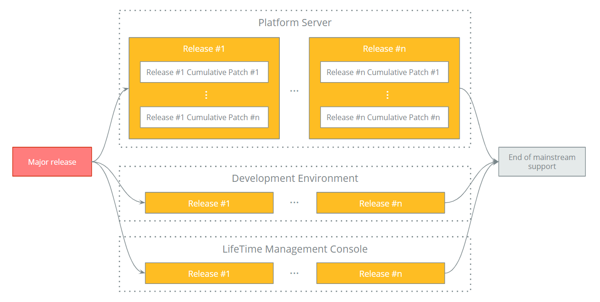

# OutSystems Product Lifecycle and Support calendar

At OutSystems we strive to ensure that our customers can continuously benefit from our latest innovations and features that truly help to speed up the digital transformation processes. With this goal in mind, we've devised a product lifecycle that allows OutSystems to keep our product innovative and up to date with current market trends.

Our product may be updated through several types of releases:

* **Major release** - a new major version of the product is announced through extensive marketing campaigns including, press releases, [Product Releases and Updates pages](https://www.outsystems.com/product-updates/) on our website, keynote announcements on NextStep, and other OutSystems events.

* **Release** -  within for each product major version, we will periodically release new features. OutSystems will inform customers and developers through community digests and social media posts. All customers’ registered users in OutSystems Community are informed of these changes. Additionally, depending on what's being launched, there might be a specific landing page to support the release, release videos and/or blog posts related to the subject. This type of release occurs whenever something new is added to our product offering. The added value may be in the form of a new supported integration, new supported stack, new security offering, or a new feature.

* **Cumulative patch** - these are mainly focused on bug fixing but may include minor features. This type of release is usually communicated through release notes published on our website.

## Early access programs

Major launches typically include an Early Access Program (EAP). The program duration will depend on the scope of the launch and the specific program objectives. Customers are invited to participate in an EAP, depending on pre-defined eligibility criteria. During the EAP, OutSystems has dedicated resources (Support, Engineering, Training) to enable and support the customer. OutSystems may provide additional infrastructure resources while the program is in place (for example, to run in parallel with the existing infrastructure).

## Installing new releases

### Upgrades to a new major release

Upgrading to a new major release is optional (but recommended) for self-managed customers. For OutSystems Cloud, upgrades can be scheduled and are then performed by the OutSystems Support team. Upgrades in OutSystems Cloud installations will be mandatory once the installed version reaches the end of the support window. In extreme cases, the upgrades may require very small downtimes. Pragmatic instructions for this process are provided in our [documentation](https://success.outsystems.com/Support/Enterprise_Customers/Upgrading/01_Upgrade_OutSystems_Platform). OutSystems can provide [services to assist with the upgrade](https://www.outsystems.com/evaluation-guide/professional-services).

Personal environments and enterprise trials will be upgraded to the latest major release as soon as possible.

### Upgrades to a new release or cumulative patch

Upgrading to a new release or cumulative patch are optional (but recommended) for self-managed customers. OutSystems Cloud installations are handled by our operations with no downtime. Update instructions are available in the [installation checklist](https://www.outsystems.com/Downloads/search/). OutSystems can provide [services to assist with the upgrade](https://www.outsystems.com/evaluation-guide/professional-services).

For Development Environment upgrades, developers are free to update to the latest release as soon as it becomes available.

The OutSystems free offers will be updated to the latest release as soon as possible.

## End of mainstream support

### How is it announced?

At OutSystems we are committed to supporting our customers and minimizing the impact of upgrades to new releases. We support each version of our product for a minimum of 2 years from the date of commercial release.

End of support for specific product versions is managed directly with customers. Customers using a product version approaching the end of support are notified at least 1 year before the targeted end of support date, and periodically from there until the final date. If the customer is using OutSystems Cloud, our teams will engage the customer and prepare a migration plan. Please read more about our end of mainstream support [here](https://www.outsystems.com/legal/success/support-terms-and-service-level-agreements-sla-of-the-outsystems-software/#end-of-support-for-older-software-versions).

For discontinued versions, it might be necessary to have some downtime; therefore we advise continuously upgrading to the latest release as soon as possible, which heavily reduces the risk for potential downtime. In any instance, OutSystems may provide specialized migration services.

### What is the support calendar for OutSystems releases? 

The below calendar shows the past, current, and planned dates for OutSystems product mainstream support.

## Documentation and training updates

The following table shows the different types of documentation and the moments when they're updated:

| | Major release | Release | Cumulative patch |
|---|---|---|---|
| [Training](https://www.outsystems.com/learn) | Updated | Updated | Not updated |
| [Product documentation](https://success.outsystems.com/Documentation) | Updated | Updated | Not updated |
| [Breaking changes](https://success.outsystems.com/Support/Archive/11/OutSystems_Platform_side_effects_and_breaking_changes) | Updated | Updated | Not updated |
| [System requirements](https://success.outsystems.com/Documentation/11/Setting_Up_OutSystems/OutSystems_system_requirements) | Updated | Updated | Not updated |
| [Installation checklist](https://www.outsystems.com/Downloads/search/) | Updated | Updated | Not updated |
| [Release notes](https://success.outsystems.com/Support/Release_Notes) | Updated | Updated | Updated |
| [Product updates](https://www.outsystems.com/product-updates/) | Updated | Updated | Updated |

## Product release model

OutSystems ecosystem is divided into components with different release cycles. To find out more about each component check [OutSystems tools and components](https://www.outsystems.com/evaluation-guide/development-and-management-tools) and for release cycles check [OutSystems Product Releases](https://success.outsystems.com/Support/Enterprise_Customers/Upgrading/OutSystems_Release_Cycle).
