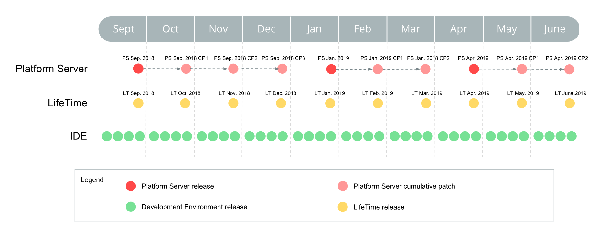

# OutSystems Product Releases

At OutSystems, we use a continuous delivery approach, focused on constantly releasing incremental value with minimal disruptions to our customer's operations and business.

## Release terminology

### Major release

This type of release introduces significant and important features, along with bug fixes. It can also include breaking changes.
Due to the continuous delivery approach, this type of release is very infrequent. It only occurs when it's necessary to improve previous models and paradigms of usage.
When these releases are required, OutSystems goes to great lengths to minimize the effort of upgrading, including providing tools, services, and training so that you can easily upgrade in a timely and controlled risk-free way. When that time comes, OutSystems will issue a one-year advance notice for the end of support of OutSystems 11, so that you can easily upgrade in a timely and controlled way.

### Release 

A version associated with a Major release that can include new features or significant improvements to current functionalities, along with bug fixes.
Since releases introduce new features, they may also bring low impact breaking changes that will only be introduced if strictly necessary.

### Cumulative patch

Meant to be a patch to an existing release with less impact and risk-free, cumulative patches (CP) introduce minor improvements of current functionalities, and bug fixes. A new cumulative patch does not introduce breaking changes to the associated release.

### Hotfix

Custom product component version built on demand for a specific customer(s) to unblock a critical issue without an acceptable workaround. Hotfixes are private (not publicly available) and delivered to customers via the Product Support team.

### Early access program (EAP)

EAP's are programs managed by OutSystems, providing early access to OutSystems new capabilities as they roll out. Links to these capabilities will be shared periodically in the community and via email. Only a set of selected customers are onboarded to these programs, check the available EAP's [here](https://www.outsystems.com/eap).

### Beta

Currently, Beta releases apply only to [Service Studio](https://www.outsystems.com/home/beta) and [MABS](https://success.outsystems.com/Documentation/11/Delivering_Mobile_Apps/Mobile_Apps_Build_Service) and include a set of capabilities that will soon be released in General Availability. It can be seen as similar to Early Access, but it's related to a specific version of the product as a whole, instead of just a specific feature.

### Technical preview

Technical previews offered by OutSystems are meant to prove a given technology or approach from all perspectives including robustness and fit to customers’ use cases. Because these are just a preview of the features, some quirks may happen from time to time. Features in technical preview were previously called Early Access Feature. Check what features OutSystems has in technical preview [here](https://success.outsystems.com/Support/Enterprise_Customers/Upgrading/Technical_Preview_features#Features_in_Technical_Preview).

## Release cycles

OutSystems ecosystem is divided into components with different release cycles.

* **Platform Server** - The core server part of OutSystems product; A new version of Platform Server is released every month and you can check the latest releases [here](https://www.outsystems.com/Downloads/search/Platform-Server).

* **LifeTime management console** - The web console for DevOps processes; LifeTime is released monthly and you can check the latest releases [here](https://www.outsystems.com/Downloads/search/LifeTime).

* **Development Environment** - The visual development tools, a part of OutSystems product that contains Service Studio and Integration Studio; OutSystems Development Environment has weekly releases. Check the latest ones [here](https://www.outsystems.com/Downloads/search/Development-Environment).

* **Supported Forge components** - Components that increase the existing built-in capabilities and can be reused across applications. Each component has its own release cycle. OutSystems components can be found [here](https://www.outsystems.com/forge/list?q=&t=&o=most-popular&tr=False&oss=True&c=%20&a=&v=&hd=False&tn=&scat=forge).

The following products are delivered as Software as a Service over the web and continuously updated and improved:

* **Mobile Apps Build Service** - A cloud service developed by OutSystems that allows the generation of mobile app packages. Check out MABS release history [here](https://success.outsystems.com/Support/Release_Notes/Mobile_Apps_Build_Service_Versions).

* **Architecture Dashboard** - The OutSystems technical debt monitoring tool, delivered as a cloud service. Architecture Dashboard release history can be found [here](https://success.outsystems.com/Support/Release_Notes/Architecture_Dashboard).

* **Builders** - Cloud services to build native experiences, design workflows, and automate processes. These include [Integration Builder](https://success.outsystems.com/Support/Release_Notes/Integration_Builder), [Workflow Builder](https://success.outsystems.com/Support/Release_Notes/Workflow_Builder), and [Experience Builder](https://success.outsystems.com/Support/Release_Notes/Experience_Builder).

For more information, [check OutSystems tools and components](https://www.outsystems.com/evaluation-guide/outsystems-tools-and-components).

## Planned dates for OutSystems 11

### Platform Server

**Note**: Since version 11.8.0, Platform Server is released first for OutSystems cloud, and 2 to 3 weeks later, it's available to [download](https://www.outsystems.com/downloads) for self-managed configurations.

<iframe frameborder="0" height="300" marginheight="0" marginwidth="0" scrolling="yes" src="https://release.outsystems.net/ReleaseDashboard/O11PSReleasePlan.aspx" vspace="0" width="800"></iframe>

### LifeTime Management Console

<iframe frameborder="0" height="300" marginheight="0" marginwidth="0" scrolling="yes" src="https://release.outsystems.net/ReleaseDashboard/O11LTReleasePlan.aspx" vspace="0" width="800"></iframe>

### Development Environment

<iframe frameborder="0" height="500" marginheight="0" marginwidth="0" scrolling="yes" src="https://release.outsystems.net/ReleaseDashboard/O11DEReleasePlan.aspx" vspace="0" width="800"></iframe>

