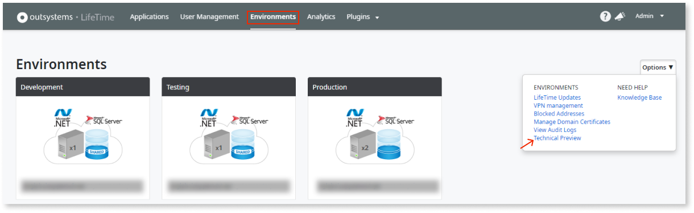
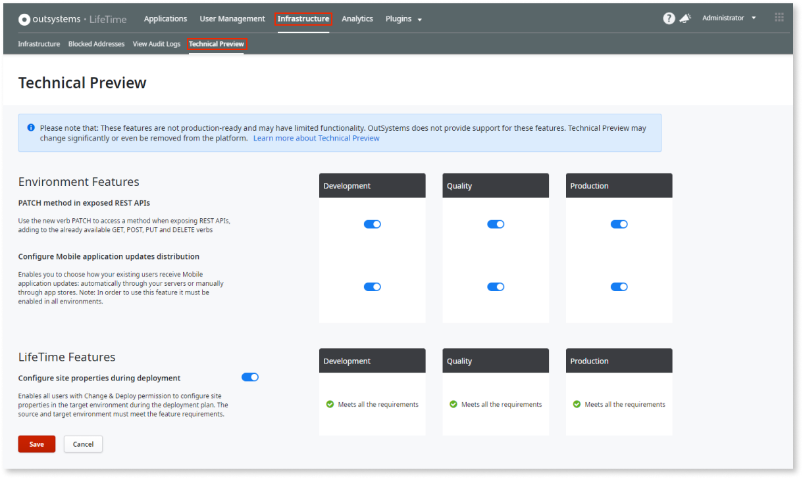

---
summary:
tags:
locale: en-us
guid: 60B738CE-9DC3-4C1F-8269-9B857668FBE4
app_type: traditional web apps, mobile apps, reactive web apps
platform-version: o11
---

# Technical Preview features

OutSystems gives you access to features in Technical Preview. These are specific features that allow you to enjoy new development possibilities and plan your future development sooner without upgrading to a major version.

We encourage you to try them out and [send us your feedback](https://www.outsystems.com/forums/71/early-access-features). These features are released much more frequently, in smaller chunks, and before they’re generally available. Given their nature, be aware of the following:

* These features aren't production-ready and may have limited functionality.
* They're disabled by default and you need to explicitly opt-in and activate them manually.
* OutSystems doesn't provide support for these features.
* Features in Technical Preview may change significantly or even be removed.

Starting from LifeTime Release May.2019, you can enjoy these features before they're generally available. In LifeTime, toggle the switch to **ON** to activate the feature you want to use. 

You must have the "Manage Infrastructure and Users" infrastructure permission to enable or disable features in Technical Preview.

In the OutSystems Cloud, you'll find **Technical Preview** under **Environment** > **Options**.

For self-managed installations, Technical Preview is at **Infrastructure** > **Technical Preview**.

## Features currently in Technical Preview
* **PATCH method on exposed REST services**: PATCH in an exposed REST Service. This new feature enables users to partially update a resource. [Learn more about this feature](https://success.outsystems.com/Documentation/11/Extensibility_and_Integration/REST/Expose_REST_APIs/PATCH_method_on_exposed_REST_services).

* **Configure mobile apps update distribution**:  Choose how your existing users receive mobile apps' updates: automatically through your servers or manually through app stores. To use this feature, it must be enabled in all environments. [Learn more about this feature](https://success.outsystems.com/Documentation/11/Delivering_Mobile_Apps/Technical_Preview_-_Configure_mobile_apps_updates_distribution).
