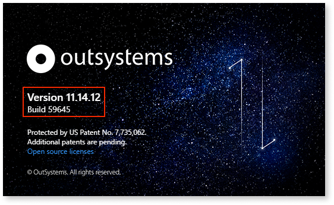
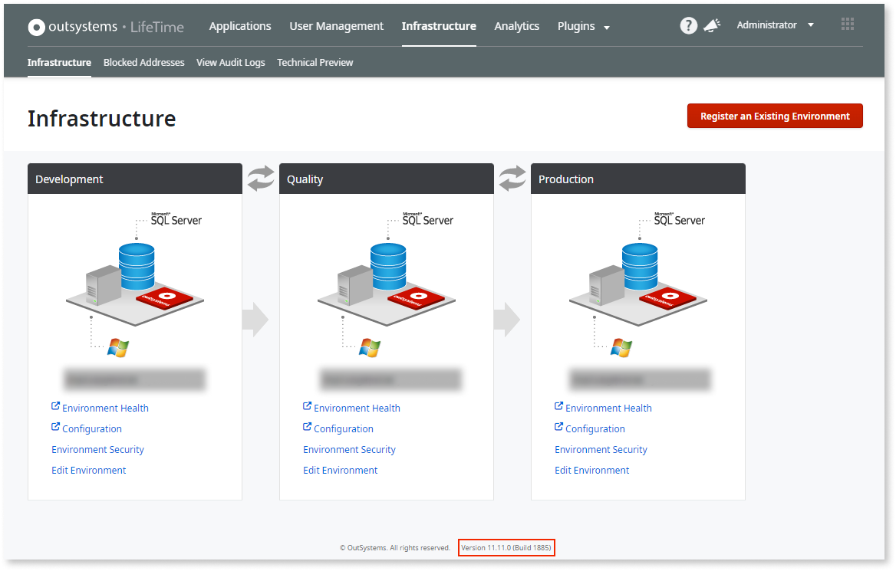
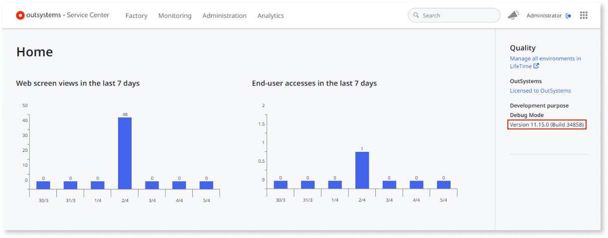
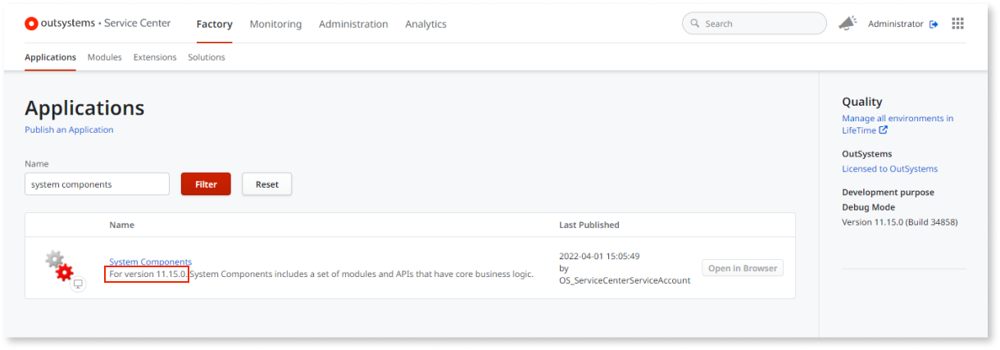
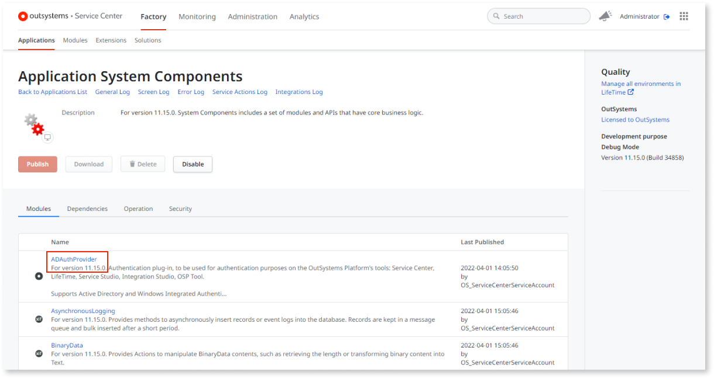

# Check what OutSystems version you are using

In the context of a support case, or when exploring the OutSystems documentation, it's useful to know what version and revision of OutSystems you have. This article explains how to obtain such information from the OutSystems components.

## Service Studio and Integration Studio

To display the version of Service Studio and Integration Studio click **Help** > **About**.

## LifeTime

Once logged into LifeTime, the version will display at the bottom of the page.

## Platform Server

At Platform Server, three pieces compose a healthy instalation: the Platform Server binaries instaled, Service Center and System Components.

In a proper instalation, all these components will have the same version. You can however, check their version separately.

### Platform Server binaries

In the OutSystems Cloud, this version will always be the same that's seen in Service Center. 
If, in a self-managed instalation, you suspect there's any inconsistency, you can check the installed version of the Platform Server by accessing the server remotely and opening Configuration Tool. Go to **Help** > **About** to see the version.

### Service Center

To obtain the Service Center version, login and check the right sidebar.

### System Components

Obtain the System Components version by logging in to Service Center, clicking **Factory**, then **Applications**, and search for **System Components**. Check the version on the description.

You can also check the version of each module that's a part of System Components by clicking the application to see the modules list.

