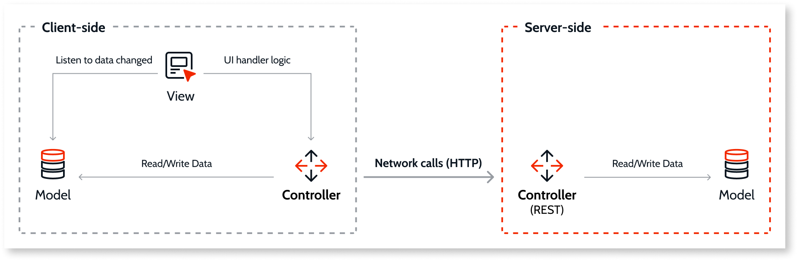

# Mobile app to server communication and security

In an OutSystems mobile application, the app communicates with the Platform Server through REST calls. The platform automatically generates REST endpoints for all calls to Aggregates, Data Actions, and Server Actions in mobile modules.

When the app fetches data from the server or runs a server action, JavaScript code from the app's controller files performs HTTP calls to the generated REST endpoints.

When fetching data, the controller receives the response from the REST endpoint and sends the data to the Model. If the UI uses this data, the View receives an alert and updates the screen.

## Security of the endpoints

OutSystems automatically secures these REST endpoints through two approaches:

* Encryption for all requests
* Server-side access control for all requests

### Encryption

All communication to OutSystems-generated REST endpoints uses HTTPS encryption. Any attempt to use these APIs over HTTP issues an error on the server side.

### Server-side access control

The server enforces access control to prevent unauthorized requests to the generated REST endpoints. The server uses a secure user token sent with each call to these endpoints. For more information about the authorization mechanism for OutSystems mobile apps, see [Configure Mobile App Authentication](https://success.outsystems.com/Documentation/11/Managing_the_Applications_Lifecycle/Secure_the_Applications/Configure_App_Authentication).

OutSystems automatically computes access control for each endpoint based on usage and the security definitions the developer sets.

**Screens** that access the server create endpoints that have the same security permissions as the screen:

* Anonymous screens generate public endpoints.
* Screens that have permissions generate endpoints that validate those same permissions.

**Blocks** that access the server create endpoints that have the minimum set of permissions of the screens that use them:

* If an anonymous screen uses the block, it generates a public endpoint.
* If a screen that requires "Manager" permissions uses the block, it generates an endpoint that requires "Manager" permission.
* If a screen that requires "Manager" permission and a screen that requires "Employee" use the block, it generates an endpoint that requires either "Manager" or "Employee" permission.
* If a screen that requires "Manager" permission and an anonymous screen use the block, it generates a public endpoint.

**Global client actions** that access the server create endpoints that inherit permissions at runtime from the calling screen or block context.

**Exception handlers defined on UI flows** that access the server create public endpoints. This ensures any user of your application sees the correct information about any error that might occur, even if the user hasn't logged in yet. This also applies to server endpoints that client actions use indirectly, meaning that the action becomes publicly available even if screens protected by roles also use it.

**Application events**, such as _OnApplicationReady_ and _OnApplicationResume_, that access the server create public endpoints. These events require public endpoints because they often occur before the user logs in. This also applies to server endpoints that client actions use indirectly, meaning that the action becomes publicly available even if screens protected by roles also use it.

You can customize access control for a particular endpoint. OutSystems provides built-in functions to check roles and permissions whenever there is access to the server. You can raise a security exception if you detect an unauthorized access.
