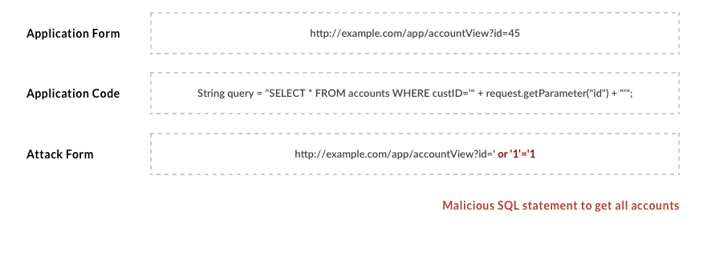
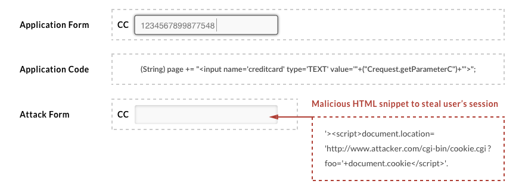

# Protecting OutSystems apps from code injection / Cross Site Scripting attacks

## Code Injection

Code injection is all about sending untrusted data into a code interpreter. The most common scenarios are SQL Injection and XML Injection.

The following example from the [OWASP documentation](https://www.owasp.org/index.php/Top_10-2017_A1-Injection) illustrates how an SQL injection attack can be used to fetch all accounts from a database:

## Cross Site Scripting

Cross Site Scripting (XSS) occurs when there is an attempt of sending untrusted data into the web browser (renderer). It is one of the most common web application vulnerabilities.
The following example from the [OWASP documentation](https://www.owasp.org/index.php/Top_10-2017_A7-Cross-Site_Scripting_(XSS)) illustrates how an XSS attack can be used to hijack a user session and impersonate that user:

|**Use case** |**Actions**|
|-------------|-----------|
|Escape string literals provided by the end-user and used in expressions |Use the [EncodeHtml()](https://success.outsystems.com/Documentation/11/Reference/OutSystems_Language/Logic/Built-in_Functions/Text#EncodeHtml) built-in function to replace special characters in a string so that you can use it in HTML literals. %% %% Use the [EncodeJavascript()](https://success.outsystems.com/Documentation/11/Reference/OutSystems_Language/Logic/Built-in_Functions/Text#EncodeJavaScript) built-in function to replace special characters in a string so that you can use it in JavaScript literals. |
|Escape HTML content provided by the end-user |Use the [SanitizeHtml()](https://success.outsystems.com/Documentation/11/Reference/OutSystems_APIs/Sanitization_API#SanitizeHtml) function from the [Sanitization API](https://success.outsystems.com/Documentation/11/Reference/OutSystems_APIs/Sanitization_API) to ensure that the value entered by the end-user does not contain any malicious content. |
|Expand inline parameters in advanced queries |Follow the guidelines in [Building dynamic SQL statements the right way](https://success.outsystems.com/Documentation/Best_Practices/Building_dynamic_SQL_statements_the_right_way). |
|Manually build URLs in redirects with dynamic URLs |Use the [EncodeURL()](https://success.outsystems.com/Documentation/11/Reference/OutSystems_Language/Logic/Built-in_Functions/Text#EncodeUrl) function to replace all non-alphanumeric characters in a string so that you can safely use it in URL parameter values. |
|Whitelist allowed external sites |[Apply a Content Security Policy](https://success.outsystems.com/Documentation/11/Managing_the_Applications_Lifecycle/Secure_the_Applications/Apply_Content_Security_Policy) as a way to prevent and mitigate the impact of XSS attacks. |

Service Studio will issue design-time warnings about the patterns that can lead to code injection attacks. 

## More information

To learn how to protect your OutSystems apps against other common types of attacks, check the [how OutSystems helps you develop secure applications](intro.md) article.
