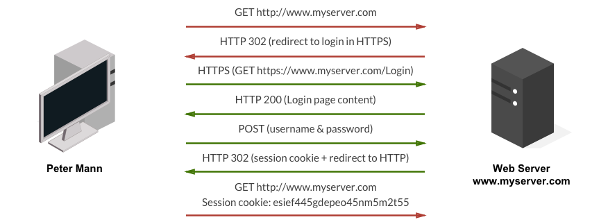
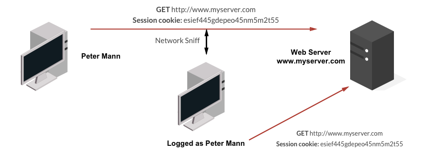

# Protecting OutSystems apps using encryption and SSL/TLS

By using encryption you safeguard stored, or in transit, sensitive data from being read by third-parties. However, the most common flaw in software is not encrypting sensitive data.

Usually, attackers don’t attempt to break the encryption itself, they break something else. Some examples of attack vectors are stealing plain text data, using Man-in-the-Middle (MITM) attacks, or stealing keys.

The following example illustrates how a MITM attack can be used to listen to a communication between two computers and impersonate a legitimate user after stealing his session (green arrows represent secure connections, while red arrows represent plain text connections):

## How to do it with OutSystems

OutSystems encrypts all the stored data of Cloud customers automatically. For customers with on-premise environments, the recommended strategy is to **encrypt all channels and sensitive data**.
To do so with OutSystems Platform follow these recommendations for each scenario:

|**Use case** |**Actions** |
|-------------|------------|
|Secure apps' communications |**HTTPS, SSL/TLS**: Use [HTTP Security SSL](https://success.outsystems.com/Documentation/11/Developing_an_Application/Secure_the_Application/Secure_HTTP_Requests) in Web Flows and Web Services (Requires SSL certificate).  Use only trusted SSL certificates. |
|Protect how Cookies are transmitted |**HTTPS, HSTS**: Enable secure cookies in your applications/server. Enable [HSTS](https://cheatsheetseries.owasp.org/cheatsheets/HTTP_Strict_Transport_Security_Cheat_Sheet.html) headers (forced HTTPS at the client-side - see [Enforce HTTPS Security](https://success.outsystems.com/Documentation/11/Managing_the_Applications_Lifecycle/Secure_the_Applications/Enforce_HTTPS_Security).) |
|Encrypt data (stored or in transit) | **AES-128, AES-256**:OutSystems hashes the built in [end users](https://success.outsystems.com/Documentation/11/Developing_an_Application/Secure_the_Application/End_User_Management) and [IT users](https://success.outsystems.com/Documentation/11/Managing_the_Applications_Lifecycle/Manage_IT_Users) passwords with a salted SHA512 algorithm. Use [CryptoAPI](http://www.outsystems.com/forge/component-details/437/CryptoAPI/) component to encrypt your data. Use a Key Management System. Use [OutSystems Platform built-in SHA512 algorithms for hashing](https://success.outsystems.com/Documentation/11/Reference/OutSystems_APIs/PlatformPasswordUtils_API). |

