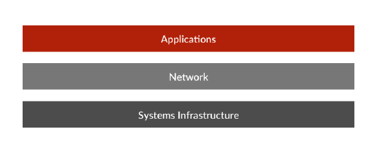

# How the OutSystems Platform Helps You Develop Secure Applications

Recent years have shown that security breaches have consistently increased both in terms of number of incidents and gravity of the outcome.

Failing to secure your apps may have severely damaging results for your business, such as:

* Loss of customer trust
* Compromised private data
* Damaged credibility
* Identity theft
* Loss of revenue

## Keeping your enterprise secure 

As attackers are moving faster, exploiting far-reaching vulnerabilities, holding files for ransom, stealing identities and deploying more malicious code, it becomes paramount that you know how to develop applications that are as secure as possible against these attacks.

These attacks aren't isolated to well-defined parts of your enterprise, rather having the potential and the capability of affecting every single technological layer. The purpose of this guide is to provide development best practices to mitigate the security risks at the Application layer.

## Protecting your apps against common vulnerabilities

The Open Web Application Security Project (OWASP) is a free and open software security community. OWASP TOP 10 describes the major vulnerabilities that can be found with web applications.

The following articles provide you with coding best practices with OutSystems to protect your apps against these vulnerabilities.
