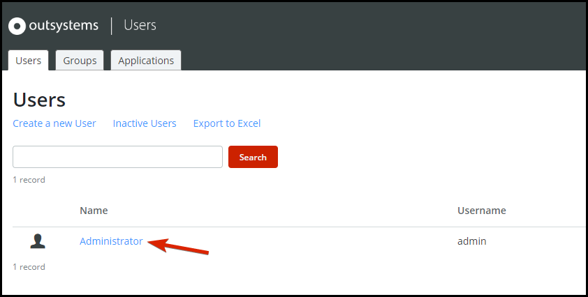
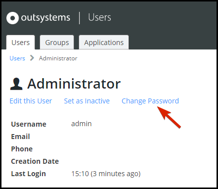
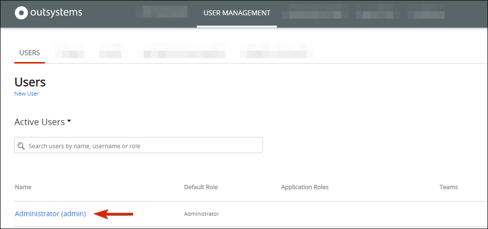

# OutSystems Platform Server hardening

Within this page you can find an initial guide for secure configuration of the Platform Server, and contact details for the OutSystems security team.

Make sure you read the [shared responsibility model](https://success.outsystems.com/Support/Enterprise_Customers/Maintenance_and_Operations/OutSystems_Cloud_Shared_Responsibility_Model) before continuing. It might be of special interest if you have a cloud infrastructure.

## Setup support portal security contacts

The security contact is the first recipient of all security-related email communications. Please refer to the following [document](https://success.outsystems.com/Support/Enterprise_Customers/OutSystems_Support/Managing_Your_Company_Permissions_on_outsystems.com#How_to_define_the_Security_Contact.3F) for instructions on defining your security contact in the support portal.

## Initial user setup

<div class="info" markdown="1">
As part of the initial usage of any infrastructure, it's necessary to initialize the administrator users of all tenants. In this case, we're looking at IT users and Application users.
</div>

The LifeTime and Service Center consoles manage the Platform Server. LifeTime manages the IT users, while the Users application manage the end users of the deployed applications. Make sure to change both administrator passwords on first use according to the following instructions.

### Applications

Each environment has a [dedicated User tenant](https://success.outsystems.com/Documentation/11/Developing_an_Application/Secure_the_Application/End_User_Management) which, for some versions of the platform, might contain an Administrator account with a default password. This tenant is used by default for newly created applications. Make sure to change the passwords of all these users.

1. Navigate to each of your environments: ```<environment address>/Users```

1. Select the **Administrator** user:

    

1. Choose **Change Password**:

    


### LifeTime

LifeTime console [manages the IT users](https://success.outsystems.com/Documentation/11/Managing_the_Applications_Lifecycle/Manage_IT_Users/Create_an_IT_User). It's a good practice to perform an initial password change and apply a rotation policy for any administrator users.

1. To rotate the password navigate to the User Management tab in ```<lifetime address>/Lifetime```, select the user assigned administrator privileges:

    

1. Edit the password:

    


#### External authentication provider

Within LifeTime, OutSystems allows you to manage IT users (developers, testers, operators). By default, when these users access OutSystems, they're authenticated using the built-in authentication mechanism. OutSystems also supports end-user authentication with external identity management providers by using the External Authentication feature.

When configured to use an external authentication provider, the platform delegates authentication to the assigned plugin. In this situation, the plugin is responsible for validating the credentials and returning a unique user identifier. That unique identifier maps the authenticated user to an OutSystems IT user. Refer to the documentation [here](https://success.outsystems.com/Documentation/11/Managing_the_Applications_Lifecycle/Secure_the_Applications/Use_an_External_Authentication_Provider) for details on setting up external authentication.

Furthermore, OutSystems provides the capability of implementing your own authentication plugin. Refer to [this](https://success.outsystems.com/Documentation/11/Managing_the_Applications_Lifecycle/Secure_the_Applications/Implement_an_Authentication_Plugin) article for instructions.

As an additional note, the [SAML Platform Authentication](https://success.outsystems.com/Support/Security/OutSystems_Platform_Server_hardening) forge component allows your OutSystems applications such as Service Studio, Integration Studio, Service Center, and Lifetime to integrate with most of the commercial IdP companies that support SAML 2.0 protocol for authentication purposes.

You can find below the details for external authentication in end-user applications.

## Certificates & data encryption in transit

It's important to make sure that data in transit is encrypted using secure communication channels. An SSL certificate binds a cryptographic key to an organization’s details. When such a certificate is installed in an application server, the HTTPS protocol is activated. This creates an encrypted channel between your web server and your visitor’s web browser, allowing private information to be transmitted without eavesdropping or being tampered.

Here is [how to request and install a certificate in your application server](https://success.outsystems.com/Support/Enterprise_Customers/Installation/How_to_install_an_SSL_Certificate_for_the_OutSystems_platform) so that your OutSystems applications can use secure connections in an on-premises setup.

Your OutSystems cloud environment is automatically deployed with default valid SSL certificates with the outsystemsenterprise.com domain. It's possible, and highly advisable, to [customize your environment hostname and SSL certificate](https://success.outsystems.com/Support/Enterprise_Customers/Installation/Enable_Custom_SSL_Domain_In_OutSystems_PaaS). Moreover, knowing that TLS protocol versions are in constant change and evolution, it's highly advisable that you restrict the usage to the most recent ones. To do so, please contact our support team, request the de-activation of unnecessary and old version. Please note that you are only allowed to customize the versions that are used, but not the ciphersuites used in them.

OutSystems provides developers with the ability to decide at design time which pages and integrations are available over HTTP or HTTPS. However, IT Managers or Administrators can override and enforce the HTTPS security of applications that are installed and running. This can be done for a whole environment, which affects all applications running there, or application by application.

Find instructions for [enforcing HTTPS security here](https://success.outsystems.com/Documentation/11/Managing_the_Applications_Lifecycle/Secure_the_Applications/Enforce_HTTPS_Security).

## Data encryption at rest

OutSystems protects your data with a number of data security controls. However, you are still responsible for developing applications that follow best practices for data security. Components like [CryptoAPI](https://www.outsystems.com/forge/component-overview/437/cryptoapi) help you encrypt sensitive data at the application level. Using this component you can easily achieve, for example, an Envelope Encryption Technique. Beware the presented Forge component isn't supported by OutSystems.

Learn how to [secure data at rest with encryption](https://success.outsystems.com/Support/Enterprise_Customers/Maintenance_and_Operations/Data_Encryption_at_Rest) in the OutSystems platform.

## Internal network

OutSystems allows specific elements of applications (Web UI Flows, exposed SOAP services, and exposed REST APIs) to be available only within an internal network, while other parts of the application are available to the general public. Depending on the type of applications developed, make sure to check the configuration of the [internal network](https://success.outsystems.com/Documentation/11/Managing_the_Applications_Lifecycle/Secure_the_Applications/Configure_an_Internal_Network). It's a good practice to apply restricted internal network rules when developing back office or any other type of internal management application that should only be accessed by a limited range of IP addresses.

## VPN (to OutSystems cloud) 

A Virtual Private Network (VPN) allows the extension of a private network across the internet. This enables you to create a private network between your OutSystems cloud infrastructure and your on-premises systems by establishing a secure communication channel between the two. After making sure [all requirements are fulfilled](https://success.outsystems.com/Support/Enterprise_Customers/Maintenance_and_Operations/Set_Up_a_VPN_to_your_OutSystems_Cloud#before-begin), you can [enable the VPN connection](https://success.outsystems.com/Support/Enterprise_Customers/Maintenance_and_Operations/Set_Up_a_VPN_to_your_OutSystems_Cloud).

## Improving end-user authentication

When you start developing a new module it has the built-in logic for [end-user authentication](https://success.outsystems.com/Documentation/11/Developing_an_Application/Secure_the_Application/End_User_Management/End_Users_Authentication) and respective [configuration](https://success.outsystems.com/Documentation/11/Managing_the_Applications_Lifecycle/Secure_the_Applications/Configure_App_Authentication). Other than the built-in logic, the OutSystems offers four other mechanisms for end-user authentication:

* **Active Directory**: The Active Directory authentication method for authenticating end-users requires the front-end server to be part of the Active Directory domain. Refer to the following [page](https://success.outsystems.com/Documentation/11/Developing_an_Application/Secure_the_Application/End_User_Management/End_Users_Authentication/Configure_Active_Directory_authentication) for configuration instructions.
* **LDAP**: Instructions for LDAP (Lightweight Directory Access Protocol) configuration of OutSystems applications can be found [here](https://success.outsystems.com/Documentation/11/Developing_an_Application/Secure_the_Application/End_User_Management/End_Users_Authentication/Configure_LDAP_Authentication).
* **SAML 2.0**: Uses SAML-based authentication to authenticate the end-users with single sign-on (SSO) provided by commercial Identity Provider companies. [Check how to Configure SAML 2.0 Authentication](https://success.outsystems.com/Documentation/11/Developing_an_Application/Secure_the_Application/End_User_Management/End_Users_Authentication/Configure_SAML_2.0_Authentication).
* **Azure AD**: Uses SAML based authentication to authenticate the end-users with single sign-on (SSO) provided by the Azure AD Identity Provider. [Check how to Configure Azure AD Authentication](https://success.outsystems.com/Documentation/11/Developing_an_Application/Secure_the_Application/End_User_Management/End_Users_Authentication/Configure_Azure_AD_Authentication).

### Improved authentication

To achieve greater security with authentication, the following approaches can be included as part of application development.

#### Single sign-on

OutSystems provides [single sign-on capabilities](https://success.outsystems.com/Documentation/11/Developing_an_Application/Secure_the_Application/End_User_Management/End_Users_Authentication/Single_Sign-On) by default: after authenticating in one of the applications, the end-users can access all other applications without having to provide the credentials. Single Sign-On is supported only for modules where cookies are enabled.

#### CAPTCHA

Used to distinguish human from machine input, CAPTCHA protects your websites from spam and abuse. To include this in OutSystems applications, simply install and use the [reCAPTCHA](https://www.outsystems.com/forge/component-overview/970/new-recaptcha) Forge component. Please note that this Forge component isn't supported by OutSystems.

#### Multi-factor authentication

To implement multi-factor authentication, multiple methods of authentication from different categories of credentials are required to verify a user’s identity, giving a much greater level of confidence that the legitimate user is logging in. The categories of credentials include:

* Knowledge (passwords, PINs).
* Possession (OTP, ID card, SIM card).
* Inherence (retina scan, fingerprint scan).
* Location (GPS device).
* Time factors (user versus time verification).

[Google Authenticator](https://www.outsystems.com/forge/component-overview/967/googleauthenticator) and [Touch ID Plugin](https://www.outsystems.com/forge/component-overview/1431/touch-id-plugin) are forge components that implement possession and inherence factors. However, please note that these forge components aren't supported by OutSystems.


## Secure the applications

The following sub-sections describe advanced configurations that protect against common attacks. They can also prevent the generation of false positives when performing penetration tests.

### Mobile apps hardening

OutSystems AppShield lets you harden the protection of your native Android and iOS apps. Fully integrated with Mobile Apps Build Service (MABS), OutSystems AppShield builds and adds protection at runtime and at rest.

Features like root and jailbreak detection, code injection protection, screenshot protection, repackaging detection, and many others are included.
Check the [AppShield documentation](https://success.outsystems.com/Documentation/11/Delivering_Mobile_Apps/Harden_the_protection_of_mobile_apps_with_AppShield) for the full list of features and how to protect your mobile app against attempts of modification and misuse.

### Secure cookies
  
  Cookies may contain sensitive information that shouldn't be accessible to an attacker eavesdropping a channel. To ensure that cookies aren't transmitted in clear text, it's possible to send them with a secure flag.

  Web browsers supporting the "secure" flag only send cookies having the "secure" flag when the request uses HTTPS. This means that setting the "secure" flag of a cookie prevents browsers from sending it over an unencrypted channel.

  Follow [this article](https://success.outsystems.com/Support/Enterprise_Customers/Maintenance_and_Operations/Secure_Cookies%3A_How_to_enable_secure_session_cookies_and_set_application_cookies_as_secure) for instructions on how to enable the secure flag in cookies.

### Apply Content Security Policy
  
  To protect against a growing number of attacks on the Web, use the Content Security Policy (CSP) against code injection attacks in applications developed with OutSystems. CSP provides a standard way of declaring approved origins of content that browsers are allowed to load.

  Follow [this article](https://success.outsystems.com/Documentation/11/Managing_the_Applications_Lifecycle/Secure_the_Applications/Apply_Content_Security_Policy) for instructions on how to apply the content security policy.

### Factory Configuration
  
  The [Service Center Factory Configuration application](https://www.outsystems.com/forge/component-overview/25/factory-configuration) allows you to change the configuration of the components of your Service Center Factory. You can customize Service Center known Configurations for an eSpace or create Shared Configurations that apply to several eSpaces, such as specifying a default proxy for web service calls. This and other common samples of Shared Configurations have been already created for you and are available as pre-made samples.

  This component is useful in cloud infrastructures, where the infrastructure isn't under your control. To understand how to use the component please visit the following [discussion](https://www.outsystems.com/forums/discussion/60471/how-to-setup-the-web-config-file-to-send-http-security-headers-to-your-app/). In fact, the given example provides an template that sets two headers for increased security. A list of headers that can be considered is:

  * **X-Frame-Options**: used to indicate whether or not a browser is allowed to render a page in a ```<frame>```, ```<iframe>```, ```<embed>``` or ```<object>```. Can be used avoid click-jacking attacks. The added security is provided only if the user accessing the application is using a browser that supports this header.
  * **X-XSS-Protection**: used to stop pages from loading when they detect reflected cross-site scripting. This header is used to provide protection in older browsers that don't support the Content Security Policy.

## OutSystems CSIRT

OutSystems has a Computer Security Incident Response Team that you can reach out to at any time. The OutSystems Computer Security Incident Response Team (OutSystems CSIRT) is the OutSystems cyber investigation and forensics team. A part of the Information Security Office, the team provides security monitoring services to protect OutSystems from cyber attacks and the loss of its intellectual assets.

[CSIRT contact details](https://www.outsystems.com/trust/csirt/).
