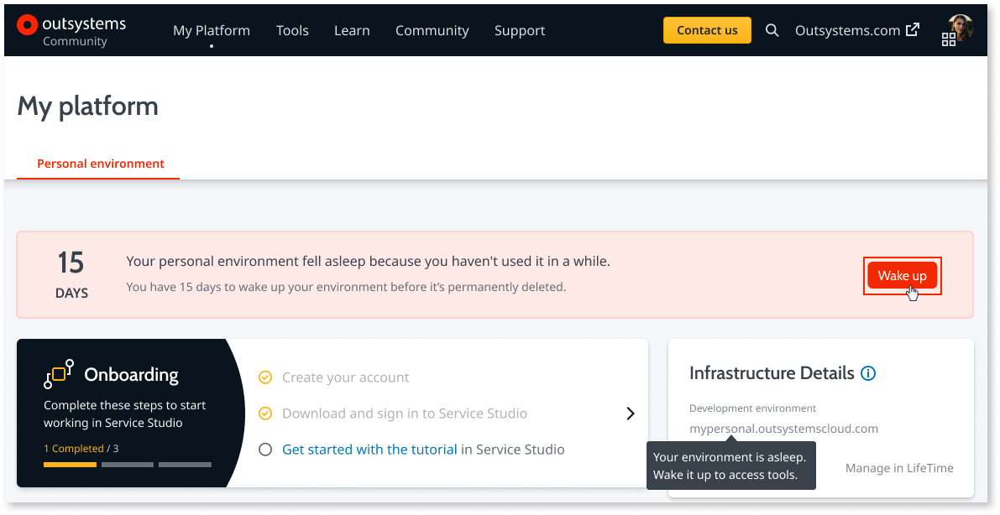
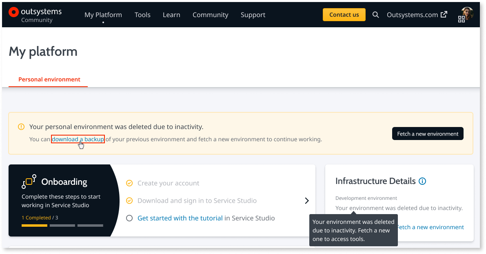
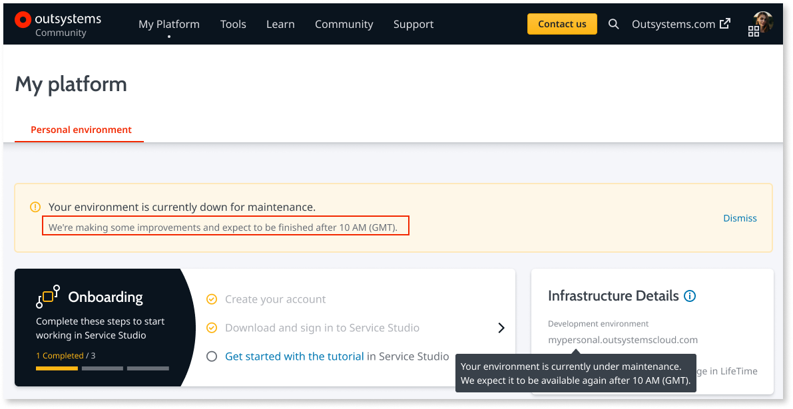
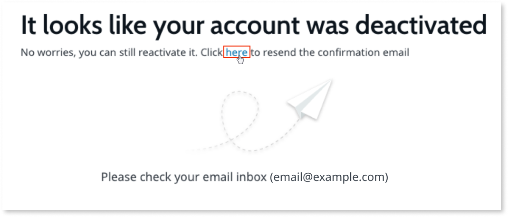
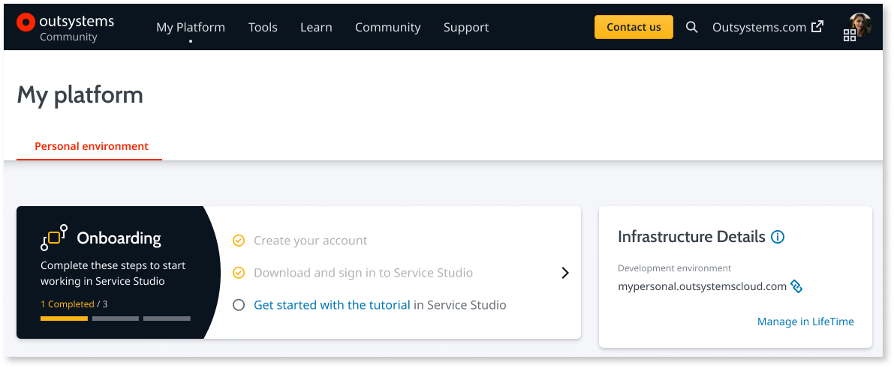

# Error messages while connecting to your personal environment

The easiest way to connect to your personal environment is by using the email and password you used when creating your OutSystems account.
Check this article to learn the causes and how to solve errors that can occur during the login.

## We weren’t able to connect you. Your environment is asleep due to inactivity. Wake up your environment.

**Cause**

Your personal environment is asleep due to lack of usage. Your apps are still there, but you need to wake up your environment before you can use it.
Your personal environment can stay asleep for up to 15 days, after that it's deleted.

**Recommended action**

Go to [www.outsystems.com/home](https://www.outsystems.com/home), ensure you're logged in, and click **Wake up**.

## We weren’t able to connect you. Your environment has been deactivated due to inactivity. Fetch a new environment.

**Cause**

Your personal environment was deleted due to lack of usage for more than 15 days. Your apps are saved for six months, after that they're deleted.
You need to request a new personal environment before using it.

**Recommended action**

Go to [www.outsystems.com/home](https://www.outsystems.com/home), ensure you're logged in, and click **Fetch a new environment**.

If your environment has been deleted less than six months ago, download your apps by clicking **download a backup**. After you create a new personal environment, you can re-publish your apps.

## We weren’t able to connect you. Your environment is under maintenance. Please try again later. Check your environment status.

**Cause**

Occasionally, OutSystems has to do some maintenance to your personal environment, which can include a platform server upgrade.

**Recommended action**

Check your environment status in [www.outsystems.com/home](https://www.outsystems.com/home) to know when you should be able to use your personal environment again.

If the environment stays under maintenance for more than a few hours after the expected time, please contact [OutSystems support](https://success.outsystems.com/Support).

## Your account was deactivated because we didn't receive your account confirmation. Follow the instructions in the email we sent you to activate it.

**Cause**

Your account was deactivated since we didn't receive your email confirmation in the first 48 hours after your account creation.

**Recommended action**

Follow the instructions in the email we sent you to confirm your email and activate your OutSystems account.
If you can't find the email, check your spam folder.
If you didn't receive the email, go to [www.outsystems.com/home](https://www.outsystems.com/home), and click the link in the message to resend the email.

## We weren’t able to connect you. We’re setting up your account. Please try again shortly. Check your environment status.

**Cause**

Your personal environment is still being set up.

**Recommended action**

Check your environment status in [www.outsystems.com/home](https://www.outsystems.com/home), and wait until it's ready.

If the environment isn't ready after one hour, please contact [OutSystems support](https://success.outsystems.com/Support).
