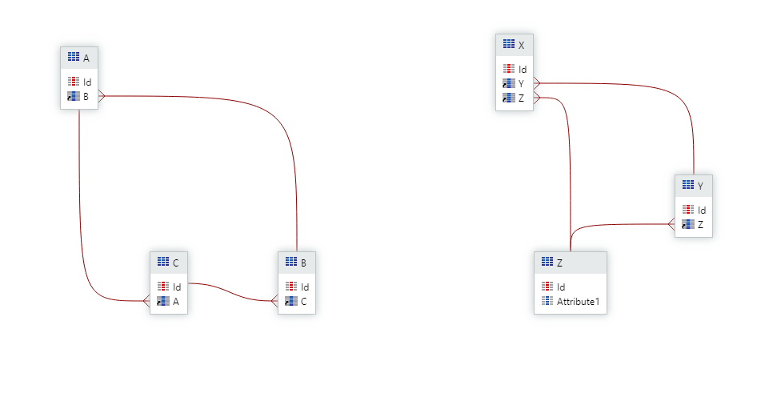

# Troubleshoot Could not create Foreign Key errors during deployment

When publishing a module you may, in certain situations, encounter the following error:

```
Could not create Foreign Key: This may have happened because there are '<EntityAId>' values of entity '<EntityB>' with no corresponding value in entity '<EntityA>', or attribute '<EntityAId>' of entity '<EntityB>' is creating a circular dependency between entities. Check error log for details.
```

You may see it when publishing a module in Service Studio:


Or also in Service Center when, for example publishing a solution:


# Most common scenarios

In this guide, we’ll list the most common situations that can lead to this publishing error and how to fix them. The most probably causes are listed first, so we suggest to troubleshoot in this order.

## No corresponding values

To create a Foreign Key (FK) from one table to another, it’s important that the table where the FK is being created (entity ‘A' of the error) contains only values that exist on the parent table (entity 'B’ of the error). To give you a practical example, imagine the two tables:

Entity 'A':

| ID | User_ID | Task |
|----|----|----|
| 1 | 10 | Create |
| 2 | 11 | Review |

Entity 'B':

| ID | Username | Email |
|----|----|----|
| 5 | Ruben | ruben@example.com |
| 6 | Capitao | capitao@example.com |

If we create the Foreign Key from Entity 'A' column 'User_ID' to point to Entity 'B' column 'ID', we'll obtain an error. This because the existing data in column 'User_ID' contains values that don't exist in the parent table (entity 'B').

To validate this hypothesis, check the data on the physical tables that the entities are pointing to. 

To resolve the situation, it's necessary to correct the data in the tables such that all values referenced exist in the parent table, by either:

* removing entries that don't exist 
* adding the values to the parent table


## Circular dependencies or multiple cascade paths

It's possible to set up your tables so that when deleting an entry from a table, all foreign keys depending on that entry are deleted: this is called cascade deletion. You can do this in OutSystems by going to the properties of the Foreign Key relationship and selecting "Delete" for the [Delete Rule property](https://success.outsystems.com/Documentation/11/Developing_an_Application/Use_Data/Data_Modeling/Entity_Relationships/Delete_Rules).


In some scenarios, these delete rules run into scenarios that the database engine can't handle and therefore doesn't allow. In the scenarios below, this error is expected and the delete rules should be reviewed to avoid running into the error.



### Circular dependencies

In the entity diagram above, on the left, the Delete Rules loop back to the table being deleted, which would cause the database engine to follow the delete cascade path indefinitely. Since this would result in undesirable behaviors, the topology of the entity model should be reviewed such that either: 

* one of the Foreign Key relationships doesn't exist 
* one of the delete rules isn't “Delete”

### Multiple cascade paths

In the entity diagram above, on the right, deleting a value from table Z will ultimately cause the deletion of values in table X, however, the database engine can't determine which deletion should be made first: Y and consequently X or directly X. To avoid this situation, one of the Foreign Key relationships leading to X should be set to “Ignore”.

## Database timeout

Considering that the SQL engine validates the data present in the tables, if the tables exist, the larger their size the more time it’s required to create the FK. Validate if the tables have many records and, in that case, update the timeout value in the configuration tool. 


Otherwise, if increasing the timeout isn't enough and/or the tables are small, check for database locks.

## Database locks

It is also possible that locks in the tables prevent the foreign key from being created by simply causing a timeout as described above. In Oracle, you might even see the following error in the event of a lock:

```ORA-00054: resource busy and acquire with NOWAIT specified or timeout expired```

To check if this is the case, you should work with your Database Administrator to determine if there are locks that affect the publish operation and how to resolve them.
