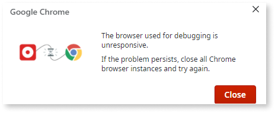
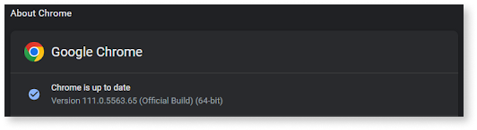

# Troubleshoot - Debugger does not start in Chrome

The debugger at Service Studio does not start with the Chrome version 111.0.5563.64/.65 released on March 7, 2023. Check the following section to understand and solve the error that can occurs while using the debugger in Service Studio. 

## Symptom

When launching the debugger at the Service Studio you may see a message similar to the one below:

If you encounter this message, please check the Chrome version by clicking the **About Chrome** tab under Settings section. 

## Cause

The Chrome version **111.0.5563.64/.65** released on March 7, 2023 is associated with a detected issue on Service Studio usage.
Hence, all Service Studio users that are using Chrome 111.0.5563.64/.65 will not be able to start Debugger.

## Recommended action

To restore debugger feature back to service, upgrade Service Studio to the latest version 11.53.43.62091. 

If the problem still persists, [open a ticket](https://www.outsystems.com/CISA/Redirect?error=login_required&state=%23RedirectURL%23https%3A%2F%2Fwww.outsystems.com%2Fsupport%2Fportal%2Fopen-support-case%3FErrorCode%3DOS-MABS-GEN-50000;%23GUIDVerifier%23561a7d09-21cc-4066-ad8b-5816dd53d383#_=_) with OutSystems Support. 
