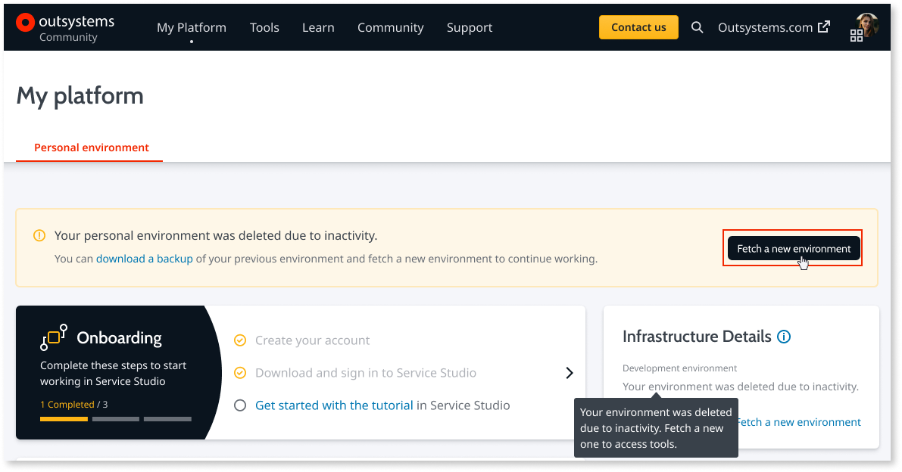

# There was an error contacting outsystemscloud.com - Host not found

## Symptom

When trying to connect to your personal environment from the IDE, you get the following error:

`There was an error contacting [my].outsystemscloud.com. Host not found.`

## Cause

* Bad internet connection

* Your personal environment has been recycled after a long period of inactivity

## Resolution

Since you're reading this, you can assume your internet connection is working fine. On your IDE, try reconnecting to your personal environment again.

If the problem has not been solved yet, it's probable that you haven't used your personal environment in quite some time, so it fell asleep or was deleted. 

### Step 1 

Go to `https://<yourpersonal>.outsystemscloud.com` and check the state of your environment.

* If you can see your applications, then your personal environment is up and running and you **should** be able to connect to it from the IDE.

* If you are redirected to [https://www.outsystems.com/home/](https://www.outsystems.com/home/), then your personal environment fell asleep or was deleted.

### Step 2

If your personal environment fell asleep, you just need to wake it up. Click the **Wake up** button.

If your personal environment is deleted due to a long period of inactivity, click the **Fetch me a new environment** button.

A new environment will be provisioned for you, with the same URL you had before. However, your applications will not be available in the new environment. After you create a new personal environment, you can re-publish your apps.
