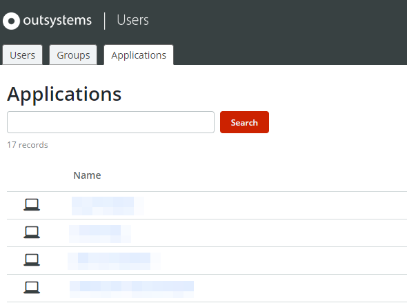
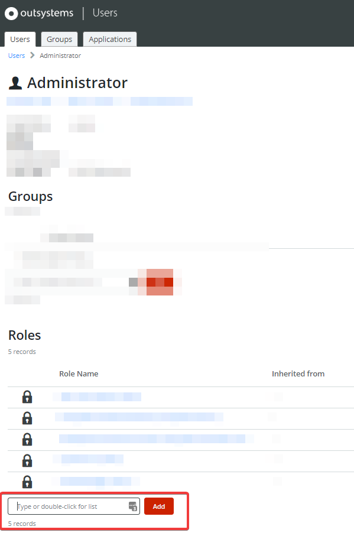
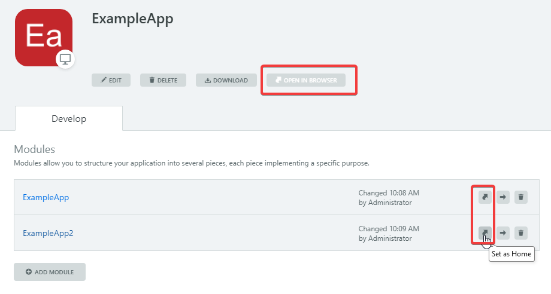
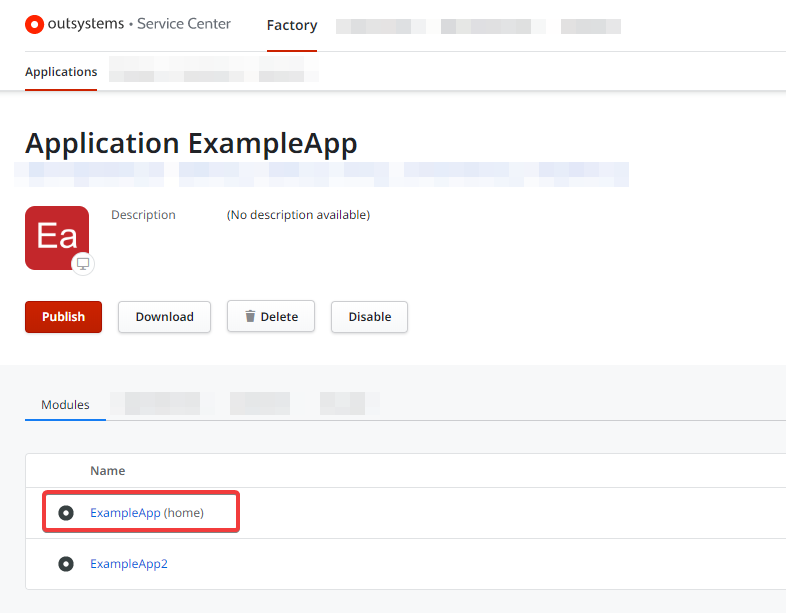
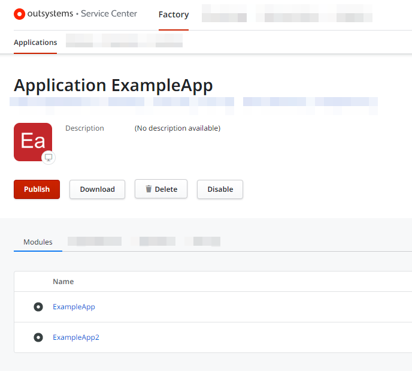
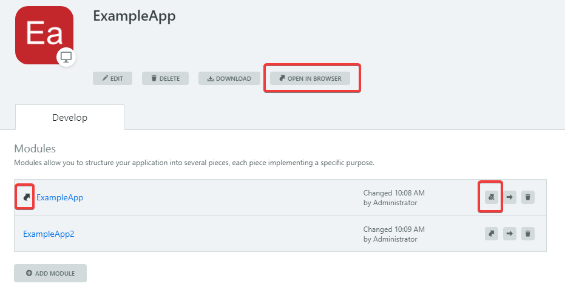

# Application is not present in the Users app

## Symptoms

When acessing the **Users** application at `https://<environment_address>/Users`, on the **Applications** tab, you notice that one of your created apps isn't showing on the list.

As a consequence, you also can't assign the app's role to an user.

## Cause

This happens when a given app doesn't have a "Home" module defined. You can confirm if this is the case either in Service Studio or in Service Center.

### Identifying the app doesn't have a home module in Service Studio

Connect Service Studio to your environment and click the affected app.
When it doesn't have a "Home" module defined you'll notice that:

* the **Open in browser** button is disabled
* all it's modules with show with the "Set as Home" icon 

Once you have confirmed in Service Studio that your app doesn't have a home module defined, you can proceed to the resolution.

### Identifying the app doesn't have a home module in Service Center

Another way to confirm the cause is by accessing Service Center > Factory > Applications and click the affected app.

Examine the **Modules** list: an app that has a home module defined will display "(home)" after one of the modules' name.

This is how it looks when a home module is defined:

If your app doesn't have a home module it won't show the **(home)** tag in any of the modules.

Once you have confirmed this is the case, you can proceed to the resolution.

## Resolution

Define a home module for the app.

Connect Service Studio to your environment and click the app you wish to set the home module.
In front of the module that should be the home module, click the "Set as Home" icon 

The **Open in browser** button becomes enabled:

Go back to the Users application and on the **Applications** tab, your app now shows on the list and you can assign it's role to users.
