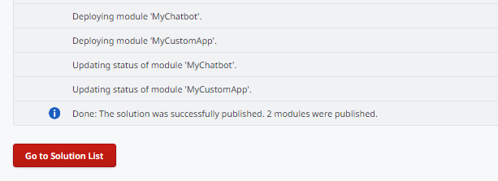

# Deploy applications through Service Center

When you want to deploy an application from a **source** to a **target** environment (for example, from Development to QA) and for some reason, you aren't able to perform the deployment in LifeTime, a possible workaround is to **deploy through Service Center** using an OutSystems Solution.

This article explains how you can deploy an application to a target environment through Service Center.

This workaround has the limitations described below. It should only be used occasionally, when you have a critical need to deploy the application and LifeTime deployment is temporarily unavailable.

## Limitations

This workaround might be acceptable for some situations, it might not work for other scenarios:

* You will only be able to deploy the application latest version or a Solution that you had previously created and versioned in Service Center.

* You won’t be able to deploy an application’s tagged version - LifeTime tags aren't available in Service Center.

* If LifeTime deployment isn't working correctly due to issues in the source or the target environment, you may hit the same issues when trying to use this workaround.

## Step 1. Create a solution in the source environment

To deploy applications to a target environment (for example, QA), you need to have an OutSystems Solution in the source environment (for example, Development) containing the **applications** you want to deploy and the **applications’ dependencies**.

If you haven’t created this Solution yet, do the following to create one:

1. In the Service Center console of the **source environment** (`https://<source_environment>/ServiceCenter`), go to the **Factory** area.

1. Go to **Solutions**.

1. Click the **New Solution** link.

     

1. Choose a name and description for your Solution and click **Save**.

1. In the **Components** tab, choose all the modules of the applications you want to deploy. Make sure to select **include dependencies as components** option.

     

1. Click the **Associate** button. You'll see the application modules and all dependencies in the Associated Components list.

1. Dissociate any system module that might have been added as a dependency (for example, modules from Charts Web, Charts Mobile, OutSystems UI, etc) by selecting those modules from the list and click the **Dissociate Selected** button. The Solution must contain only the modules of your application.

     

1. Go to the **Versions** tab and click the **Create Version** button.

     

1. Choose a Name and a Description for the version, and click **Save**. This version is a snapshot of the currently running version of all the modules in the Solution, which you are able to deploy later if you need.

1. Click the **Download** button.

     

1. Click **Download** to save the .OSP file of the Solution.

## Step 2. Upload and publish the solution in the target environment

To deploy the Solution in the target environment, do the following:

1. In the Service Center console of the **target environment** (`https://<target_environment>/ServiceCenter`), go to the **Factory** area.

1. Go to **Solutions**.

1. Click the **Upload & Publish a Solution** link.

1. Click the **Choose File** button and select the .OSP file you have downloaded from the source environment.

1. Click the **1-Click Publish** button.

     

Validate if the Solution is successfully published.

    