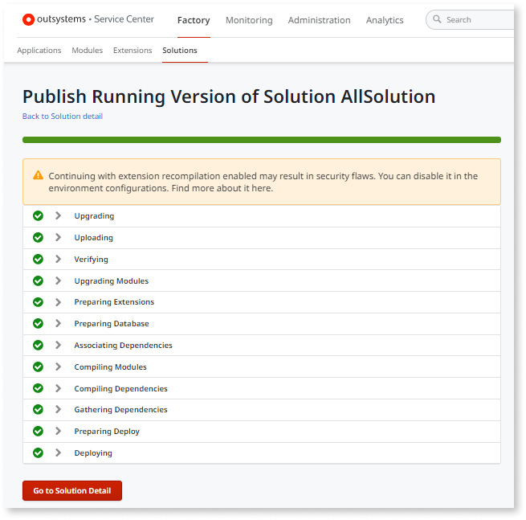

# Publish warning - Continuing with extension recompilation enabled may result in security flaws

## Symptoms

You are executing a publishing operation and you get the following warning:

`Continuing with extension recompilation enabled may result in security flaws. You can disable it in the environment configurations.`

This warning can occur in environments running **Platform Server 11.14.0 or later**.

## Cause

When running **Platform Server 11.14.0** or later, the automatic upgrade and recompilation of extensions on the server-side is blocked by default. This prevents unattended and unwanted code modifications.

This warning indicates that the automatic upgrade and recompilation of extensions **is enabled** in your environment. Therefore, your environment is exposed to unattended and unwanted code modifications whenever the Platform Server automatically upgrades and recompiles extensions in the following scenarios:

* Publishing an application or solution that includes an extension created in an earlier major version of OutSystems (for example, publishing an OutSystems 10 extension in an environment running OutSystems 11).

* Installing a Forge extension already created in an earlier major version of OutSystems.

* Publishing an extension after upgrading the Platform Server to a later major version (for example, from OutSystems 10 to OutSystems 11).

See more details [here](./extension-recompilation.md).

## Recommendation

To prevent unattended and unwanted code modifications in extension upgrade scenarios, ensure the automatic upgrade and recompilation of extensions is **disabled** and execute the upgrade and recompilation of extensions in a secure way.

Do the following:

1. [Disable the automatic upgrade and recompilation of extensions](./extension-recompilation.md#enable-disable) in the environment. This operation must be performed by a Service Center administrator.

1. In the described scenarios, [upgrade and recompile extensions in a secure way](./extension-recompilation.md#secure-upgrade).

If you get the `Extension recompilation on upgrade is disabled` error during the publishing process, execute the upgrade and recompilation of that extension in a secure way. See more details [here](extension-upgrade-disabled-error.md).

## Accepting the risk

If you trust the origin of the extensions that need to be upgraded, you can choose to [accept the risk](./extension-recompilation.md#accept-risk) of unattended and unwanted code modifications for that specific upgrade operation and keep the automatic upgrade and recompilation of extensions temporarily enabled. However, OutSystems recommends that you [disable the option](./extension-recompilation.md#enable-disable) after that upgrade operation.
