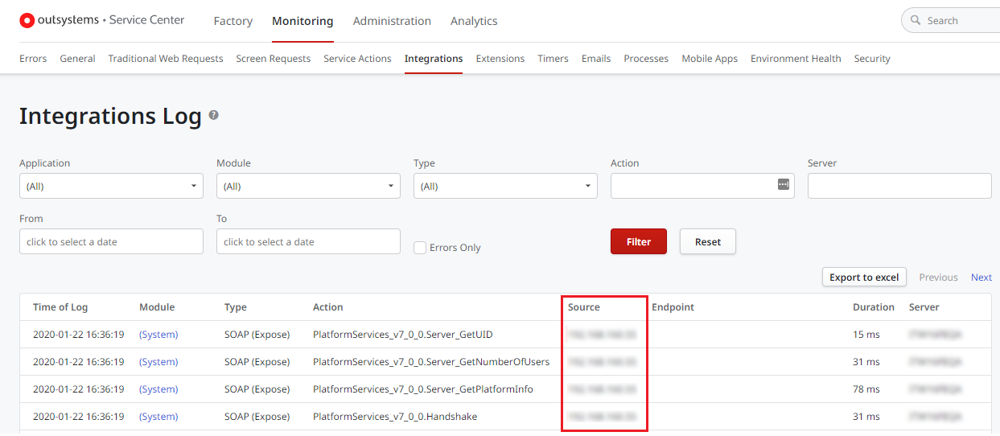

# Error registering an environment in LifeTime

## Symptom

I’m getting an error when trying to register a new environment in LifeTime.

## Troubleshooting

When you are having problems registering a new environment in LifeTime, there are some validations that you can perform to troubleshoot a potential issue.

### Check the network connectivity between environments (on-premises only)

If you have on-premises environments, make sure there is bidirectional communication between LifeTime and the environment you are trying to register:

1. [Test the connectivity](../../infrastructure-management/test-env-connectivity.md) from **LifeTime** to the **environment you are trying to register**.

1. [Test the connectivity](../../infrastructure-management/test-env-connectivity.md) from the **environment you are trying to register** to **LifeTime**.

### Check the Integration logs of the environment

Check the **Integration logs** of the **environment you are trying to register** to validate if the requests from LifeTime are reaching the environment:

1. Go to the Service Center console of the environment you are trying to register (`https://<server>/ServiceCenter`).

1. Go to **Monitoring** » **Integrations**. You should see some SOAP requests which the Source is the IP of your LifeTime server.

### Check the SSL certificates

If you have installed your own SSL certificate in the environments, make sure both **LifeTime** and the **environment you are trying to register** have a valid SSL certificate. You can use [SSL Checker](https://www.sslshopper.com/ssl-checker.html) to validate.

## Still having problems?

If the above validations didn't help you to solve the issue and you need further assistance, [open a support case](https://www.outsystems.com/SupportPortal/CaseOpen/) to get help from OutSystems Support.
