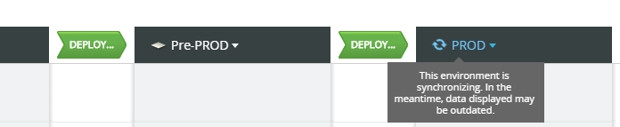
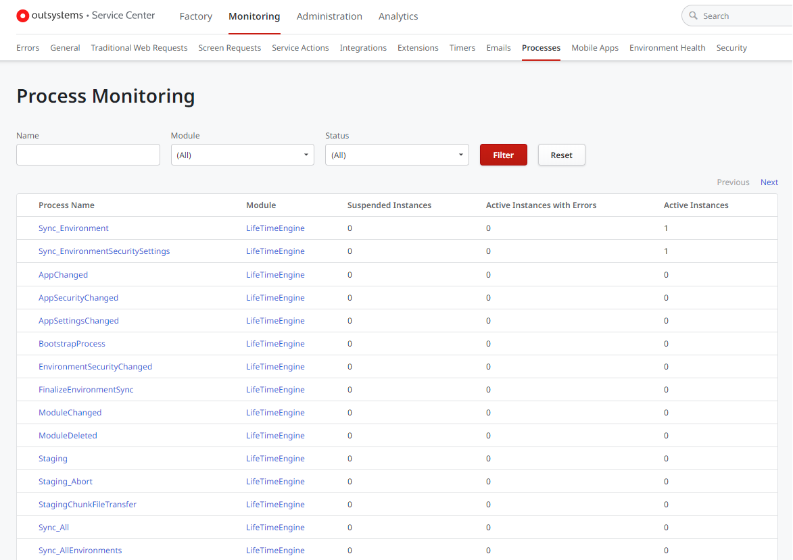

# LifeTime synchronization is stuck

## Symptom

Environment synchronization in LifeTime is taking longer than expected.

## Troubleshooting

When the synchronization of an environment in LifeTime is stuck, follow the validations below to troubleshoot a potential issue.

### Verify that you are running the latest version of LifeTime and Platform Server

Keep **LifeTime** and **Platform Server** updated to take advantage of the latest improvements in synchronization procedures.

### Check the connectivity between environments (self-managed only)

If you have self-managed environments, make sure there is bidirectional communication between LifeTime and the synchronizing environment:

1. [Test the connectivity](../../infrastructure-management/test-env-connectivity.md) from **LifeTime** to the **synchronizing environment**.

1. [Test the connectivity](../../infrastructure-management/test-env-connectivity.md) from the **synchronizing environment** to **LifeTime**.

### Check the servers timezone (self-managed only)

If you have self-managed environments, make sure the database server and the application environment servers (controller and front-ends) are set with the same [Timezone](https://support.microsoft.com/en-us/help/4026213/windows-how-to-set-your-time-and-time-zone), as described in [OutSystems Timezone considerations](https://success.outsystems.com/Support/Enterprise_Customers/Maintenance_and_Operations/Timezone_considerations_in_the_OutSystems_Platform).

### Check the status of LifeTime Processes

Environments synchronization in LifeTime is based on [OutSystems Business Process Technology](https://success.outsystems.com/Documentation/11/Developing_an_Application/Use_Processes_(BPT)).

Check the status of the Processes for potential issues:

1. Go to the Service Center console of your LifeTime environment (`https://<LifeTime_environment>/ServiceCenter`).

1. Go to **Monitoring** » **Processes**. You should have **no Suspended Instances** and **no Active Instances with Errors**. If you get any of these, [open a support case](https://www.outsystems.com/SupportPortal/CaseOpen/) to get help from OutSystems Support.

## Still having problems?

If the above validations didn't help you to solve the issue and you need further assistance, [open a support case](https://www.outsystems.com/SupportPortal/CaseOpen/) to get help from OutSystems Support.

If you have a critical need to deploy an application to that environment, you can try to [deploy the application through Service Center](../deploy-apps-sc.md) as a workaround.

If your infrastructure is self-managed (not required for OutSystems Cloud), make sure to attach the following information to your support case:

* [**Error**, **General**, and **Integrations** log files](../../get-logs.md#runtime-logs) from the Service Center console of the **synchronizing environment**

* [**Error**, **General**, and **Integrations** log files](../../get-logs.md#runtime-logs) from the Service Center console of your **LifeTime environment**

* [LifeTime Report](../../get-logs.md#lifetime-report)

* [BPTUtils Troubleshooting Report](../../get-logs.md#get-bptutils-troubleshooting-report)
