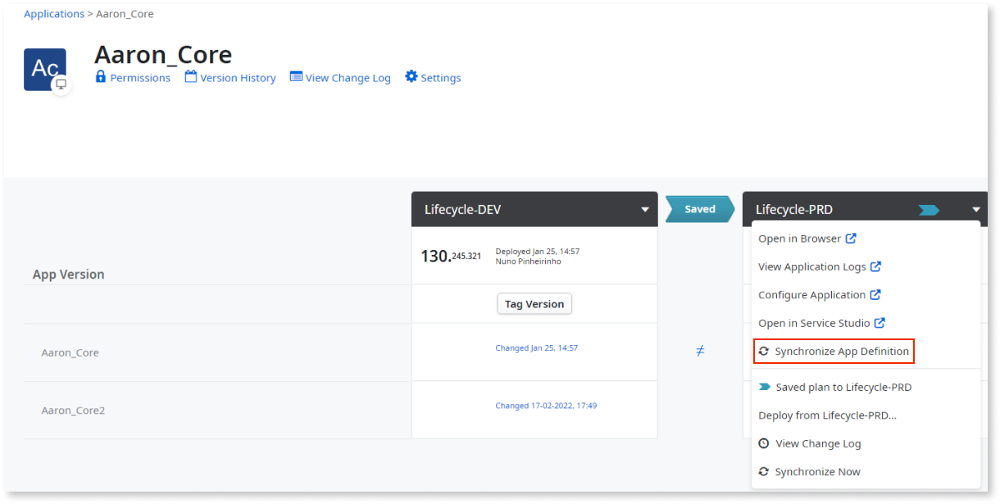

# Synchronize app definition

## Symptoms

LifeTime shows an app's name, icon, or color that doesn’t reflect the actual values these attributes have for a particular environment in your factory.

## Cause

At the infrastructure level, LifeTime presents a unified view of an app, including its name, color, and icon. However, this can sometimes lead to confusion, as these attributes can vary across different environments. For example, if you modify any of these attributes using the **Edit Application** screen in Service Studio within the Development environment, LifeTime reflects those changes, even if the updated version of the app hasn't been propagated to other environments yet. Therefore, LifeTime displays an app's most recently modified values, regardless of the infrastructure environment in which the changes were made.

## Resolution

In LifeTime, to display an application's name, icon, and color from a particular environment, go to the Application's details screen, and from the **Environment Options** dropdown, click **Synchronize App Definition**.

