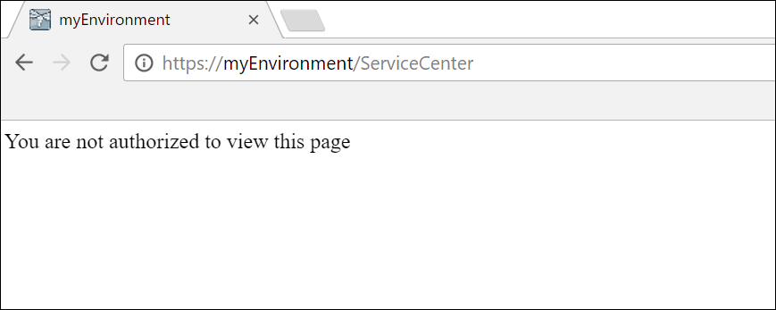
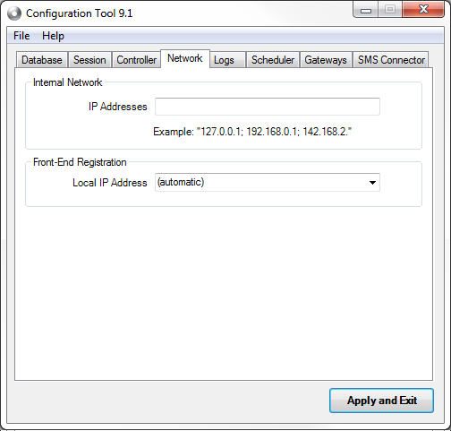

# Error accessing management consoles - You are not authorized to view this page

## Symptoms

While performing your regular daily tasks, which require access to ServiceCenter and Lifetime, you open your browser and type in the correct path to the management consoles. However, instead of accessing the login screen as usual, you are unexpectedly presented with an error screen, with the following message:

**"You are not authorized to view this page"**

## Cause

This typically means that you are trying to access from a network which is not part of the Internal Network configuration, and therefore ServiceCenter and LifeTime are not accessible from your machine, as you would  expect.

## Resolution

**OutSystems 9.1 Bali or earlier**

Even if you have local access to your server, but the Internal Network contains only a set of addresses, not including for example "127.0.0.1", you will still be unable to access ServiceCenter or LifeTime from your server’s machine. A more extensive description of the behavior can be found in the [documentation of the Configuration Tool](http://www.outsystems.com/help/configurationtool/9.1/index.htm#t=Network_Tab.htm).

You can overcome this problem by having someone access your server and perform the following steps:

* Open the Configuration Tool in your standalone machine or one of your farm environments;

* In the Network tab, set the Internal Network with the correct information (please refer to the [documentation](http://www.outsystems.com/help/configurationtool/9.1/index.htm#t=Network_Tab.htm) for more details);

* Apply the changes and exit the Configuration Tool

    * Restart the OutSystems Services when prompt

    * No need to install Service Center

* In every machine of your environment, you must restart IIS:
 
    
 

**OutSystems 10 or later**

The Internal Network is configured in ServiceCenter. A user with local access to the environment should always be able to access the management consoles, even if there is no "127.0.0.1" address configured in the Internal Network. In this case, the user is always able to access ServiceCenter in each machine and adjust the Internal Network configuration. In order to do this, have someone access your server (or one of the machines from your farm environment) and perform the following steps:

* Access the appropriate Network Security (Administration > Security > Network Security) screen in ServiceCenter and configure the Internal Network there;

* Make sure the trusted proxy addresses field is correctly configured for your infrastructure, as it may be the root cause of your problem;

* Apply changes:

    
 
If the correct addresses were added, you should now be able to access your management consoles again.

