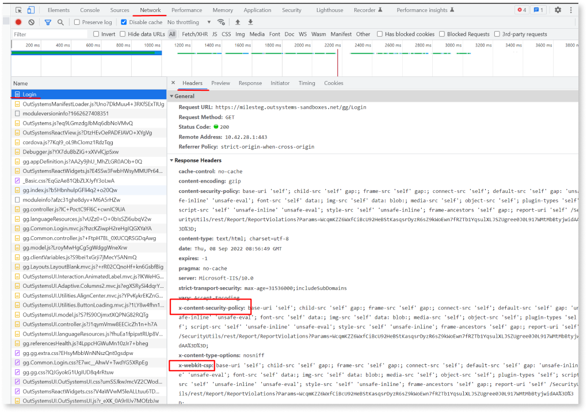

## Troubleshooting missing or incorrect CSPs

To confirm if the CSP headers are being applied, you can use the browser's developer tools to check the headers sent by the OutSystems appl. To accomplish that, navigate to the application URL with the Developer Tools opened on the Network tab and check the response headers of the request (document type).

Example below:

If the headers are either not present or are different from what you expected, we recommend checking the following:

* Confirm that the app and its dependencies were published after the configuration of the Content Security Policies. Otherwise, the settings are not effective.
* Validate whether the CSP configurations set at the application level are the same as the ones set for the whole environment. CSP headers at the application level overwrite the environment-level configurations.
* Confirm that no Shared Configuration is manipulating the CSP headers. If there's an existing Shared Configuration adding custom headers associated with existing modules, it will overwrite the CSP configurations defined in LifeTime. OutSystems recommends managing CSP headers in Lifetime only.
