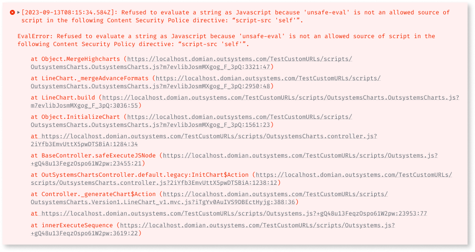
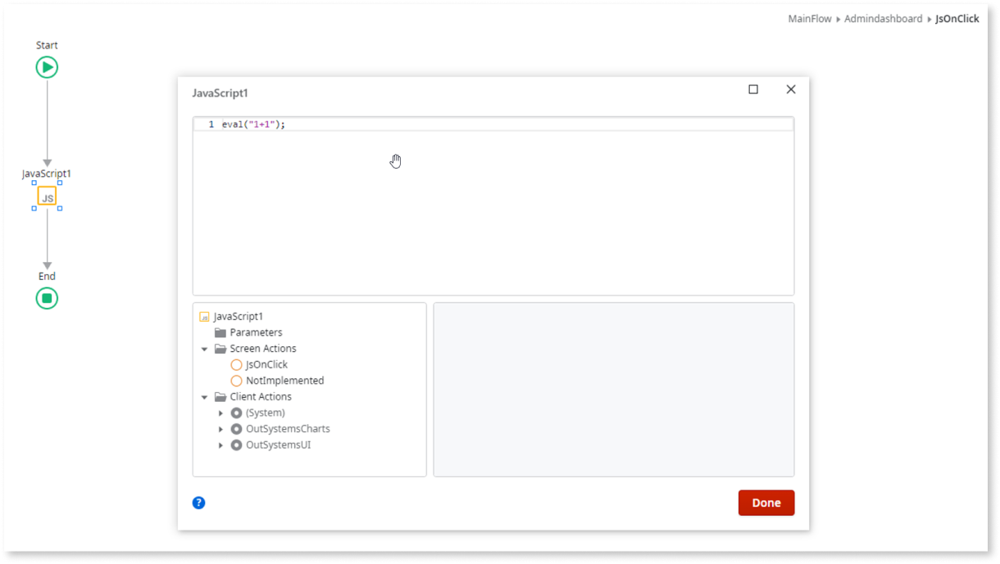
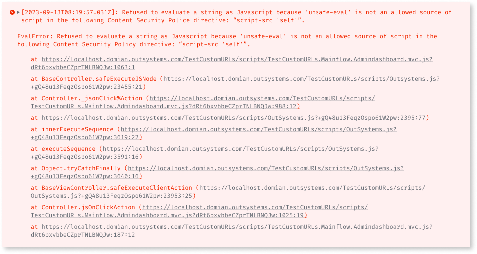

# Removing unsafe-eval

Applies to Reactive web apps only

## Browers console error

* ``Refused to evaluate a string as JavaScript because 'unsafe-eval' is not an allowed source of script in the following Content Security Policy directive: "script-src 'self'".``

## Service Center error logs

* ``Content Security Policy blocked 'eval'.``
* ``EvalError: Refused to evaluate a string as JavaScript because 'unsafe-eval' is not an allowed source of script in the following Content Security Policy directive: "script-src 'self'".``

Service Center and browser errors include a stack that allows you to track the source of the error and correct it. 

### Example 1

In this example, the error is caused by using a component (from OutSystems Charts) that uses the eval().

### Example 2

In this example, the error is caused by a JavaScript Widget that is performing an eval().

Reading the stack trace allows you to track the exact location of this pattern in order to correct it.

If you can’t resolve the error, open a support case with the OutSystems Support team. You’ll need the following information:
* Service Center Error Logs (that occur when the error is observed)
* OutSystems Solution that contains all dependencies in order to replicate the issue
* Exact steps to reproduce the Error
