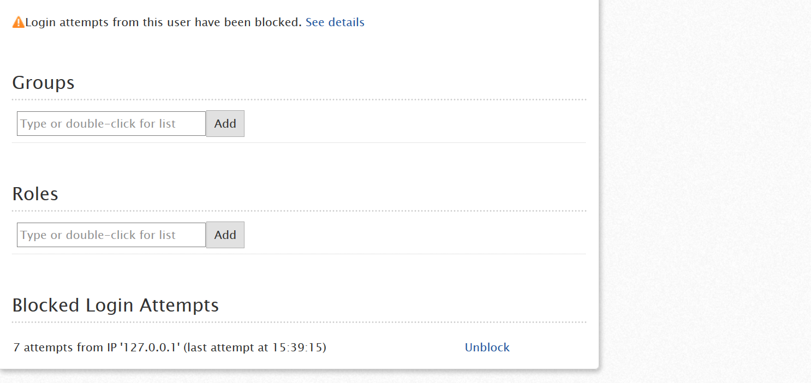

# Too many failed login attempts - causes and resolution for IT users and end users

## Symptoms

A user tries to login in one application or management console (LifeTime or Service Center) and gets one of the following errors:

* Too many failed login attempts. Please try again in a few minutes.

* Too many failed login attempts. Please try again in 60 minutes.

## Cause

Possible causes for this issue are:

* The user mistyped the password several times within a short timeframe.

* User changed their password, but at the same he had Service Studio running, connected with the previous username/password.

* The user account was target of a brute-force attack.

* The network where the user is working on was target of a brute-force attack.

You can check the conditions that trigger the brute force protection [here](https://success.outsystems.com/Documentation/11/Managing_the_Applications_Lifecycle/Secure_the_Applications/Protection_against_Brute_Force_Attacks).

## Resolution

### Unblock IT users in management consoles

If this issue is preventing the IT user from logging in a management console (LifeTime or Service Center) and the IT user requires immediate access, the situation must be handled by an administrator. Otherwise, the user should wait the indicated period.

**LifeTime managed environment**

The administrator must have the Manage Infrastructure and Users permission and perform the following steps:

1. Login to LifeTime;

2. Click on Users & Roles;

3. Go the user’s detail page;

4. A warning message with respect to the User’s blocked condition should appear:

 

5. By clicking on the "See details" link, the administrator will be redirected to an information table, where they will be able to unblock the user on their current address, by pressing the “Unblock” button:

 

6. After clicking the button, the table is cleared and a success feedback message is presented to the administrator, indicating that the user is unblocked.

If there is no warning message in Step 4 or if the warning message is displayed for several users in the same network, it probably means that several users unsuccessfully tried to login from a single IP address and that this IP address is blocked by the platform. If this is the case:

1. Click on Infrastructure;

2. Click on the Blocked Addresses link under the Infrastructure title;

 

3. Match the user’s IP address with the corresponding line in the blocked addresses table;

4. Click on the Unblock button to allow login actions from that address again:

 

5. After clicking the button, the table is cleared and a success feedback message is presented to the administrator, indicating that the address is unblocked.

 

**Environment is not managed by LifeTime**

If LifeTime isn't installed in your infrastructure, use Service Center to unblock an user.

1. Login to Service Center;

2. Click on Administration > Users;

3. Go the user’s detail page;

4. A warning message with respect to the User’s blocked condition should appear:

 
 

5. By clicking on the "See details" link, the administrator will be redirected to the corresponding tab on the screen, where he'll be able to select and unblock the user on his current address, by pressing an “Unblock Selected” button:

 

6. After selecting the appropriate line and clicking the button, the line is cleared and a success feedback message is presented to the administrator, indicating that the user is unblocked.

If there is no warning message in Step 4, this probably means several users unsuccessfully tried to login from a single address, which led to this IP address being blocked by the platform. If this is the case:

1. Click on Monitoring > Security;

2. Match the user’s IP address with the corresponding line in the blocked addresses table and select it:

 

3. Click on the "Unblock Selected" button to allow login actions from that address again;

4. After selecting the appropriate line and clicking the button, the line is cleared and a success feedback message is presented to the administrator, indicating that the address is unblocked.

Should the administrator not be able to solve the issue, by accessing the Management Consoles, please contact OutSystems’ Support.

### Unblock end users (Users application)

If this issue is preventing the end user from logging in one of your applications, the situation must be handled in Users Management console ([Users application](https://success.outsystems.com/documentation/11/developing_an_application/secure_the_application/end_users/access_the_users_app/)) by an administrator (requires UserManager (Users) role). Otherwise, the end user should wait for the indicated period.

The following steps must be executed:

1. **Login** int the Users application;

2. **Click** on Users;

3. Go the User’s detail page;

4. A warning message with respect to the User’s blocked condition should appear:

 

5. By clicking on the **See details** link, the administrator will be redirected to an information table, where he will be able to unblock the user on his current address, by pressing an “Unblock” link:

 

6. After clicking the link, the line is cleared and a success feedback message is presented to the administrator, indicating that the user is unblocked.

If there is no warning message, this probably means several users unsuccessfully tried to login from a single address, which led to this IP address being blocked by the platform. If this is the case:

1. **Click** on Users;

2. On the right panel, **click** on the **Blocked Addresses** link:

 

3. Match the user’s IP address with the corresponding line in the blocked addresses table and press the Unblock button:

 

4. After clicking the appropriate link, the line is cleared and a success feedback message is presented to the administrator, indicating that the address is unblocked

Should the administrator not be able to solve the issue, by accessing the Management Consoles, please contact OutSystems [by submitting a new case at OutSystems Support Portal](https://www.outsystems.com/goto/submit-support-case).

For more details on the Users scope, check our documentation regarding [IT users](https://success.outsystems.com/documentation/11/managing_the_applications_lifecycle/manage_it_users/) and [end users](https://success.outsystems.com/documentation/11/developing_an_application/secure_the_application/end_users/configure_the_administrator_user_of_the_users_app/) management.

