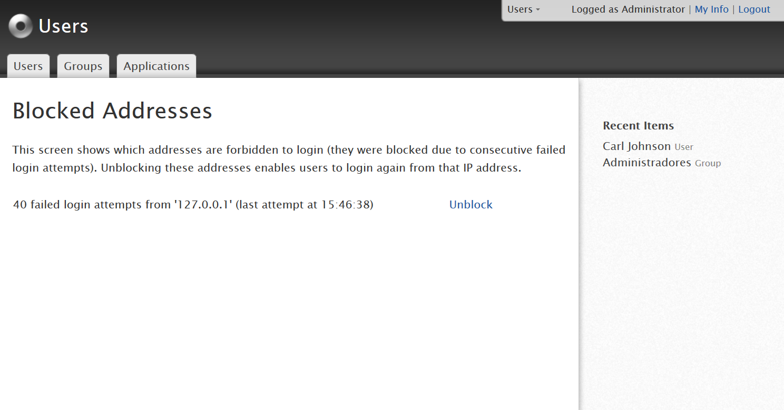

# Too many failed login attempts - causes and resolution

## Symptoms

A user tries to login in one application or management console (LifeTime/ServiceCenter) and gets one of the following errors:

* Too many failed login attempts. Please try again in a few minutes.

* Too many failed login attempts. Please try again in 60 minutes.

## Cause

Possible causes for this issue are:

* The user mistyped the password several times within a short timeframe

* User changed his password, but at the same he had Service Studio running, connected with the previous Username/Password

* The user account was target of a brute-force attack

* The network where the user is working on was target of a brute-force attack

## Resolution

### Unblock Users in Management Consoles

If this issue is preventing the user from logging in a management console (Lifetime/Service Center) and the user requires immediate access, the situation must be handled by a System Administrator. Otherwise, the user should wait the indicated period.

**LifeTime managed environment**

The System Administrator must have the Manage Infrastructure and Users permission and perform the following steps:

1. Login to LifeTime;

2. Click on Users & Roles;

3. Go the user’s detail page;

4. A warning message with respect to the User’s blocked condition should appear:

 

5. By clicking on the "See details" link, the System Administrator will be redirected to an information table, where he will be able to unblock the user on his current address, by pressing the “Unblock” button:

 

6. After clicking the button, the table is cleared and a success feedback message is presented to the System Administrator, indicating that the user is unblocked.

If there is no warning message in Step 4 or if the warning message is displayed for several users in the same network, it probably means that several users unsuccessfully tried to login from a single IP address and that this IP address is blocked by the platform. If this is the case:

1. Click on Infrastructure;

2. Click on the Blocked Addresses link under the Infrastructure title;

 

3. Match the user’s IP address with the corresponding line in the blocked addresses table;

4. Click on the Unblock button to allow login actions from that address again:

 

5. After clicking the button, the table is cleared and a success feedback message is presented to the System Administrator, indicating that the address is unblocked.

 

**Environment is not managed by LifeTime**

If LifeTime is not installed in your infrastructure, the unblocking operation is performed in ServiceCenter.

1. Login to ServiceCenter;

2. Click on Administration > Users;

3. Go the user’s detail page;

4. A warning message with respect to the User’s blocked condition should appear:

 
 

5. By clicking on the "See details" link, the System Administrator will be redirected to the corresponding tab on the screen, where he will be able to select and unblock the user on his current address, by pressing an “Unblock Selected” button:

 

6. After selecting the appropriate line and clicking the button, the line is cleared and a success feedback message is presented to the System Administrator, indicating that the user is unblocked.

If there is no warning message in Step 4, this probably means several users unsuccessfully tried to login from a single address, which led to this IP address being blocked by the platform. If this is the case:

1. Click on Monitoring > Security;

2. Match the user’s IP address with the corresponding line in the blocked addresses table and select it:

 

3. Click on the "Unblock Selected" button to allow login actions from that address again;

4. After selecting the appropriate line and clicking the button, the line is cleared and a success feedback message is presented to the System Administrator, indicating that the address is unblocked.

Should the System Administrator not be able to solve the issue, by accessing the Management Consoles, please contact OutSystems’ Support.

### Unblock Application Users

If this issue is preventing users from logging in one of your applications, the situation must be handled in Users Management console (Users) by a System Administrator (requires Users Manager role). Otherwise, the user should wait for the indicated period.

The following steps must be executed:

1. Login to Users;

2. Click on Users;

3. Go the User’s detail page;

4. A warning message with respect to the User’s blocked condition should appear:

 

5. By clicking on the "See details" link, the system administrator will be redirected to an information table, where he will be able to unblock the user on his current address, by pressing an “Unblock” link:

 

6. After clicking the link, the line is cleared and a success feedback message is presented to the System Administrator, indicating that the user is unblocked.

If there is no warning message, this probably means several users unsuccessfully tried to login from a single address, which led to this IP address being blocked by the platform. If this is the case:

1. Click on Users;

2. On the right panel, click on the "Blocked Addresses" link:

 

3. Match the user’s IP address with the corresponding line in the blocked addresses table and press the Unblock button:

 

4. After clicking the appropriate link, the line is cleared and a success feedback message is presented to the System Administrator, indicating that the address is unblocked

Should the System Administrator not be able to solve the issue, by accessing the Management Consoles, please contact OutSystems’ Support.

 

