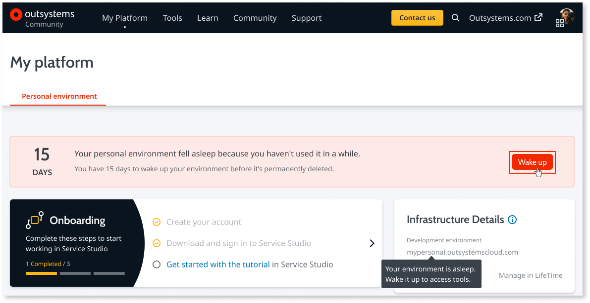

# Cannot reach apps on my personal environment

## Symptoms

You're trying to access an application running on your personal environment, but you're being redirected to [http://www.outsystems.com/home/](http://www.outsystems.com/home/) with a message telling you that your personal environment fell asleep or has been deleted.

## Cause

Your personal environment is asleep. This occurs if:

* you've stopped developing for a while or

* your apps aren't being used.

This happens as part the recycling mechanism to save resources for active personal environments.

## Resolution

Go to [http://www.outsystems.com/home/](http://www.outsystems.com/home/) and login with your OutSystems credentials. Click the **Wake up** button and wait a few seconds while the personal environment is restored.

## More information

OutSystems sends you an email letting you know that your personal environment will be recycled.

If you need your personal environment running 24/7, check your emails regularly. A couple of visits per week to your apps is enough to keep the environment active.

