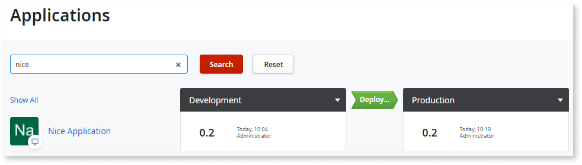
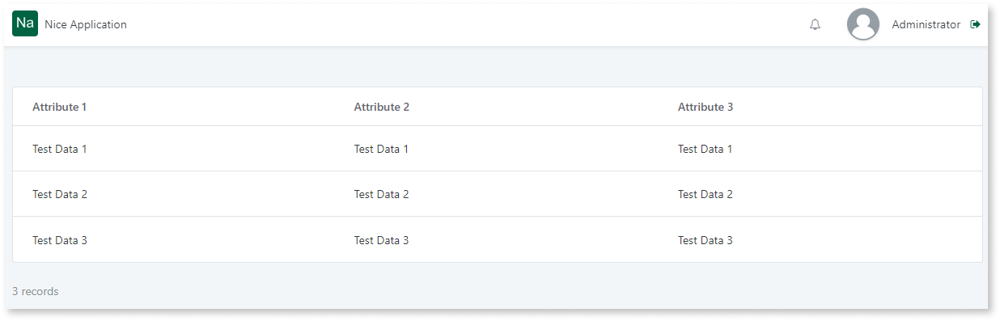
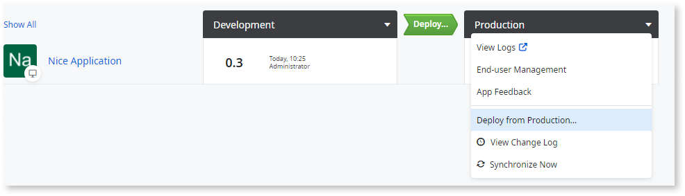

# Entities lose data after deployment

After a deployment, it is possible that Aggregates or Advanced Queries that access entities from an application **stop returning values**.
This usually happens due to a change to the Identifier of the Entity in the Platform metamodel. This causes it to no longer be recognized as the same entity by the environments even if the names are the same.

In this article, you will learn to create a workaround to avoid this situation. 

## Example scenario

Consider a scenario with two environments: **Development** and **Production**. Both of them contain the same version of the application.

The application simply displays the values of an Entity on the screen.

On the database side, an Identifier is created that uniquely identifies the Entity so that the Platform can recognize it across different environments.  

If  a developer recreates an entity, for example, cuts/copies and pastes the Entity in Development, even though the entity keeps the same exact name and attributes. This action causes the platform to mark the original Entity as inactive and create a new Entity with a new Identifier.

Nevertheless, this change passes unnoticed and now the developer stages the application from Development to Production. After the deployment finishes, they notice that the application no longer displays information.

This is because a new Entity, with a new Identifier, will also be created in Production and the original one that contains the physical data is marked as inactive. 

## Workaround 

There are two workarounds in such scenarios:

### Workaround 1

Follow these steps to avoid data lose vy entities during deployment. 

1. Rollback the application version in Production. This will cause the original Entity that contains the information to be marked as active again and the data to be displayed again in the application.

1. Considering that the information in Production is usually more valuable than in Development, stage the Entity from Production to Development so that the Identifier in Development becomes the same as in Production. This will keep the data in Production and the data in Development will be lost. 
The easiest way is through LifeTime. There is another option to merge the eSpace from Production into Development directly through Service Studio. The important part is that the Entity in Production is merged to the Entity in Development.

1. Now, the Identifier in Development is the same as the one in Production. When staging again from Development to Production, the Identifier will now be consistent and the data will persist. 

### Workaround 2

A second way is to re-populate the Entity with all information contained in the original table. 

Note that this is usually not feasible due to possible changes to the Ids of the data, which can create inconsistencies in the logic execution.
