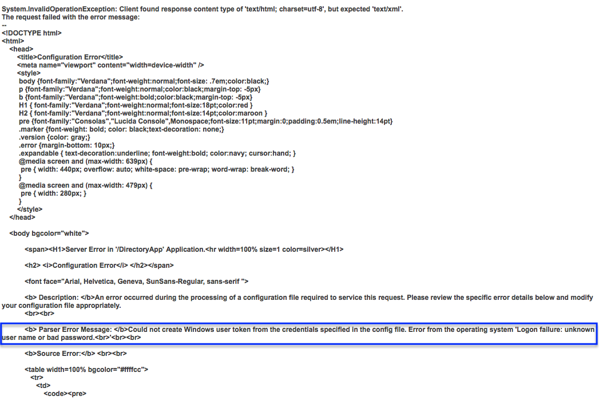

---
summary:
locale: en-us
guid: 6d5b466c-0819-4e81-a080-6089039c0394
app_type: traditional web apps, mobile apps, reactive web apps
---

# Error accessing application - Could not create Windows user token from the credentials specified in the config file

## Symptoms

In an OutSystems Platform running on .NET stack, one (or more) of the following happens in a specific eSpace:

* It is not possible to access any screens in the eSpace

* It is not possible to call any web-services from the eSpace

* All BPT processes are stuck and giving errors

* All timers are stuck and giving errors.

* A publication error occurs in the final stage

When looking at the error log, the error message is generic, but the details show the below detail:

  `<b> Parser Error Message: </b>Could not create Windows user token from the credentials specified in the config file. Error from the operating system 'Logon failure: unknown user name or bad password. '  `

## Cause

This error is thrown because you have configured a "Run As" user for your eSpace that does not exist, or doesn't have sufficient privileges to run in the server

## Resolution

Solving this problem involves either:

1. Removing the "Run As" credentials, if they are not needed. This is the solution for all cloud customers, since "Run As" is not available for cloud customers.

2. Fixing the privileges for the user.

### Method 1:

To remove the "Run As" credentials, access the details of the eSpace, and check the Operation tab. You will see the username set up. To remove these credentials, simply delete the value, click **Apply Run As settings**. 

After this change, Service Center informs you that you need to republish the eSpace so the change gets effective.

### Method 2:

To fix the user credentials, first identify the user that is running the eSpace. In our example, it is jpi90871

After you have found the user, log in to your server, and in Manage Users and Roles, open the IIS_IUSRS group and add the user to it:

 

## Properties

Applies to OutSystems Platform for .NET, all versions.

