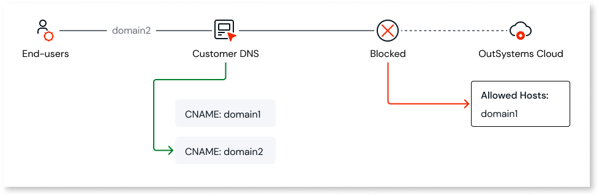
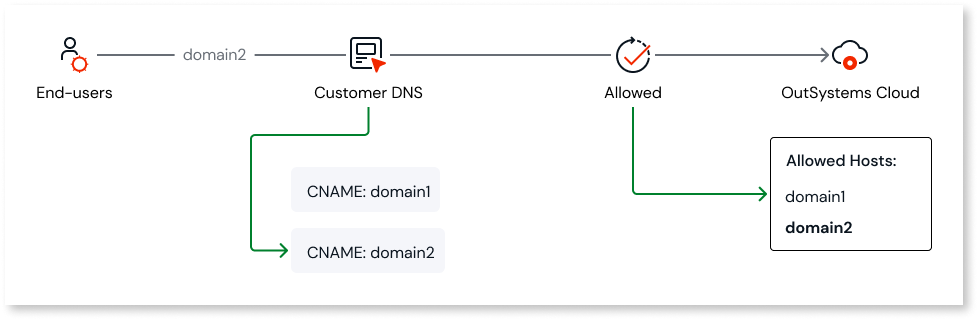

# Troubleshooting error 503 - Host header does not match

In the user browser, the error `503 - Host header does not match` appears when [secure endpoints](https://www.outsystems.com/tk/redirect?g=6c1dcebe-0c55-4fb3-b94b-21d162a23053) are enabled and the OutSystems Cloud environments receive a request with a host header that is not allowed. 

## Causes

When this error occurs, one of the following may be happening:

* There was a host header injection attempt that was blocked.
* There’s an endpoint that’s missing in the [secure endpoints configuration](https://www.outsystems.com/tk/redirect?g=6c1dcebe-0c55-4fb3-b94b-21d162a23053).

When an endpoint is missing from the configuration, the possible causes are:

* There’s a redirect rule configured in that environment that redirects to an endpoint that’s not in the list of secure endpoints. To solve this, either add the endpoint or remove the redirect rule if it’s no longer necessary.

* Your DNS may be configured with custom rules and not all possible endpoints are listed in the secure endpoints. Reading [Configuriing secure endpoints](https://www.outsystems.com/tk/redirect?g=6c1dcebe-0c55-4fb3-b94b-21d162a23053) helps understand how it works. In the next section we’ll show an example scenario and its resolution.

## Example scenario and resolution

Follows an example of the problematic scenario with an incorrect configuration of your legitimate endpoints and how to solve it.

Let’s consider that: 

* There are 2 domains (`domain1` and `domain2`) in the DNS pointing to your OutSystems environment (`my-example.com`). They’re both your own legitimate domains.

* Only `domain1` is allowed as a secure endpoint.

In this scenario, requests from `domain2` are blocked and the error `503 - Host header does not match` is present.

To fix this, you must add `domain2` to the list of secure endpoints, now allowing requests from domain2`:

