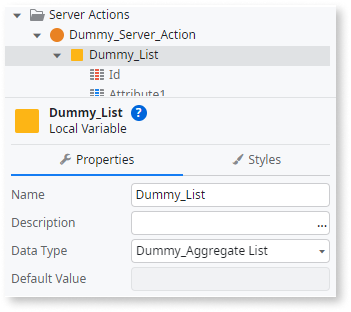
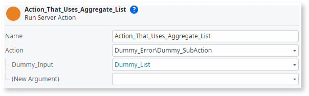
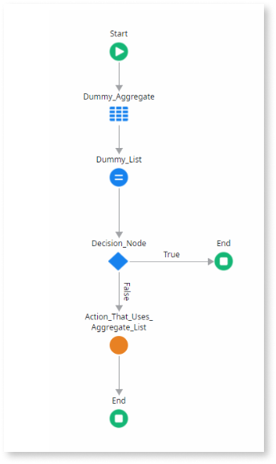

# Maximum number of open cursors exceeded in a session

## Symptoms

During the application runtime, you get the following error message: ``Failed to load resource: The server responded with a status of 500.``

In Service Center, this error translates to the following: ``Error executing query. ORA-01000: maximum open cursors exceeded.``

## Causes

Your session has more than the defined number of OPEN_CURSORS.

## Resolution

**Option 1**: 

Depending on the value of the **OPEN_CURSORS** you have defined in your Oracle database, you may need to change the value. To do this, run this query:

``alter system set open_cursors= `your_value` scope=both;``

Remember that the maximum value is 65535.

**Option 2**: 

Modify your logic so that it doesn’t use the aggregate output as a direct input for the server action. To do this, follow these steps: 

1. Create and assign a local variable (with the Assign widget) to the existing aggregate output. 

    

1. Replace the use of the aggregate output in the loops by creating a local variable as the input for the logic (Loops/inner Server Actions).

    

The following is example logic:

For more information about preventing too many **OPEN_CURSORS** in a session, see Oracle’s [OPEN_ CURSORS](https://docs.oracle.com/en/database/oracle/oracle-database/19/refrn/OPEN_CURSORS.html#GUID-FAFD1247-06E5-4E64-917F-AEBD4703CF40) documentation.
 