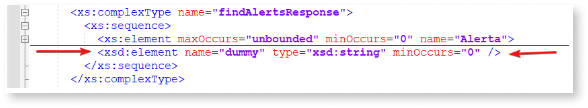

# Compilation errors after consuming a SOAP web service

When you import a SOAP web service, Service Studio checks its 'Web Service Description Language' (WSDL) file for any unsupported cases. Sometimes, these cases are not detected and you are still able to import the web service successfully. This leada to a compilation error when you try to publish the module.

One of the most common situations where this occurs is when the WSDL file contains a [List attribute in a single list attribute](https://success.outsystems.com/documentation/11/extensibility_and_integration/soap/consuming_soap_web_services/unsupported_soap_use_cases/#list-attribute-in-a-single-list-attribute). 

This triggers a CS0117 error with the message **does not contain a definition for ‘FromProxyStructure’**. To fix it, check the error details for specific element names in the WSDL file.

## Example scenario

In the example below, the following error occurred when publishing the module that consumes a SOAP web service:

```
Internal Error: Compilation Error.
CustomClients\GSWebServiceImplService\CcGSWebServiceImplService.findAlerts.cs(110,95): error CS0117: 'ssCoreIntegrations_IS.CcGSWebServiceImplService.SOAPAlerta2' does not contain a definition for 'FromProxyStructure'
outParamAlerta = RLAlerta2List.ToList(resultHolder.findAlertsResponse1.ToArray(), SOAPAlerta2.FromProxyStructure);

```
You can notice the following details in the message:
* The name of the method where the error occurs, `findAlerts`;
* The name of the output parameter where the issue occurs, the element `Alerta`.

### Error details

As detailed in the [Unsupported SOAP Use Cases article](https://success.outsystems.com/documentation/11/extensibility_and_integration/soap/consuming_soap_web_services/unsupported_soap_use_cases/#list-attribute-in-a-single-list-attribute), the error occurs when there's a `complexType` with a single element with `maxOccurs > 1` and that type is used as an element inside another type with `maxOccurs > 1`. To apply the suggested workaround, you need to understand what is the `complexType` element that contains a single element that has `maxOccurs` larger than `1`. 

### Error resolution

Edit the WSDL file and search for the name of the problematic element. In this example, that element is **Alerta**. Focus on the findings that relate to the method contained in the error (`findAlerts`) and where you see a `maxOccurs` defined.


If you collapse the identified element, you will see that the `complexType` name `findAlertsResponse`, which corresponds to the Output parameter of the `findAlerts` method that was present in the error message, only contains a single element, named **Alerta**.


You can confirm if this element is a list or not by looking at its definition (it should contain more than one element).


To resolve the error, add a dummy element to the single list attribute, the `complexType` `findAlertsResponse`.


