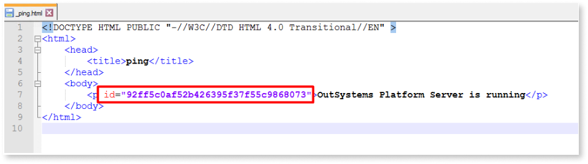

# Troubleshoot failed deployments due to an error in ping

At the end of a module’s deployment, a request is made to the module’s **_ping.html** file to confirm the module was correctly deployed. 
The request’s result to _ping.html is then compared  the actual value of the _ping.html compiled on the server side.

The content of the _ping.html are be similar to this:

```
<html>
	<head>
		<title>ping</title>
	</head>
	<body>
		<p id="92ff5c0af52b426395f37f55c9868073">OutSystems Platform Server is running</p>
	</body>

</html>
```

If this is not returned correctly, you will see following errors at the end of the deployment:

1. **Could not invoke ping**: This error occurs when the module’s _ping.html file could not be reached.

1. **Unexpected content found in ping**: This error occurs when the content of the _ping.html file received is not the expected one.

## Identifying each scenario

### Could not invoke ping

This can be caused by different reasons which are usually defined within the following HTTP status code errors:
* 5xx errors
* 4xx errors
* 3xx errors

To confirm which one you are currently facing, you can take a look at the error details in Service Center or during the publish operation. This will give you the error code received on the ping request:

* **Deployment failed**: Deployment failed. Could not invoke ping. **Exception**: The remote server returned an error: (**503**) Server Unavailable.

### Unexpected content found in ping

For this specific error, there can be different scenarios why the ping response is unexpected:

* **Code Injection on the _ping.html file**: This alters the file altogether, adding content that differs from the original _ping.html file.

To confirm if you are in an **injection scenario**, you can take a look at the error details in Service Center. The error stack will display the content of the _ping.html that was received. The example image shows a javascript that should not be present in the file.


* **Redirection scenario**: In this case, the content of the _ping.html file does not match the expected one because the file being accessed does not correspond to the module being published. it’s from another module instead.

Follow these steps to confirm if you are in the redirection scenario:

1. Access the Deployment Controller server and find the _ping.html on the running folder of the affected module (OutSystems->PlatformServer->Running->module).


2. Open the file  with a text editor and check the ID present at the beginning of the file.



3. Look into the Service Center’s Error logs where the deployment error is located. Open the details of the error and check the returned response, focusing on the ID contained in the _ping.html file.


4. Compare that ID with the one you found in the running folder of the module. If the IDs do not match, you are in a redirection scenario. This means that module A has a redirect rule to Module B, so pinging Module A will give us the ping of Module B.

## Troubleshooting each scenario

### Could not invoke ping

After identifying the status code which occurs as a result of the attempted ping request, we can proceed with the troubleshooting steps accordingly:

#### 5xx errors
Most common errors include 504, 503, 502 and 500. 

1. **504 - Gateway Timeout**: You can try to increase the Gateway Timeout

2. **503 - Server Unavailable**: This is usually related to an issue with the application pool in IIS being stopped or malfunctioning. Make sure the ApplicationPool is running correctly on the affected server.

3. **502 - Bad Gateway**: Follow [this documentation](https://success.outsystems.com/support/troubleshooting/application_runtime/troubleshooting_http_502_bad_gateway/) for this error code

4. **500 - Internal Server**: Access the faulty server and navigate to the following page on the browser:  `localhost/<module_being_deployed>/_ping.html`. This will provide more detail on the error, showing specific actions to take on the **Coding Error** section.


#### 4xxx errors
Most common errors include 404 and 403

1. **404 - Not Found**: This happens when the module cannot be reached nor deployed since IIS is down or unavailable. Make sure IIS is working properly.

2. **403 - Forbidden**: This error can have multiple different reasons, such as:
    * The identity user of the application pool not having access to the requested resource;
    * Having HTTPS required for the default web site; 
    * Having wrong DNS mappings. 

So making sure your network configuration is well configured is important to mitigate this error.

### Unexpected content found in ping

To mitigate this error, you need to understand its origin first. After confirming if you are in a injection or redirection scenario, you may proceed with the steps below accordingly:

#### Injection scenario

1. Disable the tool performing the injection (For example Dynatrace or any other software that scans the requests).

1. Configure the tool in question to not inject any scripts on the _ping.html file. 

#### Redirection scenario

1. Validate if any SEO rules are defined in the Environment. Go to `Service Center > Administration > SEO Rules`.

1. Look for any rule affecting the module being deployed and delete it, making sure the rule is not strictly necessary for your daily operations and business.

1. If no rule is found there, look into the following tables in the database:
* OSSYS_PATHRULE
* OSSYS_SITERULE

4. If the tables have any rules for the module affected, delete them with a query similar to: `delete from <table_name> where id in (<id1>,<id2>,…)`
