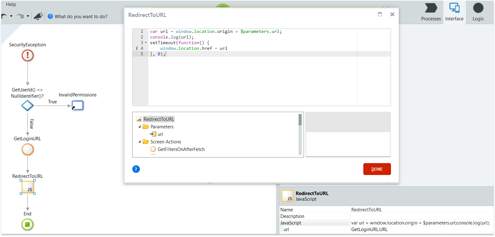

# Troubleshooting and known issues with SEO-friendly URLs for Reactive Web Apps

This document provides troubleshooting and known issues related to **SEO-friendly URLs for Reactive Web Apps**.

## Known issues

The following sections cover more technical details related to the known issues.

### Redirects don't work after adding rules

In a small number of OutSystems Cloud environments the redirect rules may not work initially. This may happen in environments that satisfy all prerequisites for the **SEO-friendly URLs for Reactive Web Apps**. To make your redirects work, first check what version of React your OutSystems apps are running.

Do the following in Google Chrome to get the React version your apps are using:

1. Visit a page that belongs to your OutSystems app.
1. Press **F12** to open the browser console.
1. Paste the following code into the console: `console.log("React Version " + require("react").version);`
1. Press **Enter** to confirm. The console returns the React version.

If your React version is **lower than 16**, contact OutSystems Support and inform them that your OutSystems Cloud environment isn't running React 16. There may be a valid technical reason why your OutSystems Cloud is still using React 15.

### Empty string in a required parameter causes an error

When the app runtime passes an **empty string** as a value for a **required parameter** of the Text data type, by design the screen can't load. The users of the app see the following error:

* Error building URL for (screen name)/:(parameter name). Parameter (parameter name) is missing or has an empty value.

As a fix, try configuring the Screen without parameters on the path.

### Users can't access page when Screen has External URL in SecurityException

If you have:

* An active site rule for a domain
* An **External URL** node in the **SecurityException** logic

The following happens and prevents users from accessing a login page or a home page:

* A blank page loads in the browser
* Service Center logs show an error with the message "Content Security Policy blocked `<url>`"

To fix the issue, use a **JavaScript** note instead of the **External URL**, and add the following code:

```javascript
var url = window.location.origin + $parameters.url;
console.log(url);
setTimeout(function() {
    window.location.href = url
}, 0);
```

Here is a screenshot of the fix:


