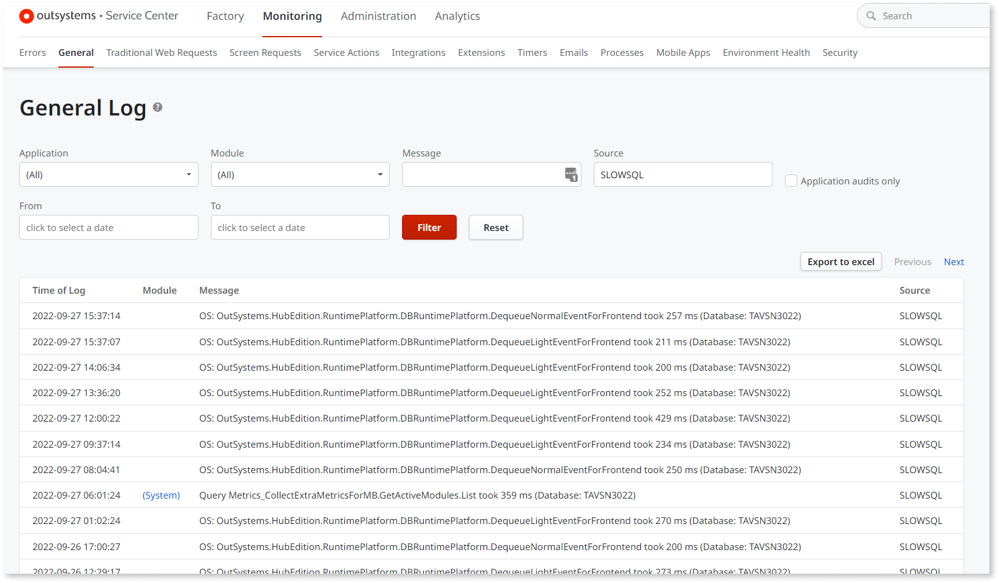

# SLOWSQL log messages

## Overview

Service Center includes logging information about slow queries for Platform
Server and Modules, which allows troubleshooting of performance issues. These
messages identified as 'SLOWSQL' appear in 'General Logs'.

Measurement of database processing time happens during query execution.
However, this doesn't consider the fetching of the results over the network and
into memory. Query optimization fetches records progressively as needed by the
runtime.

In case the query duration is greater than the defined threshold, then the
SLOWSQL log message triggers. This threshold is 200 ms by default and
configured using Factory Configuration on the “Slow Query Threshold” option of
the “Platform Configurations” tab.

## Operating constraints

Due to the way queries work on the platform, the logs can only account for the
time taken between the moment the query starts and finishes database
processing. These queries are usually optimized to fetch the records
progressively while iteration happens (eg. in a `For` node, screen list widget,
etc). This makes it impossible for the log to include the real duration since
other operations are executing during the process.

Due to [Server-to-client data transfer optimizations that the platform may
perform](https://success.outsystems.com/Documentation/11/Developing_an_Application/Implement_Application_Logic/Server-to-client_data_transfer_optimization),
changing the flows and screens to measure the real elapsed time can lead to
completely different results.

For example: isolating the query in an action and iterating all the records can
cause more attribute fetching than the ones a screen would read.

The opposite can also occur: not fetching any fields because they're never
read in the action. These optimizer decisions can lead to completely different
results than the normal ones the application would get. It also changes the
execution plans on the database, making it even less deterministic for a
troubleshooting process.

This behavior has always existed and it doesn't depend on the platform
version.

## Measuring the complete operation

In situations where a list iteration is inside an action, an alternative is to
call `LogMessage` actions before and after the query and the iterations. This
way it's possible to measure the complete access to the data, including the
fetch of the information. Don't use any output of the query on the `LogMessage`
action to avoid having an impact on optimizations.

When screen widgets iterate over the result list the fetching of data happens
between the screen rendering operations. This happens most of the times,
depending on the optimizer, which makes measurement more challenging. It's not
recommended to isolate the query in an action or to force its iteration inside
the preparation. That would change the optimizations and potentially give
completely different performance results.

The best way is to make a copy of the screen and remove as many of any
other elements unrelated to that query as possible. Then, validate the render
time of the screen.
