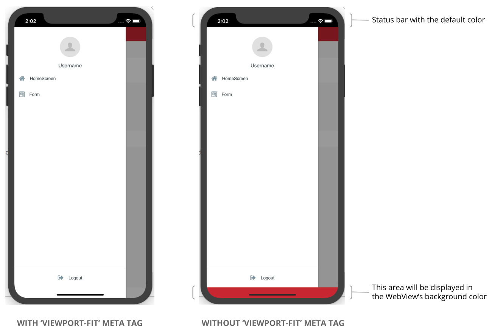
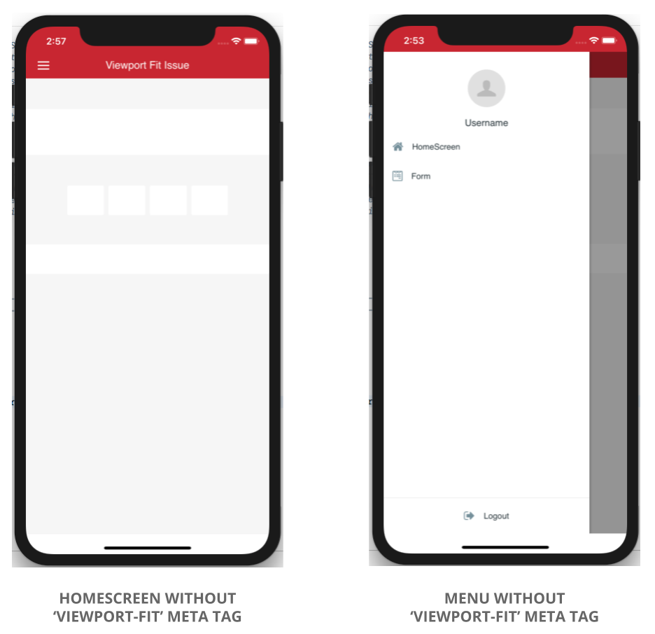

# Further Recommendations on the MABS 4.0 Viewport-Fit Issue in iOS 12 Phones

OutSystems proposes a way to solve the [known issue about the "viewport-fit" meta tag](https://success.outsystems.com/Support/Release_Notes/Mobile_Apps_Build_Service/MABS_Version_4.0#Known_issue) in iPhones running iOS 12. However this causes the app to stop using the entire screen, and an empty bottom bar appears over the "home" button area in iPhone X devices. 

The following images show a mobile app with and without the "viewport-fit" meta tag: 



To provide a better user experience, you can change the Status Bar color and the default background color of the WebView in runtime.

## To change the color of the Status Bar

You can [change the color of the Status Bar](https://success.outsystems.com/Documentation/11/Delivering_Mobile_Apps/Customize_Your_Mobile_App/Customize_the_Application_Status_Bar#Status_Bar_with_a_Different_Color) during development.

You can also change the color of the Status Bar in runtime with the following JavaScript code:

```javascript
if (typeof(window.StatusBar) !== 'undefined') {
    window.StatusBar.backgroundColorByHexString("#C3272B");
}
```

**Note:** With this workaround, [using the Status Bar preference "StatusBarOverlaysWebView"](https://success.outsystems.com/Documentation/11/Delivering_Mobile_Apps/Customize_Your_Mobile_App/Customize_the_Application_Status_Bar#Transparent_Status_Bar_in_Full_Screen_App) is no longer recommended because this places the transparent Status Bar over an empty top bar with the default background color of the WebView. 

## To change the default background color of the WebView in runtime

Change the background color of the WebView in runtime with the following JavaScript code:

```javascript
if (typeof(window.plugins) !== 'undefined' && typeof(window.plugins.webviewcolor) !== 'undefined') {
    window.plugins.webviewcolor.change("#FFFFFF");
}
```

After changing the Status Bar color and the default background color of the WebView, the mobile app should look like the following images:


