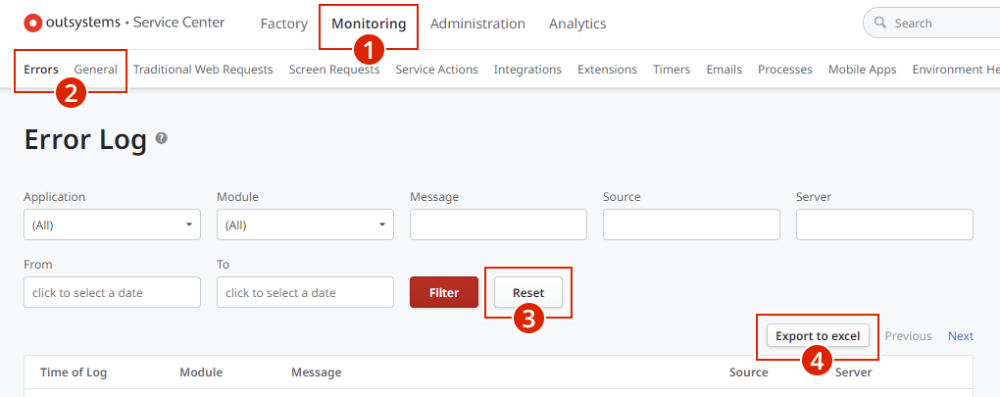

# How to get logs for troubleshooting purposes

This article explains how to get the logs and report files from the several OutSystems components and other system components.

In context of a support case, OutSystems Support might require that you provide some of these files so they can troubleshoot the issues you are experiencing. In this situation, you should get the required files as described in this article and attach them to your support case.

## Service Studio Report

When an **unexpected error** occurs in Service Studio, you will get an Unexpected Error window. The Service Studio report has all the actions performed inside Service studio within an active session as well as all unhandled exceptions. 

Click the accordion below to learn how to get the Service Studio report.

    

   	Get Service Studio Report
  	

1. Click **You can help us fix this…** to expand the window, if it’s not expanded.

    

1. Click **View diagnostics report** to open the report in a text editor. In OutSystems 10, use the link **View report**.

    

1. Save the report as a text file. If you need help from OutSystems support but you don’t have an open support case yet, you can use the link **open a support case** to go to Support Portal.
1. Click **Continue** to close the window. In OutSystems 10, use **Cancel**.
   

## Service Center Logs

### Runtime Logs

The [logs for the runtime of the platform](https://success.outsystems.com/Documentation/11/Managing_the_Applications_Lifecycle/Monitor_and_Troubleshoot/View_the_Environment_Logs_and_Status#monitoring-area) are available in the **Service Center** console of each environment - application and LifeTime environments. These logs can be helpful when trying to debug a specific feature or behavior and understanding exactly what is happening within that process. You can access the following reports from Service Center:

* Errors
* General logs
* Web requests
* Mobile requests
* Service Actions
* Integrations
* Extensions
* Timers
* Emails

Click the accordion below to learn how to get Runtime logs.

    

   	Get Runtime Logs
  	

    

 1. In the Service Center console of the environment you want to obtain the logs from (`https://<your_server>/ServiceCenter`), go to the **Monitoring** section.
 1. Choose the type of logs you want to get (e.g., **Errors** or **General**).

 1. Click **Reset** to remove filters.

 1. Click **Export to excel** to save the file.

 

### Mobile App Generation Logs

OutSystems logs the generation steps of a mobile app package, including the stack trace with additional details in case of error. These logs help us understand which steps were taken while generating the mobile application, and in case of failures, where the generation failed exactly.

Click the accordion below to learn how to get Mobile App logs:

    

   	Get Mobile App Generation Logs
  	

1. If you are in Service Studio, go to the details page of the mobile app and click **Application Management...** to open the mobile app's page in Service Center console. The page opens in a separate browser.

    

    Otherwise, open the Service Center console of the environment (`https://<your_server>/ServiceCenter`), select **Factory** » **Applications**, and click the mobile app name to go to the app details page.

1. Click the **Native Platforms** tab. You will see the information about the latest mobile app package generation for each mobile platform.

    

1. Click the **Log File** icon to save the file.

## LifeTime Reports

From the LifeTime console, you can obtain the following reports:

* LifeTime report
* Staging report
* User permissions report

You need [Manage Infrastructure and Users](https://success.outsystems.com/Documentation/11/Managing_the_Applications_Lifecycle/Manage_IT_Users/Understand_the_Permission_Model_for_IT_Users) permission to get these reports. If you don’t have this permission, contact your infrastructure manager.

### LifeTime Report

This report has information about each environment within LifeTime's infrastructure as well as the available environments configurations, present in LifeTime. It helps paint a picture on what configurations are enabled for each environment within LifeTime as well as how the infrastructure is built and designed.

Click the accordions below to learn how to get the LifeTime report in OutSystems 11 and OutSystems 10.

    

   	Get LifeTime Report in OutSystems 11
  	

1. Access the page `https://<LifeTime_server>/lifetime/troubleshoot.aspx`.

1. Click the link **Download Infrastructure report** to save the file.

    

    

   	Get LifeTime Report in OutSystems 10
  	

1. Go to the LifeTime console, `https://<LifeTime_server>/lifetime`.

1. Click the **Send us your feedback** icon on the upper right corner.

    

1. Click the **here** link to save the file.

    

### Staging Report

The staging report is the unified report of each LifeTime deployment. It has useful information such as:
  * existent applications in the managed environments,
  * versions (tags) of the existing applications,
  * entity keys and their module versions from entities that require configurations (e.g., catalog or schema), etc. 

Click the accordions below to learn how to get the Staging report in OutSystems 11 and OutSystems 10.

    

   	Get Staging Report in OutSystems 11
  	

1. Access the page `https://<LifeTime_server>/lifetime/troubleshoot.aspx` to see the **Deployment/Staging** list.

1. In the Staging list, identify the staging you need to troubleshoot. You can filter by the staging date or environments.

1. In the row of the identified staging, click the link **Download staging report** to save the file.

    

    

   	Get Staging Report in OutSystems 10
  	

1. Go to the LifeTime console, `https://<LifeTime_server>/lifetime`.

1. In the **Applications** page, click the name of the target environment and select **View Change Log** from the drop-down.

    

1. Take note of the deployment plan number for the deployment you want to troubleshoot.

    

1. Using that deployment plan number, access the following page:
 `https://<LifeTime_server>/lifetime/DebugStaging.aspx?StagingId=<deployment plan number>`.

     For the Java stack, use: `https://<LifeTime_server>/lifetime/DebugStaging.jsf?StagingId=<deployment plan number>`.

1. Click **download the staging report** to save the file.

### User Permissions Report

Click the accordions below to learn how to get the User Permissions report in OutSystems 11 and OutSystems 10:

    

   	Get User Permission Report in OutSystems 11
  	

1. Access the page `https://<LifeTime_server>/lifetime/troubleshoot.aspx`.

1. Click **Download the user permissions report** to save the file.

    

    

   	Get User Permission Report in OutSystems 10
  	

1. Access the page `https://<LifeTime_server>/lifetime/DebugPermissions.aspx`.

     For the Java stack, use `https://<LifeTime_server>/lifetime/DebugPermissions.jsf`.

1. Click **download the user permissions report** to save the file.

    

## Get BPT Utils Troubleshooting Report

[BPT Utils](https://www.outsystems.com/forge/component-overview/1313/bpt-utils) is a Forge component that provides information about BPT Processes, including a troubleshooting report.

If you haven’t done it yet, you must install BPT Utils component in your LifeTime environment (you need “Full Control” permissions in the environment):

1. Download [BPT Utils](https://www.outsystems.com/forge/component-versions/1313) from OutSystems Forge. You will get an OutSystems application file (.oap). There is one version available for OutSystems 9.1, 10 and 11. Make sure to download the version corresponding to your LifeTime environment.

1. Go to the Service Center console of your LifeTime environment (`https://<LifeTime_server>/ServiceCenter`).

1. Go to **Factory** » **Applications**.

1. Click the **Publish an Application** link.

1. Click **Choose File** and select the .oap file you downloaded from Forge.

1. Click **1-Click Publish**.

BPT Utils is now installed in your LifeTime environment.

Click the accordion below to learn how to get the BPT Utils troubleshooting report.

    

   	Get BPTUtils troubleshooting report
  	

1. In the BPT Utils application (`https://<LifeTime_server>/BPTUtils/`), click the **Troubleshooting Processes** tab.

1. Click **Download Troubleshooting Report** to save the file.

    

## .Net Stack Specific Logs

### Windows Event Logs

The Windows Event Viewer shows a log of application and system messages, including errors, information messages, and warnings.

Click the accordion below to learn how to get the Windows Event logs.

    

   	Get Windows Event Logs
  	

1. Connect to the server using Remote Desktop.

1. Launch the Windows Event Viewer application.

1. Expand the **Windows Logs** folder.

1. Select the logs category, such as **Application**, **Security**, or **System**.

1. Click **Save All Events As…** on the right panel to save the file.

    

1. Name the file **SystemEventViewer.evtx** and click the **Save** button.

1. Click **OK** you see a Display Information dialog.

### IIS Manager Logs

IIS logs are meant to record data from Internet Information Services, web pages, and apps. While IIS itself contributes to the scalability and flexibility of web resources, the log files contain specific statistics about the websites, user data, site visits, IPs, and queries. These files can help you detect a problem a specific call between your server and another external server or service and understand if there are any underlying network issues.

Click the accordion below to learn how to get IIS Manager logs:

    

   	Get IIS Manager Logs
  	

1. Connect to the server using Remote Desktop.

1. Launch the Internet Information Services (IIS) Manager application.

1. On the tree to the left, select your website.

1. Double-click the **Logging** feature.

    

1. Check the **Directory** where the log files are stored.

    

1. Use the File Explorer to navigate to the logs directory.
1. Zip all the directory content to attach to your support case.

## Java Stack Specific Logs

These logs represent various moments during an application execution in a Java context. With these logs we can understand which methods or functions are being called within a Java application during runtime.

Click the accordions below to learn how to get Java Stack specific logs:

    

   	Get JBoss Logs
  	

1. Connect to the server.

1. Find the log files at:
     * JBoss 5: /opt/jboss-5.1.0.GA/server/outsystems/log
     * JBoss 7: /opt/jboss-as-7.1.1.Final/standalone/log

    

   	Get WildFly Logs
  	

1. Connect to the server.

1. Find the log files at:
     * WildFly 8.2: /opt/wildfly-8.2.0.Final/<wbr/>standalone/log

    

   	Get WebLogic Logs
  	

1. Connect to the server.

1. Find the log files at:
     * Admin Server logs: /opt/Oracle/Middleware/user_projects/domains/outsystems_domain/servers/AdminServer/logs
     * Managed Server logs: /opt/Oracle/Middleware/user_projects/domains/outsystems_domain/servers/`<ManagedServerName>`/logs

## Platform Solution File 

A Platform Solution is a list of all modules and dependencies related to a certain application that make up all the application’s content and references. Having a full solution for an application helps us understand how each element works with all its other dependencies. This makes sure that no connection is broken between each module and works properly. 

Click the accordion below to learn how to get the Platform Solution file:

    

   	Get Platform Solution File
  	

1. In the Service Center console of the Source Environment (https://<source_environment>/ServiceCenter), go to the Factory area.
2. Click **Solutions**.
3. Click **New Solutions** and choose a name and description for your solution. 

4. Click **Save**. 
5. In the **Components** tab, choose all the modules of the applications you want to deploy. Make sure to select include dependencies as components option.
6. Click the **Associate** button. You'll see the application modules and all dependencies in the Associated Components list.

7. Dissociate any system module that might have been added as a dependency (for example, modules from Charts Web, Charts Mobile, OutSystems UI, etc) by selecting those modules from the list and clicking the **Dissociate Selected** button. The Solution must contain only the modules of your application.

8. Go to the **Versions** tab and click **Create Version**. 

9. Choose a Name and a Description for the version, and click **Save**. This version is a snapshot of the currently running version of all the modules in the Solution, which you are able to deploy later if you need.
10. Click **Download** to save the .OSP file of the Solution.

## Platform Service Logs 

The Service logs are the logs for the OutSystems services, such as the Scheduler or the Deployment service. These logs help us understand in more detail what is happening within the OutSystems services actions and logic being run during normal operations, such as running timers, compiling modules or synchronizing environments. [Click here](`https://success.outsystems.com/Support/Troubleshooting/Application_lifecycle/Change_OutSystems_platform_logging_levels_-_OSTrace`) to read more about Platform Logs. 

## Database - AWR and ADDM Report

The AWR and ADDM report are database reports detailing important information about the performance of the database. 

ADDM automatically detects and reports on performance problems with the database, such as:

  * Adding CPUs or changing the I/O subsystem configuration
  * Changing initialization parameter settings
  * Hash partitioning a table or index, or using automatic segment-space management (ASSM)
  * Using the cache option for sequences or using bind variables
  * Running the SQL Tuning Advisor on high-load SQL statements or running the Segment Advisor on hot objects

AWR has valuable information such as:
  * CPU Statistics
  * Wait Time Statistics
  * Workload Profile
  * Sessions

[Click here](`https://docs.oracle.com/database/121/TGDBA/compare_stats.htm#TGDBA272`) to learn how to get AWR reports. 

## Network - HAR File

HAR is the short form for **HTTP Archive Format**, which tracks all the logging of web browser's interaction with a site. You may this file if you encounter the following issues:
  * Performance issues: slow page load, a timeout when performing a certain task, etc.
  * Page rendering: incorrect page format, missing information, etc.

Click the accordions below to learn how to get HAR file from different browsers.

    

   	Get HAR file for Google Chrome
  	

1. Navigate to the page of the application that is facing the issue.
1. Press **F12** or open the dev tools on the top right of Google Chrome. Under **More tools**, select **Developer Tools**.
1. Open the **Network** tab.
1. Check the **Preserve log** option and clear the log.
1. Turn on recording using the **Record Network Log** button.
1. Attempt to reproduce the issue.
1. Right-click the log and Save as HAR with content.

    

   	Get HAR file for Firefox
  	

1. Navigate to the page of the application that is facing the issue.
1. Press **F12** or open the dev tools by selecting the Firefox menu (three horizontal parallel lines) at the top-right of your browser window. Under **More tools**, select **Web Developer Tools**.
1. Open the **Network** tab.
1. Check the **Preserve log** option and clear the log.
1. The recording autostarts when you start performing actions in the browser.
1. Attempt to reproduce the issue.
1. Once you have reproduced the issue and you see that all of the actions have been generated in the Developer Network Panel, right-click anywhere under the **File** column, and click **Save all as Har**.

    

   	Get HAR file for Edge
  	

1. Press **F12** to open the debug pane.
1. Clear the session history before reproducing.
1. To clear the session history press the button indicated by three lines and a red **X**.
1. Click **Play** at the top left of the debug pane to start recording.
1. Reproduce the issue.
1. Press the **red square** to stop recording.
1. Export the results as a HAR file by pressing the **Save** button that is identified as a floppy disk.

    

   	Get HAR file for IE11
  	

1. Press **F12** or go to the **Tools** menu and select **F12 Developer Tools**.
1. Open the **Network** tab.
1. Press the **green play button** (Enable network traffic capturing F5) on the left to start capturing.
1. Refresh the page by pressing **F5** on your keyboard, and the network traffic should be displayed.
1. Once the trace is complete, press **Export captured traffic** (second from left) and save the network trace as an xml file.

