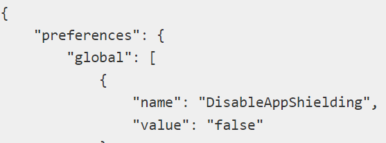

<h1>How to confirm if AppShield obfuscation is being correctly applied.</h1>

<strong>Symptoms</strong>: Mobile application source code is not obfuscated, AppShield obfuscation is not working, Exposed Code

<h2>Precautions</h2>

The limitations that are specific to the obfuscation.

<ul>
    <li>The plugin obfuscates only the supported <strong>OutSystems</strong> mobile plugins.</li>
    <li>The plugin obfuscates native Android logs in Service Center. You need to use an external tool to deobfuscate the logs.</li>
    <li>JavaScript files obfuscation isn't supported.</li>
    <li>Native iOS bitcode obfuscation isn't supported.</li>
    <li>You need to contact Support to get the mapping files.</li>
</ul>

<h3>When is this Article Useful?</h3>

This article provides valuable insights and solutions for those who are dealing with:

<ul>
    <li><strong>AppShield:</strong> If you're using AppShield for your application and need assistance.</li>
    <li><strong>Application Obfuscation:</strong> When you're looking to obfuscate your application for enhanced security.</li>
    <li><strong>Code Exposure:</strong> If you're concerned about the exposure of your application's source code.</li>
    <li><strong>Obfuscation Error:</strong> For troubleshooting errors or issues that occur during the obfuscation process.</li>
    <li><strong>Secure Code:</strong> When you aim to ensure the highest level of security for your application's code.</li>
    <li><strong>Reverse Engineering:</strong> If you want to defend your application against reverse engineering attempts.</li>
</ul>

If you are encountering any of the above issues or scenarios, this article will serve as a comprehensive guide to help you resolve them.

<h2>Troubleshooting</h2>

Basic validations:

<ul>
    <li>Mobile app contains dependency to AppShield;</li>
    <li>AppShielding feature is enabled on the extensibility configurations:</li>
</ul>

<ul>
    <li>The code that is not obfuscated belongs to an OutSystems supported plugin;
    <ul>
        <li>AppShield only obfuscates the source code of supported plugins.</li>
        <li>Obfuscating non-supported plugins isn't fully automatic in OutSystems and is necessary to configure custom obfuscation rules as is described in the <a href="https://success.outsystems.com/documentation/11/delivering_mobile_apps/harden_the_protection_of_mobile_apps_with_appshield/creating_custom_obfuscation_rules/">following documentation</a></li>
    </ul>
    </li>
</ul>

Custom obfuscation rules

<ul>
    <li>If using custom obfuscation rules, verify if the rules are present in the extensibility configuration of the mobile module. It is recommended to use the <a href="https://enmobile11.outsystemsenterprise.com/ObfuscationHelper/">Obfuscation Helper</a>.</li>
</ul>

{ "preferences": { "global": [ { "name": "AppShieldObfuscationRules", "value": (bases64-encoded rules) } ] } }

<ul>
    <li>Confirm if the class that is not obfuscated was included in the custom obfuscation rules.</li>
</ul>

<strong>[Android decompile]</strong>: to decompile an apk and analyze the source code to see if it's obfuscated or not, <a href="https://github.com/skylot/jadx">you can use Jadx from github.</a>

<h2>Incident Resolution Measures</h2>

<strong>Solution</strong>

<ul>
    <li>Validate if AppShield is enabled in extensibility configurations;</li>
    <li>Check if the custom obfuscation rules are including the classes that are not obfuscated;
    <ul>
        <li>Non supported plugins are not obfuscated. These must be included in the custom obfuscation rules.</li>
    </ul>
    </li>
</ul>
