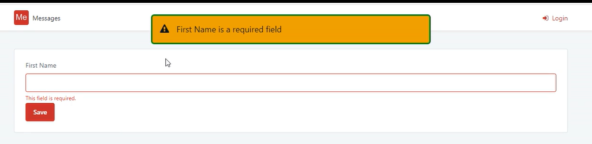

<h1>Feedback Messages are not keyboard accessible</h1>

<strong>Symptoms</strong>: Feedback Messages accessibility, Feedback Messages are not keyboard accessible

<h2>Precautions</h2>

Applies to Mobile Apps and Reactive Web Apps only

<h2>Troubleshooting</h2>

<ul>
	<li>This issue is replicated by adding a feedback message to a screen.</li>
	<li>When tabbing through the page elements the feedback message will never get focused.</li>
</ul>

<h2>Incident Resolution Measures</h2>

One of the ways to overcome this issue is to add a custom JavaScript to the OnApplicationReady action. You can do so by following the steps bellow:

<ul>
	<li>Add an <strong>OnApplicationReady </strong>client action; 
	</li>
	<li>In the above created <strong>OnApplicationReady </strong>client action add the following JavaScript; 
	</li>
</ul>

<table border="1" cellpadding="1" cellspacing="1" style="width:550px">
	<tbody>
		<tr>
			<td><code>setInterval(function () {     
			    var feedbackMsg = document.querySelector(".feedback-message");     
			    if (feedbackMsg &amp;&amp; feedbackMsg.tabIndex !== 0) {         
			        feedbackMsg.tabIndex = 0;         
			        feedbackMsg.addEventListener("keyup", function (evt) {           
			          if (evt.key === "Enter" || evt.key === " ") {                                  $public.FeedbackMessage.closeFeedbackMessage(); 
			          }         
			        });     
			    } 
			}, 500);</code></td>
		</tr>
	</tbody>
</table>

 

<ul>
	<li>(OPTIONAL) For troubleshooting purpose and in order to confirm the feedback message is being focused you can add the following CSS to the module in order to change the focus outline;</li>
</ul>

<table border="1" cellpadding="1" cellspacing="1" style="width:400px">
	<tbody>
		<tr>
			<td><code>:focus { outline: green solid 3px !important; }</code></td>
		</tr>
	</tbody>
</table>

After the above implementation, the feedback message will be focused when tabbing through the page elements. 

