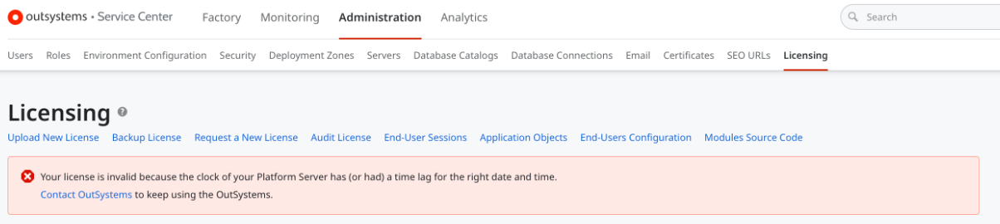

# There is a licensing error in the Service Center as follows: Your license is invalid because the clock of your Platform Server has (or had) a time lag for the right date and time

**Symptoms**: Your license is invalid because the clock of your Platform Server has (or had) a time lag for the right date and time

## Precautions

Applies to On-Premises infrastructures.

## Troubleshooting

The following error may be visible on the Licensing page in the Service Center:

*Your license is invalid because the clock of your Platform Server has (or had) a time lag for the right date and time.*

## Incident Resolution Measures

- Validate if all the timezones are correct and synchronized in all the Front End servers and the Database server. It is a requirement for all servers to be in the same timezone and synchronized.
- If time is synchronized on all the Front Ends, then validate the following:
    - In the Deployment Controller server, restart the following services:
        - OutSystems Deployment Controller Service
        - OutSystems Deployment Service
        - OutSystems Scheduler Service
- In the other Front Ends of that environment, restart the following services.
    - OutSystems Deployment Service
    - OutSystems Scheduler Service
- If the issue is still present even after doing the above restarts, then it may attempt downloading the license and re-uploading it again into that Environment.
    - Go to the Customer Portal and download the license file for the affected environment, as per the article [Get a license file for an environment](https://success.outsystems.com/support/enterprise_customers/licensing/manage_and_upgrade/get_a_license_file_for_an_environment/) (section 'Getting the license file')
    - Go to the Service Center of the affected environment, and backup your current license using the "backup license" link, as per the article [How to install a license file](https://success.outsystems.com/support/enterprise_customers/licensing/manage_and_upgrade/how_to_install_a_license_file/)
    - Upload the new license file that you downloaded on the first step, also as per the article [How to install a license file](https://success.outsystems.com/support/enterprise_customers/licensing/manage_and_upgrade/how_to_install_a_license_file/)
    - Restart the services as mentioned previously.
- If the issue still persists after doing all the above, it is possible that the license settings were tampered or corrupted.
    - Collect the contents of the OSSYS_ACTIVATION table from the Database;