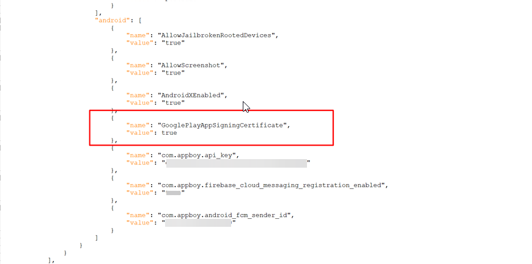
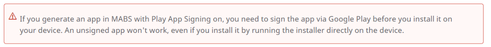
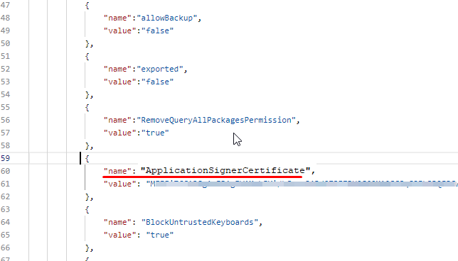
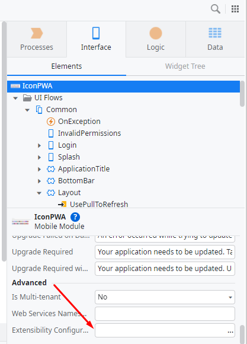
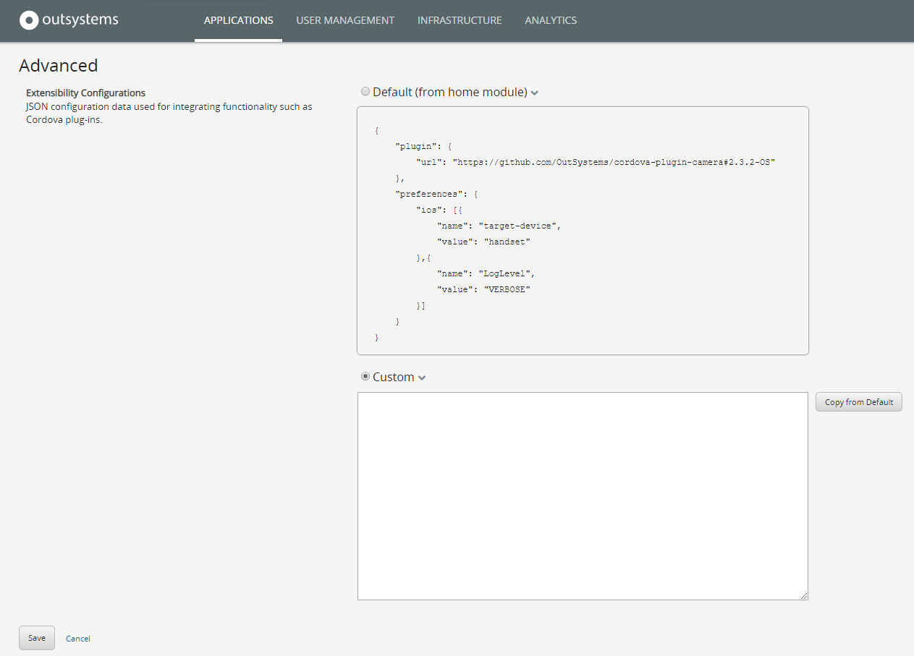

# Android Mobile app with AppShield crashes on Loading

**Symptoms**: Android App crashes on load, App with Appshield crashes on loading

## Precautions

AppShield is an enforcer plugin that disables many security risks usually found on PenTests - [Harden the protection of mobile apps with AppShield](https://success.outsystems.com/documentation/11/delivering_mobile_apps/harden_the_protection_of_mobile_apps_with_appshield/)

When enabling AppShield in Development/testing environments, you may encounter issues such as:

* Unable to debug apps
* Code obfuscation
* The need for the app to be uploaded to the Google Store in order to work on Android phones

This last issue is related to a setting in the Extensibility Configurations. When you set this property to active and then test the app, the app doesn't load and crashes. We address this in detail below.

**Note:** The way the **AppShield property** is set in the Extensibility Configurations has changed compared to older versions. As a result, it is common to encounter reports stating that "_after updating AppShield, the builds (.aab) are failing._"

This usually happens when you try to submit your builds to the store. If the property is not configured according to the newer AppShield requirements, AppShield will not recognize the signing certificate from the store (e.g., Google Play Store), which leads to failure.

In most cases, the issue occurs when using the **old property GooglePlayAppSigningCertificate** instead of the required **ApplicationSignerCertificate** (as shown in the Troubleshooting step and screenshot below):

**Note:** Even after switching to the new property, ensure that the old property (GooglePlayAppSigningCertificate) is removed. Otherwise, the application may still fail.

## Troubleshooting

For more information, refer to [Harden the protection of mobile apps with AppShield](https://success.outsystems.com/documentation/11/delivering_mobile_apps/harden_the_protection_of_mobile_apps_with_appshield/).

This means that with this setting active, the app doesn't work unless it is downloaded via the Google Play Store. If you install a build downloaded from the platform and install it on a device, when loading the app, it will crash and doesn't work.

To determine if you are affected:

* The property **"name": "ApplicationSignerCertificate"** is set on the extensibility configurations. You can check it on the Service Studio or Lifetime, depending on where you have the Extensibility Configurations set.

For more information, refer to [Override the default mobile extensibility configurations](https://success.outsystems.com/documentation/11/deploying_apps/override_the_default_mobile_extensibility_configurations/).

## Incident Resolution Measures

In order to overcome this situation, you will need to delete this configuration.

You will add it later, before generating the final Build ready for Google Play Store deployment.