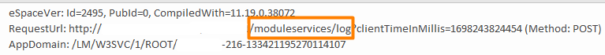

<h1>"Request failed with an error" / "The connection has timed out" client-side errors</h1>

<strong>Symptoms</strong>: "Request failed with an error", "The connection has timed out" client-side errors

<h2>Precautions</h2>

This only applies to Reactive applications and Platform Server versions prior to 11.21.0 (the logging of client-side errors was already in Platform Server version 11.21.0 due to RPM-991).

<h2>Troubleshooting</h2>

<h3><strong>Context</strong></h3>

When client-side exceptions occur in Reactive OutSystems applications, errors are logged to the platform via distinct requests to the <code>/moduleservices/log</code> endpoint of the respective module:

<ul>
	<li>Note the failed Data Action followed by the request sent to the <strong>log</strong> endpoint: 
	 
	 </li>
	<li>This can also be seen in extracted Error Logs (Environment Information column): 
	</li>
</ul>

Unfortunately, some client-side errors provide little additional insight as to the cause of the error - e.g. <code>Request failed with an error</code> or <code>The connection has timed out</code> errors.

<ul>
	<li>Errors may be caused by faulty internet connections, firewalls, canceled requests by moving to different pages or starting other requests/actions, etc.</li>
	<li>Timeouts may be caused by low timeout values configured client-side, but we do not know where they are actually occurring.</li>
</ul>

<h2>Incident Resolution Measures</h2>

<h3><strong>Improved exception logging</strong></h3>

In order to improve troubleshooting, here is a script that may be added to the <strong>OnApplicationReady</strong> action of any given module and make it so that the logged messages now also have the <u>URL</u> that was being accessed:

<ol>
	<li><strong>Logic</strong>&gt; Right-click <strong>Client Actions</strong> &gt; <strong>Add System Event</strong> &gt; <strong>OnApplicationReady</strong>: 
	 
	 
	 </li>
	<li>Add a Javascript node with the following code: 
	 
	</li>
</ol>

<code>var Logger = require("OutSystems/ClientRuntime/Main").Internal.Logger; 
var Feedback = require("OutSystems/ClientRuntime/Main").Internal.FeedbackMessageService; 
(function (xhr) { 
   var send = xhr.send;  
   var open = xhr.open;  
   xhr.open = function (method, url) {  
       this.__URL__ = url;  
       return open.apply(this, arguments);  
   };  
   xhr.send = function () {  
       if (this.ontimeout) {  
           this.ontimeout = function () {  
               if(this.__URL__) {  
                   Logger.error("XMLHttpRequest", "The connection has timed out - Accessing URL: " + this.__URL__);  
                   Feedback.showFeedbackMessage("The connection has timed out", /*Error*/ 3);  
               }  
           };  
       }  
       if (this.onerror) {  
           this.onerror = function () {  
               if(this.__URL__) {  
                   Logger.error("XMLHttpRequest", "Request failed with an error - Accessing URL: " + this.__URL__);  
                   Feedback.showFeedbackMessage("Request failed with an error", /*Error*/ 3);  
               }  
           };  
       }  
       return send.apply(this, arguments);  
   };  
})(XMLHttpRequest.prototype);</code>

<ul>
	<li>The resulting logged errors will be as follows: 
	 
	</li>
</ul>

The main goal of this improvement is to help find patterns such as if these errors occur always in the same actions, same screens, etc. - which in turn may indicate possible improvements. For timeouts, we can know exactly which actions are timing out. 
 

<h3><strong>Limitations</strong></h3>

<ul>
	<li>In order for the <code>The connection has timed out</code> script to work, <strong>Debug mode</strong> must be <u>disabled</u> for that module:
	<ul>
		<li>For Production environments, this is likely not something to worry about, since it should be <u>disabled by default</u>. 
		 </li>
	</ul>
	</li>
	<li>This script also overrides the default feedback messages when runtime errors occur, so we trigger them explicitly within the script. If you want to prevent these from displaying to the end-user altogether, simply comment the below lines (this does not affect the logging): 
	 
	</li>
</ul>

  
You may use this script in any Reactive applications and customize it as you wish - e.g., only apply the script depending on a site property value in order to enable/disable this troubleshooting script.

We recommend only using this for troubleshooting and disabling it when not needed in order to retain the default runtime behaviors in case of exceptions.

