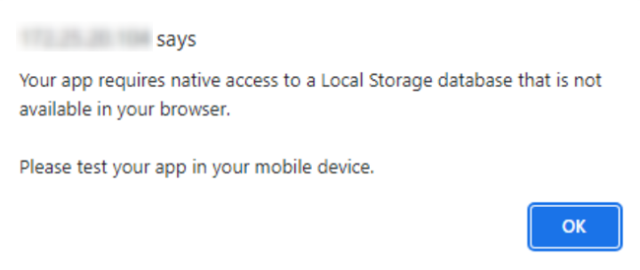
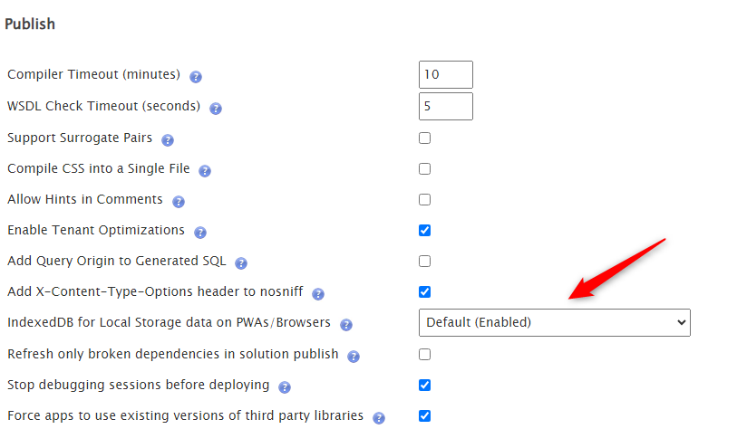

# Your app requires native access to a local storage database that is not available in your browser

**Symptoms**: Error opening mobile app in browser, Your app requires native access to a local storage database that is not available in your browser, Error opening PWA

## Precautions

Confirm this is the symptom when opening the application in the browser:

## Troubleshooting

From the Chrome version 119.0.6045.106 - Chromium 119 update (October 31, 2023), Web SQL was deprecated. More context can be found in [Deprecating and removing Web SQL](https://developer.chrome.com/blog/deprecating-web-sql/). This means that Web SQL is deprecated for mobile applications that use local data storage for offline capability.

From OutSystems Platform Version 11.8.0, there is an option in [Factory Configuration](https://www.outsystems.com/forge/component-overview/25/factory-configuration) that allows applications to run with Web SQL:

- IndexedDB for Local Storage data on PWAs/browsers

If you are getting the error above, it means you disabled this option, which is enabled by default

## Incident Resolution Measures

In order to solve this issue:

Open the Factory Configuration application in the browser from the affected environments and change the "IndexedDB for Local Storage data on PWAs/Browsers" status on the "Platform Configurations" tab to "Enabled"

Please consider the following screenshot:

It is possible that a warning pops up stating  "Configuration changes done in FactoryConfiguration might not be applied immediately". In this scenario, we recommend you [create an all content solution and apply the settings](https://success.outsystems.com/documentation/11/managing_the_applications_lifecycle/deploy_applications/configure_application_settings_after_deployment/applying_configurations_in_service_center/), so the configurations take effect.