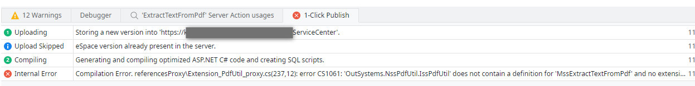
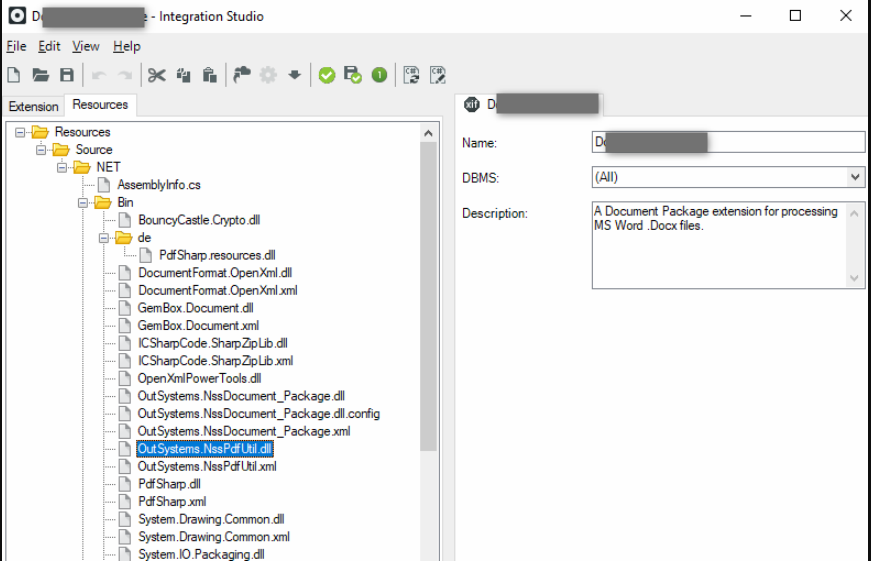

<h1>Compilation error when publishing a consumer of an extension</h1>

When consuming a newly added method from an existing Extension, it results in a Compilation Error when trying to publish the consuming module in Service Studio.

<strong>Symptoms</strong>: Unable to add/update Extension methods in Service Studio, Compilation error, Compilation error CS1061, Publish Error in Service Studio

<h2> </h2>

<h2><strong>Background</strong></h2>

A developer added a new method in an Extension and had successfully published this Extension in Integration Studio.

<h2><strong>Problem Description</strong></h2>

The issue happens when the developer refreshes or adds this updated Extension as a dependency in one of their modules and tries to publish it in Service Studio. This may result in a Publish error in Service Studio.  Example:

 

<code class="editorCode"><strong>Message </strong> </code>

<code class="editorCode"><strong>Internal Error:</strong> Compilation Error.  </code>

<code class="editorCode">referencesProxy\Extension_PdfUtil_proxy.cs(237,12): error CS1061: 'OutSystems.NssPdfUtil.IssPdfUtil' does not contain a definition for 'MssExtractTextFromPdf' and no extension method 'MssExtractTextFromPdf' accepting a first argument of type 'OutSystems.NssPdfUtil.IssPdfUtil' could be found (are you missing a using directive or an assembly reference?)  issPdfUtil.MssExtractTextFromPdf (inParamPdfFileContent, out outParamSuccess, out outParamPdfText, out outParamErrorMessage);  </code>

<code class="editorCode"><strong>Environment Information </strong> </code>

<code class="editorCode"><strong>Stack </strong> </code>

<code class="editorCode">Error logged at:  at cs#lcbtgtii.Execute(cs#lcbtgtih input, IMessageBroker messageBroker, IEnumerable`1&amp; result)  
  at OutSystems.Server.Infrastructure.Tasks.AbstractTask`1.InnerRun(InputType input, IMessageBroker messageBroker, Func`1 executeAction)  
  at OutSystems.Server.Infrastructure.Tasks.AbstractTask`2.Run(InputType input, IMessageBroker messageBroker, OutputType&amp; result)  
  at cs#lcbtgtig.Execute(cs#lcbtgtif input, IMessageBroker messageBroker)  
  at OutSystems.Server.Infrastructure.Tasks.AbstractTask`1.InnerRun(InputType input, IMessageBroker messageBroker, Func`1 executeAction)  
  at System.Threading.Tasks.ContinuationResultTaskFromResultTask`2.InnerInvoke()  
  at System.Threading.Tasks.Task.Execute()  
  at System.Threading.ExecutionContext.RunInternal(ExecutionContext executionContext, ContextCallback callback, Object state, Boolean preserveSyncCtx)  
  at System.Threading.ExecutionContext.Run(ExecutionContext executionContext, ContextCallback callback, Object state, Boolean preserveSyncCtx)  
  at System.Threading.Tasks.Task.ExecuteWithThreadLocal(Task&amp; currentTaskSlot)  
  at System.Threading.Tasks.Task.ExecuteEntry(Boolean bPreventDoubleExecution)  
  at System.Threading.ThreadPoolWorkQueue.Dispatch() </code>

<code class="editorCode"><strong>Extra Info: </strong> </code>

<code class="editorCode"><strong>State:</strong> Build References Proxy</code>

Note:- The filenames of the DLLs here are for example (e.g. in the above error message- <em>OutSystems.NssPdfUtil.IssPdfUtil</em>). The actual names referred in the error message will depend on the name of the extension and the methods inside.

<h2> </h2>

<h2><strong>Resolution Steps</strong></h2>

<ul>
    <li>This happens due to DLL version mismatch.</li>
    <li>Basically the consuming module (A) is refering to an different version of a DLL (e.g. PdfUtil in this particular example).</li>
    <li>What happens is that there are other extensions consumed by this module (A) that had included the same DLL file(s) in its resources, causing one of the older DLL file(s) to override the newer DLL file during the publish phase.</li>
    <li>In this particular example, we can see this happening at least in the <strong>D.. </strong>extension, where the <em>OutSystems.NssPdfUtil.dll</em> is also included.  Since this is an older version of that DLL that does not include the new methods, it then fails to compile in the modules that reference them.
    <ul>
        <li>An example screenshot of the reason the above error is being thrown in this example.</li>
        <li></li>
    </ul>
    </li>
    <li>The workaround is that the OutSystems.NssPdfUtil.dll (and the correspondent OutSystems.NssPdfUtil.xml) files should be deleted from those extensions that make part of the solution. These are the steps to delete the DLLs (need to be done for each of the affected extension):-
    <ul>
        <li>Open the extension in Integration Studio.</li>
        <li>In the Resources tab right-click the file you want to delete and press 'Open' to open the files location in disk and delete them the file in the disk.</li>
        <li>Then go back to Integration Studio and exclude that .dll and .xml on the 'Resources' tab by right-clicking the .dll and xml files and selecting 'Exclude from Extension'.</li>
        <li>Finally publish the extension.</li>
    </ul>
    </li>
    <li>Once the extension has been published successfully in Integaraion Studio, proceed to the Service Studio and republish the consuming module (A) to<strong> </strong>refresh the extension.
    <ul>
        <li>After that it should be possible to add the new action (for e.g. in the above case <em>ExtractTextFromPdf</em>) and publish the module accordingly.</li>
    </ul>
    </li>
</ul>

 

To check whether there are other extensions in this scenario, run this query in the database:

<ul>
    <li>
    
<code class="editorCode">select distinct ossys_extension.Name, ossys_Extension_Dependency.Filename, ossys_Extension_Dependency.Compile_Action 
      from ossys_Extension_Dependency inner join ossys_extension on ossys_extension.id = ossys_Extension_Dependency.extension_id 
      Where ossys_Extension_Dependency.Filename like '%InsertYourDLLFileNameHere%' 
        and ossys_extension.Version_Id = ossys_Extension_Dependency.Extension_Version_Id</code>

    </li>
    <li>For each of the results from the query (excluding the original problem extension which have the latest DLL), follow the workaround steps given above to remove the files and re-publish the Extensions.  Then publish the consumer module.</li>
</ul>
